.

,

.

..

11.07988021 以取活 影 像 视 觉 原 理 及 应 用
(插图第2版)
The Visual Story, 2e
(美) 布鲁斯・布洛克(Bruce A. Block) 著  汪 代政  译

# 打造影像的视觉结在

布鲁斯・布洛克所闻释的视觉结构, 对动画领域的工作者们是一种启发。对任何一位艺术家来说, 本书都是极 有价值且必不可少的参考资料。

沃尔特 - 迪斯尼电视动画 我认为每一位正在接受培训的电影摄影师都应该读读这本书。他们能从中学到团队合作的重要性, 且其中所有 的概念都是为了打造视觉结构而设。

Rexford Metz, 美国电影摄影师协会 布鲁斯 · 布洛克娴熟地剖析了如何用视觉手段讲故事。电影专业学生必须掌握这一实质。这本书会使你成为 ·
名更为优秀的电影人。

美国电影學会 布鲁斯 -布洛克的著作不仅给影像工作者提供了视觉上的选择, 更为他们决定讲故事的最终方式提供了框架, 以及使故事结构和银薪面面协调统一的工具。

-Randy Nelson, 皮克斯大学校长, 皮克斯动画工作室 布鲁斯 - 布洛克对电影的视觉结构有着独到的见解与认识。《以眼说话》在同类图书中独一无二。它会帮助你运 用视觉元素, 从而成为一名更好的讲故事的人。

-Nancy Meyers, 《爱是妥协》、《恋爱假期》导演 无论你是电影人、图片摄影师, 还是平面设计, 布鲁斯 · 布洛克都以清晰易懂的方法, 告诉你视觉元素是如何被 用来讲故事的。

-David Pagani, 实况转播创意总监, 美国DIRECTV公司 布鲁斯 · 布洛克是視觉内容设计领域的一个传奇 . 他对影像画面的卓越洞察力会永远改变你的工作方法 Dan Pappalardo, 执行设计总监/合作伙伴, Troika Design Group 拍电影网 ww.pmovie.com 后澳出版咨询 (北京) 有限责任公司 s wwwww in a b o o k , c o m

ISBN
. 1 后浪出版公司 电影学院 027

I

# 眼

影 像 视 觉 原 理 及 应 用
(插图第2版)

## The Visual Story, 2E

(美) 布鲁斯・布洛克 (Bruce A. Block) 著  汪弋岚 译

北京・广州・上海・西安

## 图书在版编目(Cip)数据

以眼说话,第 2 版 / ( 美 ) 布洛克著 : 汪 弋岚译 .

北京,世界图书出版公司北京公司,2011.10 书名原文 :  The Visual Story ,  2e ISBN 978-7-5100-4043-6 I. DL… II. D布 … DL… II. D视觉形象—艺术—设计 IV . O JOO
中国版本图书馆 CIP 数据核字(2011 )第 216500 导 The Visual Story, 2e / by Bruce A. Block / ISBN: 978-0-240-80779-9 Copyright© 2008 Bruce A. Block. Published by Taylor & Francis Group LLC. All rights reserved.

Authorized translation from English language edition published by Focal Press, part of Taylor & Francis Group LLC: All rights reserved; 本书原取由 Taylor & Francis 出版集团前下 , Focal Press 出版公司出版 , 开经其授权翻译出版。版权所有 , 授 权必死。

Beijing World Publishing Corporation is authorized to publish and distribute exclusively the Chinese ( Simplified Characters ) language edition. This edition is authorized for sale throughout Mainland of China. No part of the publication may he reproduced or distributed by any means, or stored in a database or retrieval system, without the prior written permission of the publisher. 本书中文简体翻译版授权由世界图书出版公司独家出版非在限在中国大陆地区销售。未经出版者书面许可, 不得以任何方式复制或发行本书的任何部分。

Copies of this book sold without a Taylor & Francis sticker on the cover are unauthorized and illegal. 本书封面貼有 Taylor &
Francis 公司防伪标签 , 无标签者不得销售 .

北京市版权局著作权合同登记号图字 01–2009–3473

## 以眼说话: 影像视觉原理及应用 ( 編图第2版 )

| 以眼说话: 影像视觉原理及应用 ( 編图第2版 )                                                            |                                                   |                     |        |                    |
|-------------------------------------------------------------------------------------------------------|---------------------------------------------------|---------------------|--------|--------------------|
| 若                                                                                                    | 者: ( 美 ) 布鲁斯・布洛克 ( Bruce A. Block )      | 译                  | 者     | 丛 书 名: 电影学院 |
| 筹划出版: 银杏树下                                                                                    | 出版绽筹: 吳兴元                                  | 特約编辑: 价        | .4万 . |                    |
| 责任编辑:游晓光 陈寿心                                                                                | 营销推广: ONEBOOK                                 | 装帧制造: 墨白空间. |        |                    |
| 版: 世界图书出版公司北京公司                                                                          |                                                   |                     |        |                    |
| H                                                                                                     |                                                   |                     |        |                    |
| 出 版 人: 张跃明                                                                                      |                                                   |                     |        |                    |
| 发                                                                                                    | 行: 世界图书出版公司北京公司 (北京朝内大街 137 号 | 康編 100010 )       |        |                    |
| 销                                                                                                    | 售:各地新华书店                                   |                     |        |                    |
| 刷:北京盛通印刷股份有限公司(北京亦庄经济技术开发区科创五街经海三路 18 号                              |                                                   |                     |        |                    |
| eh                                                                                                    | 郎                                                |                     |        |                    |
| ( ½存在文字不清、照中、换页、例页、脱页等位装席量问题,请与承印广联系调接。联系电话: 010–67887676–816) |                                                   |                     |        |                    |
| FI                                                                                                    | 本: 787 × 1092 毫米 1/16                          |                     |        |                    |
| E                                                                                                     | %: 18                                             | 指页 4              |        |                    |
| र्म                                                                                                    | 数: 352 T                                         |                     |        |                    |
| 版                                                                                                    | 次: 2012 年 9 月第 1 版                           |                     |        |                    |
| E                                                                                                     | 次: 2012 年 9 月第 1 次印刷                       |                     |        |                    |
| 读者服务: reader@hinabook.com 139-1140-1220                                                           |                                                   |                     |        |                    |
| 投稿服务 : onebook@hinabook.com                                                                       | 133-6631-2326                                     |                     |        |                    |
| R                                                                                                     | 133-6657-3072                                     |                     |        |                    |
| 网上订购: www.hinabook.com                                                                            | ( 后浪官网 )                                      |                     |        |                    |
| 拍电影网 : www.pmovie.com                                                                             | ( "电影学院" 官网 )                               |                     |        |                    |
| ISBN 978-7-5100-4043-6 / C - 191                                                                      | 定                                                | fif : 68.00 元      |        |                    |
| 后浪出版咨询(北京)有限公司常年法律顾问: 北京大成律师事务所 周天晖                                     | copyright@hinabook.com                            |                     |        |                    |

版权所有 copyright@hinabook.com

# 前

在 1928 年的俄国,一个寒冷的冬夜,一帮热忱的电影专业学生,聚集在只有微 弱取暖设备的教室里。这栋坐落于列宁格勒大道的建筑,曾是一家高级饭店,而今 则成为苏联国立电影大学。其中装饰有顶天立地的镜子和高大的自色廊柱的主室, 成为谢尔盖・爱森斯坦(Sergei Eisenstein)讲授课程的报告厅。谢尔盖・爱森斯坦 不但是这所电影学院的教师,更是一位电影创作者。爱森斯坦、弗谢沃洛德・普多 夫金 ( Vsevolod Pudovkin ) 以及业历山大・杜甫仁科 ( Alexander Dovchenko), 是第 一批将个人思想与电影实践结合在一起,并将其发展为电影理论的伟大艺术家。

爱森斯坦在理论和实践上的双重造诣,使他在世界范围内声名远播。1933 年他 便在好莱坞电影学院和南加州大学发表演讲。1948 年去世时,爱森斯坦年仅 50 岁。 如果在世,他应该会见到日后在南加大从事教学的南斯拉夫电影人斯拉夫柯・沃尔 卡皮奇 ( Slavko Vorkapich )。斯拉夫柯曾为米高梅、雷电华以及华纳兄弟等电影制 片公司担任导演,20 世纪 50 年代成为南加州大学电影系的系主任。在他的课堂上, 爱森斯坦的电影理论得到了更为深远的发展,在运动和剪辑方面更是有了开创性的 突破。斯拉夫柯以独具魅力的幽默教学风格,将电影的基本概念深深植人新一代电 影创作者心中。这样的国际化授课,一直持续到他 1976 年去世。

1955 年,迪斯尼动画的美术师莱斯特・诺伦斯(Lester Novros)开始在南加州大 学讲授电影视党方面的课程,其课程以美术理论为基础,辅以爱森斯坦和斯拉夫柯的 相关著作。在他退休后,我接手这门课,决心深人研究他们留下来的原始资料,包括 认知心理学、視觉艺术、剧场理论和美术史,希望能借此达到这样一个目的—— 让电 影理论重归当下,更具实践意义,并与故事结构相结合。我更希望能够填平横亘在电 影理论与实践之间的鸿沟,让电影本身的视觉结构被更为广泛地接受和运用。

这本书是我近年来的一个总结,融合了在影像制作上的经验,以及在理论教学 研究上的思考。无论在前期筹备、中期实拍,还是后期剪辑中的任何一个制作阶段; 无论在舞台纪录片、电视剧、短片、纪录片、商业广告、电脑游戏、互联网视频, 还是音乐电视中的任何一种影像类別;也无论在真人表演、动画制作,还是电脑特 效中的任何一类表现形式,您在本书中的所见所学,都将在实践中立即得到运用。

因为您可以发现,在为大大小小的银幕和荧屏摄制的胶片或数字影像中,视觉结构 却经常被忽视,尽管它和故事一样,是电影中最重要的两个方面。

通过此书,您将学会如何像小说家讲故事、作曲家谱曲那样小心谨慎地构造视 党结构。在认识和理解视党结构后,您能更好地用影像传达情感,并赋予作品统一 完整的风格,更可以发现故事结构与视觉结构之间的重要联系。

同时,您也将第一次了解到视觉原理对创作实践是多么的重要。其中一些原理 责至在几千年前便已诞生,当然也有很多是在近代随着技术上的革新而产生的。

任何一位编剧、导演、摄影师、美术设计师、美术指导、剪辑师、只要您身为影像 工作者,总会遇到相同的视觉问题。本书提供了解决这些问题的答案。在过去的遥远的 俄国,那些些在爱森斯坦冷健健的课实里却充满热情的学生们,和今天的影像工作者一 样,最基本的感望都是制作出令人满意的图像。而这本书,将教会你如何实现这个感望。

## 致

我非常愿意对我在南加州大学的学生们表示诚挚的谢意,同时也感谢数以千计 的影像专业人士,他们在世界各地的大学、电影学院、广告设计公司、电影厂参与 过我的讲座,或者选修过我的课程。如果没有与你们的互动交流,这本书很难成形。

没人能够只靠自己就获得成功。我的老师们一直鼓励着我,他们是:沃德・贝克、
劳伦斯・卡拉、苏莉・海伦德、珀尔・海伦德、戴夫・约翰逊、贝尔纳・坎特、艾琳・克 诺文、英迪凯・拉夫纳、威廉・尼尔森、尼尔・纽伦、莱斯特・诺尔斯、伍迪・奥蒙斯、吉 恩・彼得森、梅尔・斯隆、格伦・沃尔兹、朱厄尔・沃克、莫尔・扎尔科夫。感谢你们。

本书中对影像制作实践经验的归纳和总结,都得益于我与那些从事于商业广告, 纪录片、游戏视频、互联网以及动画或者真人表演的电视剧和电影制作的天赋卓越 的专业人员们共同工作的经历。这些共同的经历对于完善和修正本书中的一些观点 至关重要。

我尤其要感谢引我走上好莱坞之路的比尔・弗兰克、尼尔・伊斯雷尔,还有衣理 斯・夏伊尔。还要感谢罗德・瑞安博士,他在第六章 "色彩" 中的注释极为精彩,感谢朱 迪 - 肯特和布拉德 - 奇泽姆所做的编辑校对,感谢阿兰 - 曼德尔为附录添加的对白场景。

克瑞斯・亨特利、理查德・朱厄尔、简・卡根、比利・皮塔尔、罗尼・鲁宾, 我亲爱的朋友阿兰・德雷斯勒、埃里克・西尔斯,还有我的哥哥大卫・布洛克,感 谢你们的支持和鼓励。

- 
布鲁斯 - 布洛克 2007 华子加州洛杉矶

# 日 求 Contents

| 致中国读者           | ~ . ~ ~ ~             |                   |              |          |    |
|----------------------|-----------------------|-------------------|--------------|----------|----|
| 2                    |                       |                   |              |          |    |
| HO                   | m                     | 7                 | 近大选小规律 | 25       |    |
| 过                   |                       |                   |              |          |    |
| 第一章               | 视览元素 1            | 被被損約 的 法 為 | 26           |          |    |
| 1.1                  | 視覚成分              | 2                 | 摄影机的运动 | 28       |    |
| 1.2                  | 基本视觉元素          | 不同材质的教射 32 |              |          |    |
| 2                    |                       |                   |              |          |    |
| W                    | 间                    | 2                 | 空乾乾乾乾   | 33       |    |
| 形状变化             | 34                    |                   |              |          |    |
| 线条和形状           | 2                     | 影词分為          | 36           |          |    |
| 2                    | 10                    | 2                 |              |          |    |
|                      | a                     | 3                 | 色彩分奇     | 37       |    |
| は正高低             | 38                    |                   |              |          |    |
| : 11                 | य                     | 3                 | p            | a        | 39 |
| h                    | 炎                    | 3                 | 染           | 4.       | 40 |
| 1.3                  | 理解和享控視覚元素    | 3                 | = 40         |          |    |
| 1.4                  | 术                    | 语                | 4            |          |    |
| 所                   | र                     | 5                 | 3.2          | 平面空间 | 41 |
| 平面线索             | 41                    |                   |              |          |    |
| 真实世界 / 屏幕世界  | 5                     | 1.                | 41           |          |    |
| 前景 / 中景 / 后景 5 | 大小信定 42           |                   |              |          |    |
| 图像平南             | 5                     | in                |              |          |    |
| 视觉进阶             | 6                     | 被損傷的追救      | 42           |          |    |
| 1.5                  | 勤于实践,避免纸上谈兵 | 7                 | 援影机的运动 | 43       |    |
| 不同材质的散射 46    |                       |                   |              |          |    |
| 6. R                 | 对比和相似            | 9                 | 오           | 47       |    |
| 2.1                  | 視覚结构的关键        | 10                | 形支化支化 - | 47       |    |
| 影词分 真            | .47                   |                   |              |          |    |
| 海 海                | 호  13                | 色彩分高          | 48           |          |    |
| 第一部分 主要子元素  | 14                    | 住直高低          | .48          |          |    |
| 3.1                  | 纵深空间              | 14                | R            | A        | 48 |
| 深度线索 15          | &                     | $ 48              |              |          |    |
| 过                   | 15                    | 反用使用深度线索  | 49           |          |    |
| 부                   | 16                    | 影词分词          | 49           |          |    |
| 两 , 点 , 连 视 .    | 18                    | 色彩分高          | 49           |          |    |

不同材质的散射 49 近大运小规律 49 3.3   有限空间   50 模粉空间 52 3.3.4 3.5 3.6  在拍摄中控制空间 57 第二部分 边 框 59 3.7 両幅定商比 59 胶片面幅宽高比 59 数字面幅宽高比 60 原幕 . 宮比 60 3.8  平面分割   63 分割両面 63 平面分割物 64 平面分割的目的 67 3.9   封闭空间与开放空间   70 封闭空间 70 开放空间 71 大很よ 72 張烈的視覚遠動 72 消除国定线条 74 3.10 对比和相似 75 推荐片目 78

## 第四章 线条和形状 83

4.1 边  治   84 轮 85 85 闭合线 86 平面交线 87 由距离构成的模拟线条 88
\# 
杭 
- 

| -                  |
|--------------------|
| -                  |
| 4.2                |
| 4.3  对比和相似 93 |
| 固定方向 93        |
| - 运动方向 , 98    |

4.2 4.3  对比和相似 93
- 运动方向 , 98 R 
4.4 形 状 101 基本形状的识别 102 4.5  对比和相似 104 4.6 在拍摄中控制线条与形状 106 推荐片目 108 第五章  影 5.1  控制灰度阶 112 反射光控制 ( 美术设计 )  112 人射光控制(灯光) 114 曝光控制 115 5.2   同步与非同步   116 5.3  对比和相似 119 5.4   在拍摄中控制影闻 120 推荐片日 122

## 第六章   色

6.1 光 126 6.2 色彩原理 127 色彩的相加原理 127 相加 原理的色环 128 色彩的相减原理 128 相减 原理的色环 129 6.3 7 克 검 132 132 亮度 VS 饱和度 134 6.4 对比和相似 135 7 5         136 검  137 冷暖色 138 延展度 139 色彩间的相互作用 139 6.5 票白与色相间的相互作用 또补色间的相互作用 141 相近色间的相互作用 142 6.6 140 ii— run 145 또补色 146 邻接互补色 1 147 三分法 147 四分法 148 在拍摄中控制色彩 150 调色板 150 港 151 钱头滤钱 151 6.7
::
时间/地点 151 胶片摄影 152 数字摄影 152 洗印车间 152 2 152 अ

| 19                     | 157   |     |
|------------------------|-------|-----|
| 实际运动               | 158   |     |
| 表象运动               | 158   |     |
| 诱                     | 159   |     |
| 相对运动               | 159   |     |
| 简单运动和复杂运动 161 |       |     |
| 屏幕世界中的运动       | 162   |     |
| 被摄物的运动 162       |       |     |
| 方                     | 19    | 162 |
| 村                     | .     | 163 |
| म                      | R     | 163 |
| 法                     | 更    | 164 |
| 摄影机的运动           | 164   |     |
| 方                     | 10    | 164 |
| 范                     | R     | 164 |
| अ                      | 姓    | 164 |
| 关注点的移动 165       |       |     |
| 方                     | R     | 165 |
| 特                     |       | 166 |
| $                      | R     | 166 |

↑
\#
化学的光 153 数予配无 153 推荐片目 154

## % 七 %

7.1 7.2 7.3 7.4 7.5 7.6 7.7 对比和相似 166 166 阜一被摄物的运动
. 

167 方 41 167 村
/ .

167 社 168 168 推荐片目 183

## 第八章

| 第八章                 | H H                    | & 185   |
|------------------------|------------------------|---------|
| 间                     | W                      | 186     |
| 1.                     | l                      | 186     |
| 作                     | 拍                     | 186     |
| 静止物体的节奏 186     |                        |         |
| 8.1                    |                        |         |
| 8.2                    | 运动物体的视觉节奏 193 |         |
| 主要节奏 193           |                        |         |
| 进入和高开幕据 193     |                        |         |
| 经过另外一个物体 194   |                        |         |
| 活动和抗 194           |                        |         |
| 改 支方向 195          |                        |         |
| 次要节奏 195           |                        |         |
| 剪辑节奏 195           |                        |         |
| 8.3                    | # 197                  |         |
| 连续拍摄事件           | 197                    |         |
| 分解拍摄事件           | 197                    |         |
| 視定强调 198           |                        |         |
| 对比 种 相 似 的 控 例 | 198                    |         |
| 穷韩李件的控制 198     |                        |         |

| 结合后景的被摄物运动    | 168   |
|-------------------------|-------|
| 摄影机运动 170          |       |
| 活 t  /  #   170        |       |
| 二 M / 三 M ,   170     |       |
| 左右操 / 千移   170     |       |
| 上下载/ 카降 170        |       |
| 支法 /  排技   170      |       |
| 水子 / 不水子 171       |       |
| 运动的范围 171          |       |
| 等秒恢复 171            |       |
| 7.8 运动的连续性 172    |       |
| 镜头中的连续性 173      |       |
| 镜头之间的连线性        | 176   |
| 7.9    在拍摄中控制运动 | 178   |

算算法的控制 198 视影影样性 198 子找 节 矣 199 创作者的选择 199 8.4  节蔡模式 199 8.5  对比和相似 200 授/ 快 200 规则 / 不规则 200 8.6  在拍摄过程中控制视觉节奏 201 推荐片日 202

## 第九章 故事结构和视觉结构 205

9.1 关键联系 206 7 冲突和高潮 208 结 9.2 
< 西北偏北 》 211 故事火序表 211 农苏食活机段落的故事火序表 213
《读影重重》的故事次序表 213
《雀华德庄园》的故事次序表 215 9.3 视觉结构 217 视觉开端 217 視觉冲突和高潮 218 视视结局 218 9.4 视觉结构图表 219 形式 1: 恒定 220 形式 2 : 新变 221 形式 3:对比和相似 222 9.5 利用这些图表 223

## 第十章

10.1  视   角   238 10.2 选择视觉元素 239 正党法 240 主观法 240 研究法 240 分析选择法 241 10.3 选择和把握视觉元素 241
( 视定 ) 242 (正人) 243 ( 历劫佳人 )  243
( $ 是 $ ) ) 243 10.4  使用视觉结构 244 10.5  准备的结果 246 7 纪录片 247 责杜彩像 248 在环控环境下拍摄的 천求片 248 在不可控环境下拍摄的 紀永方 249 电子游戏 249 因特网 249 多机位电视节目 250 251 单机位电视节目 silling 252 10.6 別发疯 252

## 附

A 节点摄影 256 B 景深 : 可清晰成像的空间范围 256 C 变形镜头和 70 毫米胶片 259 D E 开尔文色温 262 光和摄影 264 F 显示器上的混合色 266 G 指示性节拍 266 H 宽高比和视频兼容性 1269 参考书目 273 出版后记 276 第 1 章 视觉元素

## 1.1 視覚成分

不管在哪里,我们都能看到各种图像。在书籍、杂志和画廊里,是静止图像; 在电影、电视、大剧院和音乐会上,是活动图像;在上网和玩游戏时,则是数字图 像。不管是大是小,是动是静,是彩色是黑白,它们都属于图像的一种。

这本书就是讲授如何理解和把握这些图像的。

所有的图像,都由一个情节和若干视觉元素组成,当然有时候也包含听觉成分。

图像的含义只有在这三者的共同作用下,才能有效传递。广告中的图像是为了说服观 众购买产品,电脑游戏中的图像是为了吸引玩家,电影中的图像则是为了打动观影者。

图像,可以被分解为三大基本成分:
- 情节 : 由戏剧冲突、人物和对话组成 ;
- 声音 : 由对话、音效和音乐组成 ;
- 视觉 : 视觉由什么组成呢 ? 布泉 ? 道具 ? 服装 ? 以上这三个答案显然都太简 单。组成视觉成分的是基本视觉元素。

## 1.2 基本視论元素

基本视觉元素包括:空间、线条、形状、影闻、色彩、运动以及节奏。

这些元素在任何图像中都能找到,它们呈现为演员、外泉、道具、服装、布景, 传达了气氛、思想和感情,最重要的是,它们为图像提供了视觉结构。虽然这些元 素可以用于创造任何图像,但是我们在本书中主要讨论的是电视荧屏、电脑屏幕还 有电影银幕上的视觉构成。

## M 间

跟 "宇宙空间" 或者 "给某人留些私人空间" 中的 "空间" 不同, 这里的空间 主要是指三种视觉空间 : ( 1 ) 摄影机前的实际空间 : ( 2 ) 屏幕展现的空间 ; ( 3 ) 屏幕 本身的空间——尺寸大小和形状。

## 銭条和形状

线条是一种知觉产物,只存在于我们的头脑中。它并不是真的存在,而是被其它 视觉元素影响,能够使大脑感知到的一种元素。形状由线条组成,也是一种知觉产物。

影 影调是用来表示被摄物体充度的一个概念,与灰度阶有关。它不是场景中的基 调(讽刺、欢快等), 也不是听觉上的音调(高音、低音 )。无论在黑白还是彩色摄 影中,影调都是非常重要的因素。

n

## 彩

色彩是作用最明显,也是最容易被曲解的视觉元素之一。

基础教育对色影常常存在误导,其复杂程度让学生感到难以理解。我们在书中 采取简单明了的方式,告诉大家如何认识和使用色彩这一视党元素。

111 运动是最先吸引视觉注意力的元素,它通常以被摄物、摄影机、观众的眼睛三 者各自的绝对运动,和彼此间的相对运动方式出现。

†
数 我们对能听到的那一类节奏最为熟悉,但还有一类节奏,是能看到的。它存在 于稳定物体之间,也存在于运动物体之间,更存在于剪辑之间。

## 1.3 理解和享控视覚元素

我们书中要讲授的主要内容,就是这些基本视觉元素:空间、线条、形状、影 调、色彩、运动和节奏。虽然我们更熟悉通常意义上的演员,但是,若想制作出优 秀的作品,包括视觉元素在内的所有"演员"都必不可少。一旦开始制作,视觉元 素会出现在每一个镜头中,在表达情绪和展现主题方面,丝毫不亚于真正的演员。

这就是为什么理解和掌控视觉元素如此重要。

既然提到了演员,我们不妨先简单讨论一下他们。演员作为屏幕上最独特的一 部分,用外形、性格和演技打动观众,通过对话、装情和肢体语言传递信息。不过, 演员在屏幕上仍然是由空间、线条、形状、影调、色彩、运动和节奏构成的,所以 从这个意义上来说,演员和其他被摄物体没有任何区别。

不管对演员、情节,还是对音响、画面,观众都会对所见、所闻产生情感上的反 应。我们都知道,音乐能轻易地打动人心,希区柯克(Hitchcock)的《精神病患者》
( Psycho, 1960) 和斯皮尔伯格 ( Spielberg) 的《大白鲨》 ( Jaws, 1975 ) 就说明了音乐 是如何成功地"吓"到观众的。在这两部影片里,音乐对杀人的"母亲"和气势演演 的鲨鱼的出现作了预示。《精神病患者》采用了尖锐的小提琴声,《大白鲨》则用了低 沉的打击乐。在惊悚角色第一次出现时,其对应的音乐母题也被引人,然后通过反复 使用这一主题音乐,一次次提醒观众,潜藏的威胁即将来临。音乐在这里传达了畏惧、
4 紧张和恐怖的情绪。

视觉元素也能达到同样的效果,有些早已被赋予了特定的情感内涵,尽管这些约 定俗成的陈规很容易被打破。比如我们都知道 "红色表示危险" 这一老套的把戏,但 很少知道,只要运用得当,绿色和蓝色也可以传递危险信号。如果凶手在每次出现的 时候,都以蓝光照明,那么在下面的时间里,只要出现蓝光,不管它是否真的代表杀 人越货,观众都会在心理上期待凶手再次出现。这一手法在西德尼・吕美特(Sidney Lumet ) 的《东方快车谋杀案》 ( Orient Express , 1974 ) 中得到了充分运用。观众一旦建 立色彩和某种含义的心理关系,就会接受它,并作出相应的反应。

事实上,所有的颜色都可以传达安全或危险、善良或邪恶、廉洁或腐败等信号。

尽管固定的套路总能有效地使视觉元素与观众准确沟通,但不得不承认,这些套路 经常显得不合时宜、陈旧过时,是最没创造性的、最低级的视觉元素使用方式。应 该有更新额,更有趣的使用视觉元素的方法,可以表达更广泛的情感和思想。

你能下决心在你的作品中弃用视觉元素吗? 不可能,它们不会因为人的忽视而消 失不见。馬白摄影可以把色彩抹去,但在任何一个屏幕上,都可以找到其他的视觉元 素,因为图像上的一切都由它们构成。即便是一片空白,也包含着空间、线条、形状、
影调和运动;即便是一格静帧,也包含着节奏和运动。所以,屏幕是没有真空的。既然 视觉元素时时刻刻都在屏幕上出现,那么理解、掌控和使用它们,对于制作杰出的图像 作品来说,就至关重要了。

对视觉元素概念的清晰界定,有助于理解视觉结构,能很好地指导各种设计, 比如外景地、人物、色彩、服装、道具、排版字体、镜头、机位、配乐、布光、表 演和剪辑。只要理解視覚元素,就能解决在制作图像上遇到的所有视觉问题。

但仍需牢记的是,学习任何知识都不可盲从,否则便会导致对它的误读和曲解。

编写这本书不是为了制造出一大堆教条让学生去死记硬背。倘若视觉结构能这么就 被推导计算出来,那任何一个人用计算机就能创造出完美的图像了。视觉结构不是 数学,无法精确地预测结果。但幸运的是,它本身还有章可循,一些概念、指导方 针和通行规则,能够在你遭遇棘手的视觉问题时,给予你最大的帮助和支持。而个 中关键就是視覚元素。

我会在本书中介绍每一个视觉元素,详细地解释、附插图以说明、并告诉你如 何运用。目的就是让你能够驾驭视觉结构,创造出更好的图像。

## 1.4

本书会介绍 一些新的概念和术语,下面先对个别术语进行简单的界定。

## J

这里的屏幕(screen)指的是二维平面,就好像我们平时看到的图画那样。它 包括电影银幕、电视荧屏、电脑显示屏、手机与其他掌上电子设备的屏幕,在博物 馆里展出的油画画布和在报刊里登载的图片版面,这些二维平面都属于我们讨论的 屏幕板念。

## 真实世界 / 屏幕世界

真实世界 ( real world ) 是我们所生活存在的环境,它是三维的、立体的。而屏 幕世界 ( screen world ) 是指所有屏幕上所呈现出来的画面,是我们用摄影机、铅笔、 画笔以及电脑等创造出来的影像空间。这两个世界所遵行的视觉规范有时候一样, 但更多时候是不同。

## 前景 / 中景 / 后景

距离观众或者摄影机较近的被摄物, 叫做 " 前京 " ( foreground ), 在本书中 用英文缩写 FG 米指代;距离观众或摄影机稍微远一些的被摄物,叫做"中泉"
( midground ),  在本书中用英文缩写 MC 来指代;距离观众或摄影机最远的被摄物, 叫做 "后景" ( background ), 在本书中用英文缩写 BG 来指代。

## 国像平面

在这本书里,围绕屏幕世界中所有视像的线条,叫做边框,它们构成了图像平

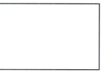

面 ( the picture plane ).

如果把图像平面看作容纳图像的一扇窗户,那么边框相当于窗框,规定窗户的 宽度和高度。无论宽高比怎么变化,屏幕始终作为一个图像平面而存在。

美术馆里展出的那些油画的图像平面由实体的画框围绕,摄影机的图像平面则 是取景器,由视机和电脑的图像平面是最示屏。把双手伸到眼前构成一个方框,那 么这个方框里所呈现的也是一个图像平面。

## 视觉进阶

对结构的讨论最终会导向对进阶(progression)的讨论。进阶是指,以一种事物

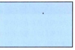

开始,然后变换为另一种事物的过程。比如音乐,它可以通过从舒缓到急速的变化 完成一个进阶,同样,视觉也存在进阶——视觉进阶(visual progression)。下面的视 觉进阶,就是一个从简单到复杂的变换过程。

我们在屏幕上能设置的最简单的图像,就是一个点。从这一点出发,视觉进阶

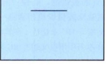

逐渐复杂。视觉影像也变得更加复杂。

一个点,可以通过在屏幕上的移动而变成一条线,最然,这条线要比刚才的点

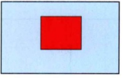

更为复杂。视觉影像也变得更加复杂。

移动这条线,就可以得到一个面。同样的,这个二维的面要比刚才的线更加复杂。

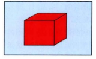

如果把这个面移动到空间里,那么就能够创造出视觉进阶上最复杂的图像一 一个立方体。

这就是进阶,从点到线、从线到面、从面到体,一个不断复杂化的过程。像所 有其他类别的结构一样,视觉结构中也包含着进阶。

## 1.5  咖于实践,避免纸上谈兵

看完上面的概念和术语,你可能会感到奇怪;这本书不是要讲如何实践吗?怎 么突然掉头转向理论了呢? 请放心,在前面的介绍中,我已经明确地说明,写这本 书的目的,就是要帮助你拍摄电影或者视频,因此绝不会挂羊头卖狗肉。那么为什 么还要提 "点、线、面" 这些概念呢? 它们听起来好像太过于理论化了。

不要被这些概念吓倒。这本书是关于如何创作更精美的影像的,把握视觉结构 对于达到这个目标至关重要。视觉理论不会破坏你的创作天分,也不会打消你的创 作积极性,更不会让你变得不切实际。事实上,只有了解视觉结构,才能够真正实 现你的创作理念。看看《愤怒的公牛》 ( Raging Bull , 1980 ), 你就会发现每一个拳 击比寨的场景都是进阶的一个环节,他们建立在情节、声音和视觉密度的基础之上。

斯科塞斯(Scorsese)正是通过从简单到复杂的视觉进阶,来表现打斗场景的 激烈程度。再看《无间行者》( The Departed, 2006 ) 开场镜头中的那个字母 X, 它 由两条交叉的斜线构成,并在后面的场景中反复出现。希区柯克的《群鸟》( The Birds, 1963)里, 视觉进阶和鸟群攻击是同步进行的。再注意一下《西北偏北》
( North by Northwest, 1959 ) 玉米田里的那场戏, 你也可以发现视觉进阶在其中起到 的重要作用。

由于视觉进阶的帮助,广告中的汽车看起来是市场上速度最快的汽车。观看弗 雷德 - 阿斯泰尔(Fred Astaire)和巴斯比 - 伯克利(Busby Berkeley)的音乐剧时, 你会发现视觉进阶和舞者人数的增加与舞台密度的增大是同时进行的。在科波拉
( Coppola ) 的《 教父 》( The Godfather , 1972 ) 的结尾部分, 迈克尔・科里昂接管家 族生意那场戏,请注意视觉进阶在其中的巧妙运用。 《 超人总动员 》 ( The Incredibles, 2004 ) 里,视觉进阶让动作场面更加激烈。斯皮尔伯格的《夺宝奇兵》( Raiders of the Lost Ark , 1981 ) 用視 觉 进 阶 表 现 追逐 和 决斗 。 在罗曼・波兰斯基 ( Roman Polanski ) 的《 冷 血 惊魂 》 ( Repulsion , 1965 ) 中 , 视觉进阶把精神失常的整个过 程形象地展现出来。回顾《指环王》三部曲 (The Lord of the Rings trilogy, 20012003 ), 导演把视觉进阶精心地安排在每场战役之中,以增强魔幻史诗的宏大效果。

V视觉进阶可以让电子游戏的晋级更加刺激。大卫・芬奇(David Fincher)的《七 宗罪》 ( Seven, 1995 ) 中一系列的視觉进阶紧随犯罪场景跟进, 使悬疑感和恐惧感
( 逐步升级。《 美国美人 》( American Beauty, 1999 ) 里的色彩母题是和国旗一致的红、
白、蓝。 ( 美丽心灵的永恒阳光 ) ( Eternal Sunshine of the Spotless Mind , 2004 ) 里的 失忆,伴随着色彩进阶,同样的技巧还出现在克林特・伊斯特伍德(Clint Eastwood ) 的《百万美元宝贝》 ( Million Dollar Baby , 2004 ) 中。如果你想知道真正该看些什么, 上面的影片段落都是关于扎实叙事和视觉进阶成功运用的范例。这就是有关视觉结 构的一切。

一个点变成一条线,再发展成为平面,接着变成立方体,这样由简单到复杂的 过程,仅仅是针对视觉进阶最为机械的解释。视觉进阶是叙事和配乐的基础,也是 组成视觉结构的基本法则。视觉结构的样式,取决于如何运用视觉元素。一旦掌握 了这些基本的元素、结构和法则,我们就能够去探索画面和故事之间的内在联系了。

因此,第一步就是学习视觉元素,知道它们具体是什么。这基本上是一串固定 不变的 "演员" 名单, 这七种视觉元素可以通过不同的组合, 在电视、电脑和大银 幕上,以真人表演、动画片、电脑特技等形式出现,表现各种情绪感觉,营造任何 狱围。它们是被揣摩得最多的元素,但也是被领会最少的元素。

许多影像工作者甚至都对空间、线条、形状、影调、色彩、运动、节奏等视觉 元素闻所未闻,但这并也不能阻止这些视觉元素出现在任何一部电影、一集电视剧、
—场话剧、一款电脑游戏、一张照片和—幅图画中。这些免费的 "演员" 们没有律 师,起早贪黑,随叫随到,分文不取,试问哪里还能找到更棒的替代者呢?

对基本的视觉元素的运用,需要一个关键原则进行指导,这就是我们下一章要

讲到的 "对比和相似"。

第 h o In F

对比和相似

## 2.1 視覚结构的关键

对视觉结构的把握是建立在对一个基本原理的理解之上的,这一基本原理就是:
对比和相似 ( contrast & affinity )。 什么是对比 ? 对比就是差异。

下面不妨以 "影调" 这一视觉元素来举例说明对比到底是怎么样的。影调是指 被摄体表面的亮度,可以用灰度阶来衡量。灰度阶相差越大的影调,放在一起所表 现出的对比越显著。毫无疑问,黑色和白色的碰撞,在影调上的对比最显著。如果 一幅画面要体现最强烈的影调对比,那么最好选用黑与白两种影调。

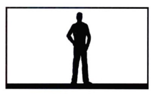

这个镜头,全部由黑色和白色组成,是说明影调对比的一个很好的例子。 什么是相似呢?相似意味着接近。

在灰度上,任何一组相邻的影调,都具有相似性。灰度阶相差越小的影调,放 在一起越相似。

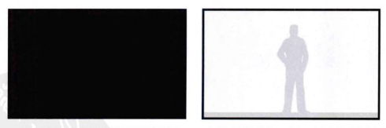

这两个镜头就是说明影调相似性的。一个用了黑和深灰,另一个用了两种色润 接近的浅灰。

每一个视觉元素(空间、线条、形状、影闻、色彩、运动以及节奏)都可以用 来表现对比与相似,下面的几个章节我们会分别详细讲解。

简而言之,对比就是差异,相似就是接近。

对比和相似原理可以描述为 : 对比越强,则视觉冲击力和视觉动感越强;相似性越强,则视觉冲击力和视觉 动感越弱。

更简单地概括一下,即:
对比 = 视觉强度高 相似 = 视觉强度弱 那么 "视觉强度" ( visual intensity ) 究竟怎么理解呢? 举例来说, 世界第一过山 车令人惊声尖叫,而熟睡的小狗则使人爱不释手;优秀影片中的龙争虎斗令人激动 不已,而阴天里的死水微演则让人兴味索然;电子游戏既可以令人欲罢不能,也可 以让人背背欲睡;电视广告可以使人心急火燎,也可以让人心情舒畅;纪录片能使 人瞬间惊醒,也能使人随遇而安。观众们这些情绪上的反应,都是由他们看到的影 像所包含的视觉强度决定的。观众可能会因此产生感情上的波动,比如哭泣、大笑, 或者惊叫;也可能产生生理上的反应,比如肌肉紧张、紧闭双眼,或者干脆呼呼大 陣。一般来说,視党刺激越强烈,观众的反应就会越强烈。

一位好的作家会小心翼翼地打磨词话、句子和段落;一位好的作曲家会谨慎地 调整音符、节拍和小节;一位好的导演、摄影师、分镜头画面设计师或者剪辑师、 则会按照 "对比和相似原理" 来使用视觉成分。

"对比和相似原理"的效果可以用下面这幅图像来演示 :

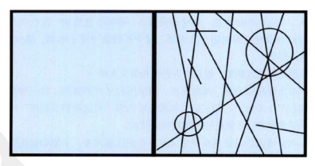 哪一边的图像更激烈?右边充满了交叉的线条,从而产生了较强的视觉冲击力; 左边由于视觉上的相似性,不具有冲击力。两边具有各自不同的视觉内涵。

假设下面的画面是从两部电影中摘取的一段 :

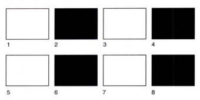

这是第一个电影的故事板(故事板是用来说明电影的每一个镜头最终会拍摄成 什么样子的絵画稿 )。每个镜头持续一秒钟,以白色开始,然后变成黒色,再变为白 色,接着变为黑色,如此往复。这一组黑白交替出现的镜头连续放映几分钟,可想 而知观众的反应会有多么抓狂。这个片段全部由对比组成,过于刺激,连续而急速 地转换黑白画面,会造成太过强烈的视觉冲击,让人难以忍受。

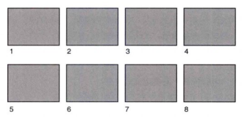

这是第二个电影的故事板。每格画面都是一样的灰色影调,没有变化。观众们 看个几分钟就会发现这部电影非常无聊。这个片段由于过于单调,缺少视觉变化, 同样让人难以忍受。

电影的黑白对比太刺激,而只有灰色的相似又太单一。

可见 "对比和相似原理" 虽然简单, 但使用起来并不容易。每一种视觉元素都 可以细分成若干个子元素,而它们又都最终要归到 "对比和相似原理" 中去。只有 享握好这个基本原理,才能更好地控制视觉结构。

下面六章要讲解的就是基本视觉元素。在创作实践中,了解如何观察它们,理 解如何把握它们,都非常重要。然而,最重要的是,学会如何用它们来建造一座 "视觉大厦"。

第

# 3

章 空 lin 空间是一个复杂的视觉元素。它不仅仅定义了其他视觉元素所处的屏幕,而 且本身就具有很多子元素,在这里,我们有必要对这些子元素稍作解释。本章包 含两个部分的内容。第一部分定义了空间的四个子元素:深度、广度、有限性以 及模糊性。第二部分则讨论了银幕宽高比、平面分割以及开放空间和封闭空间等
—系列问题。

## 第一部分    主要子元素

我们所在的真实世界,是一个三维世界,以高度、宽度以及深度来衡量。但是 一个屏幕的物理本质则是严格二维的。电影、电视以及电脑的屏幕都是平面,我们 可以用高度和宽度来衡量它们,但是它们没有深度。

要把我们的三维世界展现在二维的屏幕上,并且还要看起来的确像是三维的, 这是一大挑战。虽然在银薪上看到的是二维画面,但是观众会欣然接受这些图像, 并他们当做三维世界的真正替代物。

一个二维的屏幕平面如何才能愿现出像是三维的或者说是具有深度的画面呢?

答案并不是 3D 电影或者全息图像(虽然后者的确是三维图像 )。即便是在平面的二 维屏幕上观看,图像也可以显现得像是三维立体的。

## 3.1  纵深空间

级深空间(deep space)是三维世界呈现在二维屏幕上时产生的错觉。为观众营 造出一种三维的空间感(包含高度、宽度以及深度)是有可能的,即便这种深度是 一种错觉。其实并不存在真正的深度,因为展示图画的屏幕只是二维的。

观众因为看到了深度线索 ( depth cue ), 因此深信他们在二维的屏幕上看到了 深度。

这幅图画描绘了一条伸向远方的繁忙的高速公路。右侧车道上的车正在驶离

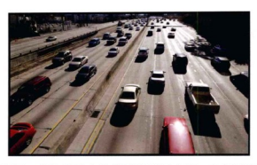

照相机的位置, 而左侧车道上的车则从远方驶来, 并迅速地驶过照相机的位置。

这个描述貌似是正确的,但是,实际上确实彻彻底底地错了。这幅图画展示在一 张二维的纸上 ( 或者是一个屏幕上 ), 所以不可能存在真实的深度。然而,我们还 是坚信这条高速公路是伸向图画的远方,有些车在驶近而另一些则在远去。在这 맹二维的图画中, 是什么让我们确信自己看到了并不真实存在的深度, 答案是, 深度线索。

## 深度线索

在二维平面上由于错觉而体验到的深度,即纵深空间,它是由深度线索创造并 控制的。深度线索是创造深度错览的视览元素。

透   视 最重要的深度线索就是透视(perspective)。在平面上创造深度错觉的时候,就

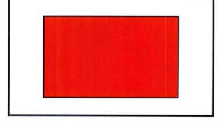

必须要了解如何识别现实世界中的透视关系。

上图是在第一章中介绍过的二维平面。平面项端和底端的直线是平行的,而且 左側和右側的直线也是平行的。这就是一个正平面 ( frontal plane )。

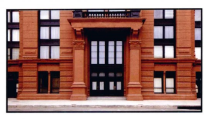

这堵墙也和正平面一样。从视觉上看,正平面和这堵墙都没有深度,但是通过 添加透视的视角,它们就可以展现出深度了。为了更清楚地解释,我们将透视法分 为三种基本的类型:单点透视、两点透视以及三点透视。

单点透视

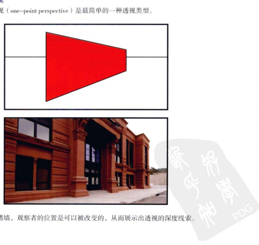

如上图,平面的顶端与底端直线的延长线交叉或汇合于一点,这一点叫做灭点

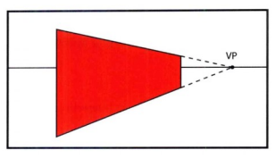

或消失点 ( vanishing point, 简称 VP )。灭点可以在画面的任何位置, 但是一般会出 现在视平线上。这样就创造出一个级向平面 ( longitudinal plane ), 这是创造深度错 党的一个极为重要的线索。纵向平面看似是具有深度的。平面的右侧看起来离我们 更远一些,虽然它仍存在于这张纸平面上。

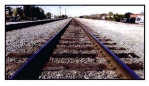

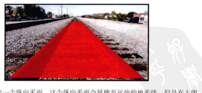

在灭点汇合了。

铁轨创造出一个级向平面,这个级向平面会延伸至远处的地平线,但是在上图
汇合现象在真实世界以及屏幕世界中都会出现,但是在屏幕世界中它出现在二 维的平面上,是深度错觉的一个线索。铁路看似要延伸到图画的深处去,但是在一 个平面上并不存在真正的深度。

两点透视 接下来的一个类型是两点透视(two-point perspective), 这里存在两个灭点,也

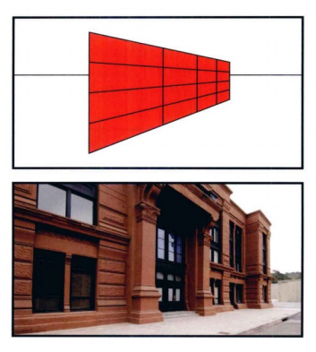

更加的复杂。有很多种方式可以形成两点透视,例如 :
这个级向平面仍然只拥有一个灭点,通过添加了一些线条,平面的汇合变得更

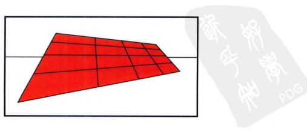

加明显了。

在这个级向平面中,我们可以再加入第二个灭点。如果抬高或者降低视线位置,

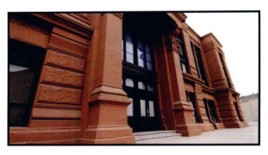

那么这个纵向平面的左右两边就不再互相平行了。

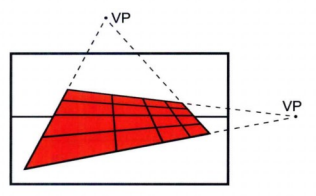

这里有两个灭点。平面的项端和底端的边线延长后汇合在边框(frame)外右侧 的一个灭点,而平面两侧的边线延长后则汇合在边框外上方的第二个灭点。如果抬 高视线角度,那么这个纵向平面两侧的边线将会汇合在边框外下方的一个灭点。

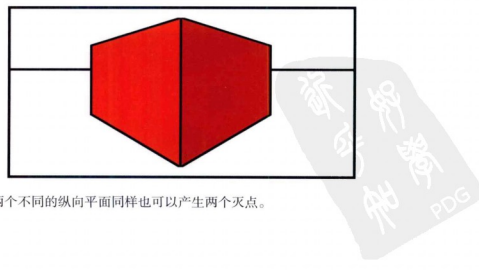

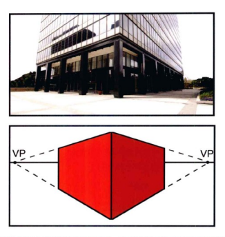

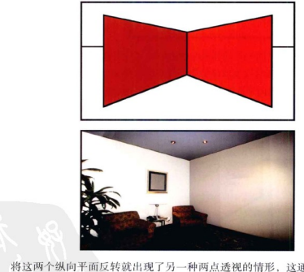

间的一个角落的时候。

虽然两个灭点都隐藏在纵向平面后,但顶端和底端的边线延长后还是汇合的。

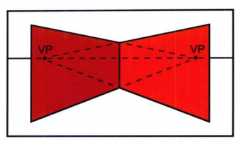

三点透视 三 点 透视(three-point perspective ) 比 章 点以及两点透视要复杂得多。下图就是

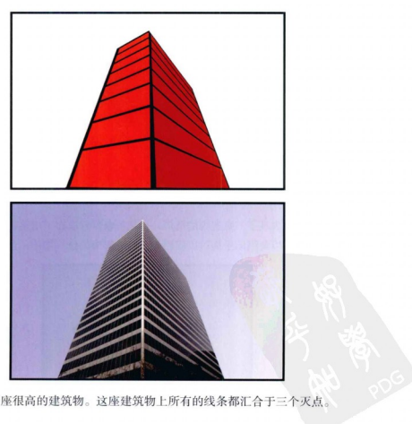

· 电 三 点透视的例子。

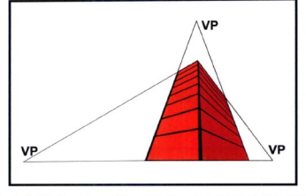

两侧的水平线上。

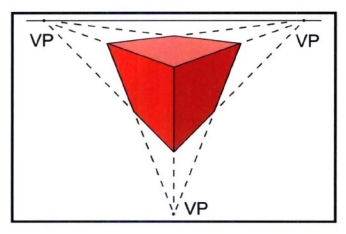

这一幅图也表现了三点透视的情形,但是视角位置取在了建筑物的上方。

透视、灭点以及纵向平面可以应用于真实世界中的任一物体,正如下图所示。

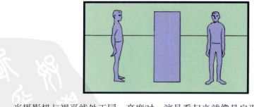

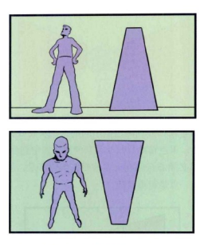

而当摄影机高度降低并仰拍时,演员就变成了一个纵向平面。当摄影机高度升

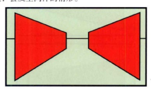

高并俯拍演员的时候,会发生同样的情形。

观众的注意力总会被屏幕上的灭点所吸引。注意你的眼睛是如何被两堵墙之间

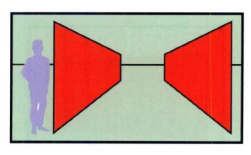

的灭点所吸引住的。

点所吸引 .

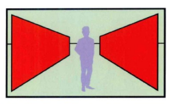

此时,我们把演员重新摆放到两堵墙中间的灭点所在处,那么观察者的注意力 就集中到了演员的身上。灭点帮助我们让观众的视线集中到演员身上。

这是否意味着演员必须总是处在灭点处呢?当然不是。但是,了解到灭点总是 会吸引观众的注意力这一点是很重要的。

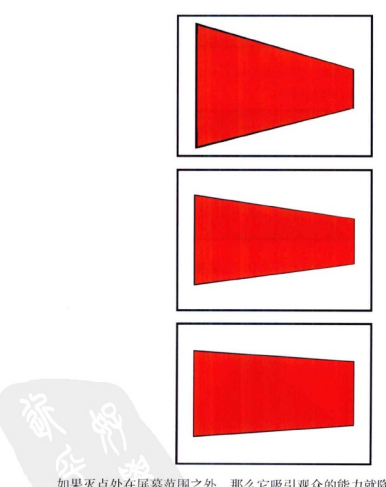

从单点透视到两点透视,再到三点透视,这是一个视觉进阶的过程。灭点越多, 深度错览越强。一个灭点能创造出深度错览,而增加第二个甚至第三个灭点则更能 够增加深度空间的错觉。

在一幅图片中运用4个、5个、20 个甚至更多的灭点是可能的。如果这是一 宝絵画实践课(当然并不是 ), 那么我们会花时间来学习复杂的多点透视。但是看 电影或者視頻的观众们只能够察觉到至多三个灭点。这个有限性对于电影制作者 来说是个优势,因为这意味着在运用透视和会聚原则的时候只有三种可能的深度 错 记住,无论增加多少个灭点,画面上并不存在真正的深度。这里用到的示意图 以及照片都是为了说明在二维的纸张表面上存在级深空间,但是所有的级深感都是 错 % .

## 近大远小规律

当一个特定尺寸的物体变小的时候,看起来它好像是变远了;而当一个特定尺 寸的物体变大的时候,它看起来好像是变近了。

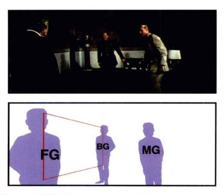

这个镜头画面具有纵深感是因为其中的三个人分別处在不同的平面上。一个人 在前景,一个人在中泉,而第三个人在后泉。把三个人分别放置在前景、中泉、后 泉三个不同平面上凸显了他们大小的不同。同样,注意前景和后景的两个人创造了 一个级向平面。当然,这三个人实际上离我们一样远,因为他们都处在同一个平面
( 这张纸 ) 上 , 而大小的不同造成了深度错党。

## 以眼话

这个概念听起来好像很简单、很明显,但是近大远小规律(size difference)是 在平面上创造深度错览的一个极为重要的手段。

在奥逊・威尔斯(Orson Welles)的《公民凯恩》( Citizen Kane, 1941 ) 中,演 员的位置设定以及深度错觉都是依据于透视和近大远小规律。事实上,这种深度线 ""
运 动 通过移动摄影机前的物体或者移动摄影机本身都可以创造出深度错觉。在第七 章中,运动的概念还将扩展到其他的领域。

## 被摄物的运动

这里所说的被摄物 ( object ), 指的是在摄影机前方的所有事物 : 人、动物、篮

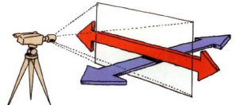

球、椅子、汽车、船以及一束光等,它们没有任何区别。

在摄影机前, 现实世界中的物体只能有两个运动方向——平面运动 ( parallel )
或者纵深运动 ( perpendicular )。切记图像平面是展示画面的二维 "窗框式" ( window )
屏幕 .

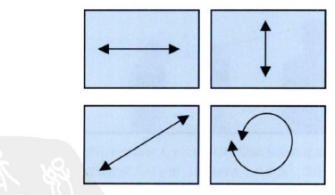

26 单一被摄物平行于图像平面移动时不会产生深度感,但是当处于不同平面的两

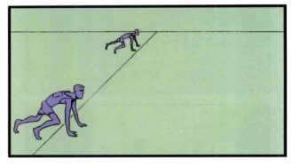

个或者更多的被摄物平行于图像平面运动的时候,在屏幕上就会出现纵深空间。

这个镜头中有两名运动员 (一个位于前景,一个位于后景) 在跑道的起跑线上。

两名运动员同时起跑,进行平面运动,并且二者的速度相等。但是看上去前景的运 动员跑得比后景的运动员要更快些,事实上,两人跑过路程的距离一样。

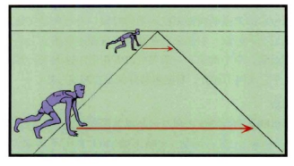

通过增加一个灭点可以准确地表示出前景运动员究竟看上去多跑了多少,虽然 这两人实际上跑过的距离是相等的。当观众发现,与前景运动员相比,后景运动员 明显速度更慢和距离更短时,他们相信后景运动员距离他们更远一些(后景平面上 的运动员也更小,这增加了深度 )。速度以及移动距离上的明显差距创造了深度线 t ,  J
当一个被摄物纵向运动的时候也会创造深度错觉。朝向或者远离摄影机移动的 被报物就是在垂直于图像平面运动。纵向运动既包括正对着摄影机的运动,也包括 级深空间中以斜线方向横跨屏幕的运动。

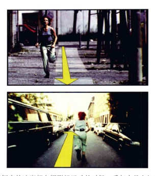

当被摄物以恒定的速度朝向摄影机运动的时候,看起来是在加速。相反,当被 摄物远离摄影机运动的时候,看起来是在减速。这种速度感觉上的变化就是级向运 动所产生的深度线索。举个例子,一架飞机沿着跑道加速起飞,实际上它的速度是 增加的,但是由于它飞向了远方,看起来却好像是在减速一样。

## 摄影机的运动

有三种摄影机的运动会创造出相对运动以及深度错觉,它们分别是:摄影机的 前后运动 ( dolly in/out ), 左右运动 ( track left/right ) 和上下运动 ( boom up/down ),
无论摄影机如何运动(通过移动式摄影车、摄影升降机、直升机、特殊的机械吊索 或者仅仅是手持移动 ), 最基本的原则都是适用的。

摄影布的前后运动是指让摄影机富近或者远离某一被摄物。

移动式摄影车创造出前景和后景之间的相对运动。

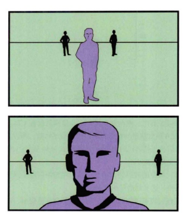

当摄影机推近时,同后景上的两名演员比起来,前景上的演员会以更快的速度 变大。这是由于前景演员和后景演员与摄影机的相对距离不同。

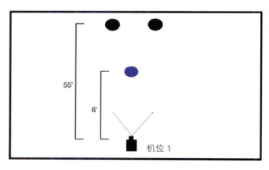

術视图或者平面设计图能帮助我们解释这个答案。摄影机的起始位置距离前泉 演员 6 英尺,距离后景演员 55 英尺。

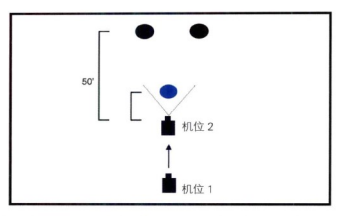

然后摄影机推近 5 英尺。现在摄影机距离前景演员仅有 1 英尺,而距离后景演 员 50 英尺。那么现在前景演员与摄影机的距离缩短了六倍,所以前景演员的尺寸变 大了很多。而后景演员与摄影机的距离从 55 英尺成为 50 英尺( 只缩短了十分之一 ), 所以他们的尺寸变化是很微小的。

在摄影机运动过程中的被摄物大小变化的相对差距创造了纵深感。而前景物体 比后景物体运动更快,这又创造了相对运动。

相反,当摄影机远离被摄物的时候,前景演员会急速变小,而后景演员的大小

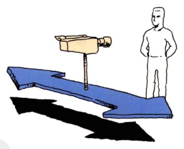

儿子不会改变。前泉与后泉的演员之间的相对运动正是深度线索。

皆摄影机向左或者向右运动的时候,通常称作推轨镜头,也可以创造出深度 画面中,一名演员位于前景,三名演员位于后泉,摄影机向右移动。

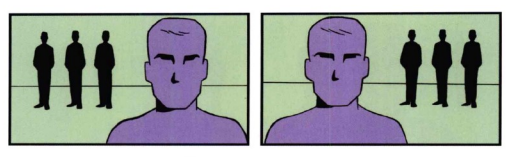

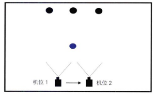

当摄影机从左至右移动的时候,前景的演员比后景的三名演员更快地掠过摄影 机前方。在速度较快的前景物体以及速度较慢的后景物体之间存在着相对运动。观 众会将这种相对运动视作深度线索。

第三种能够创造深度错觉的摄影机运动是升降镜头。

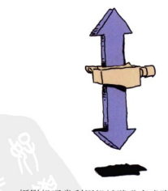

摄影机通常利用机械臂升高或降低。

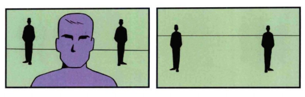

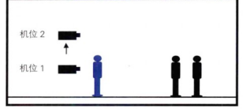

这个镜头有一名前景的演员以及两名后景的演员。当摄影机摇臂升起的时候, 前景的演员会迅速地从屏幕下方移出,而后景的两名演员则会以更慢的速度下移。

当摄影机摇臂下降的时候,前泉的演员会快速地上移进屏幕,而后景的演员则几乎 不怎么移动。

升降镜头能够创造和推拉镜头完全相同的相对运动现象,但是升降镜头创造的 是重直方向的相对运动,而非水平方向的相对运动。

在这三种情形中,摄影机运动都创造了被摄物的相对运动。正是这种相对运动, 在扁平的二维屏幕上制造了深度错觉。

## 不同材质的散射

每个物体都有其材质以及细节特征。一堵普通的石膏墙,材质是顺滑的,也没

有什么细节特征 ; 而一件羊毛衫则有丰富的细节特征 . 因此,由材质细节特征不同 而导致的散射也能创造深度错览。

这幅照片展现了不同材质的散射现象 ( textural diffusion )。前景中,球迷的衣

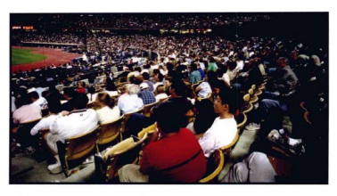

蒼和其他细节特征清晰可见;后泉中的球迷儿乎成了一个个点,衣着和其他细节 也就无法辨析了。细节特征展现得较多的被摄物,看上去离我们更近一些;相反, 则距离我们较远一些。这幅照片中也蕴含着其他的深度线索,例如大小的不同以 及透视。在解释了每一种略最陌生的深度线索之后,这些线索的共同特征就最而 易见了。

## 空气散射

空气散射 ( aerial diffusion ) 取决于空气中的微粒。这些微粒可以是灰尘、雾气、
耐、烟雾、烟或者任何可以患在空气中使后景变得模糊的东西。

空气散射造成了画面的三种视觉变化:材质细节特征模糊,对比度降低,甚至

被摄物颜色与空气颜色渐趋一致,而这会创造出深度错览。

空 然而,我们只关注了这种气象条件下被摄物的细节特征,而忽视了颜色。

在雾天我们的视觉质量就完全不同了。此时空气散射给画面增添了深度线索, 建筑物的细节特征春不见了,而且所有的影测对比也不明显了。充色的和暗色的建 筑物布变得灰蒙蒙。

穿也会把被摄物的颜色变成灰色 ( 空气散射的颜色 )。如果空气散射粒子是棕色 的烟雾,那么远方的建筑物就会变成棕色的。空气散射会使镜头中被摄物的材质细 节特征变得模糊,会降低影调对比度并且改变这些被摄物的颜色。

如果要利用空气散射营造出有效的深度线索,那么在同一个镜头中就必须存在 两种被摄物,一种不被空气散射所影响,而另一种被空气散射影响。这两种被摄物 之间的对比就创造了级深感。

在空气散射作用下材质细节特征的损失效果同材质散射很相近,但是它们产生 的原因不同。材质散射基于距离,距离远,细节模糊;空气散射基于微粒,微粒多, 细节模糊,看上去也较远。

## 形状变化

被摄物的形状变化(shape change)是创造深度错觉的又一条线索。形状变化既 可以发生在运动的物体上,也可以发生在静止的物体上。

这里有两幅手的图片。

把两只手都简化成轮廓图,使同一只手可以展现出不同的形状。

在现实世界中,这只手可以通过在三维空间中的旋转改变其形状。任何旋转 的物体都需要有第三个维度来保证转动动作的产生。当真实世界的物体旋转的 时候,它在屏幕上的形状就会发生变化。这种形状的变化就是一种深度错觉的 线索。

例如,当一个杯子旋转或者摄影机绕着它运动的时候,杯子的形状就会发生改 变。从桌子的高度看去,杯子的形状像是个长方形;但是当我们从上方看的时候,

不用运动也可以发生形状的变化。这幅建筑物的图片显得很有纵深感,因为图 中运用纵向平面以及近大远小规律(窗户从下至上渐渐变小了), 而且这些窗户的形 状也改变了。

底部窗户

顶部窗户

在这张照片中,下层的窗户看起来是细高的长方形,而上层的窗户则看起来是 矮扁的长方形。这种形状变化就是错觉深度的一个线索。观众认为所有的窗户实际 上都是同一个形状的,所以形状上的明显改变就被理解为是由深度造成。

## 影调分离

影调指的是黑色、白色以及二者之间的一系列灰色(即灰度阶[gray scale])。

灰度的不包含任何颜色,它是从黑到白的一系列影调等级。影调分离 (tonal separation) 是指通过调整被摄主体的完度让观众感知到纵深空间。通常,颜色明亮 些的物体显得高我们更近一些,而较为黯淡的物体则显得离我们更远。

这就是欧度阶。

即便是两个大小完全相同的物体,观者也通常会觉得明亮的那个物体更近,黯 淡的物体更远。

## 色彩分离

通过把颜色归类为暖色调和冷色满,颜色也可以创造深度线索。暖色调主要有 红色、橙色和黄色,冷色满主要包含蓝色和绿色。在第六章 "颜色" 中,我们会更 加全面地讨论这一分类以及颜色的复杂性。

通常暖色调看起来高观众更近, 而冷色调则显得更远一些。

红色的长方形看起来离我们更近,而蓝色的那个看似远一些,虽然二者与我们

的距离是一样的。

有很多理论解释为什么会产生这样的现象。研究者们认为这同人类对于不同波 长的光的生理和心理反应有关。无论原因是什么,这种感知上的现象是真实存在的, 我们可以运用这一现象在屏幕平面上创造出虚幻的深度空间。

## 位置高低

在屏幕范围内被摄物的垂直位置影响着观众对于其远近的感知。位置高一些的

物体看起来更远,而位置较低的物体则显得更近。

即使这两个人的形状相同,观察者还是会认为位置较低的那个人在前景。

如果在屏幕范围内存在一条视平线,这种位置高低(up / down position)的深度 线索就变得更复杂了。距离这条视平线较近的物体会显得更远,而距离这条视平线 较远的物体则会显得更近一些。

在视平线以下的位置,较高的物体显得更远一些。相反,在视平线以上的位置, 较高的物体显得更近一地。

R
s 当一个物体与另一个物体重叠(overlap)起来时,就产生了深度错觉。

在第一个镜头中,正方形显得更远一些,因为圆形造盖了正方形的一部分,即 圆形和正方形重叠了。重叠现象会创造纵深感,是因为要发生重叠,两个物体中必 须有一个距离我们近,另一个距离我们远。

軍桑的物体比不重桑的物体具有更强的纵深感。大多数时候,重桑只是个辅助 的深度线索,只有与其他主要深度线索同时发挥作用时,才能起到增加深度错觉的 效果。

聚 焦 聚焦 ( focus ) 指的是画面中被摄物的锐度。

位于焦点上的被摄物清晰,反之,则模糊。当深度线索移出焦点位置,它的纵深 空间特征就丧失掉了,变成了平面或者有限空间(flat or limited space,这两种空间在 本章的后面部分都会讲到 )。与在焦距内的前景相比,模糊的后景显得更远一些,但 是这种现象并不会造成纵深空间。只有当它在焦距内时,深度线索才会是有效的。

## 三维影片

第一部立体影片诞生于 19 世纪 30 年代,是手工绘制的。自从摄影技术产生以 来,立体影像广泛出现。第一部三维电影于 1915 年上映,自从那时起,电影制作商 以及电影院老板们在各种视觉情境中应用这一技术。通过运用两个屏幕画面,分别 展示两只眼睛所看到的景象,这两种画面的视差就能够创造逼真的纵深感。双眼距 商、交汇点以及镜头聚焦等差异都会显著影响观众对纵深空间的感知。

在同本章中所讲到的深度线索共同发挥作用的时候,3D 影像能够达到最佳的效 果。如果没有这些深度线索,那么 3D 的体验是有所欠缺的,因为在这些 3D 画面中 没有表现出我们在真实世界所体验到的深度线索。我们在真实世界中是如此地依赖 于深度线索以至于如果没有它们的存在,对纵深空间的感知就会大打折扣。

## 3.2

平面空间 ( flat space) 是纵深空间的对立面。纵深空间能够在二维的麻幕表面 营造出三维画面的错党。而平面空间不是一种错觉。平面空间强调了屏幕表面的二 维特质。这就形成了一种完全不同的视觉空间。第九章 "故事以及视觉结构" 一章 中我们将探讨如何运用本章所谈到的所有类型的空间,并且赋予它们意义。

## 平面线索

正如纵深空间具有独特的创造深度错觉的线索一样,平面空间也有自己的线索。

在平面空间中,深度线索必须被清除掉,并且以平面空间线索取而代之。

正平面 在平面空间中必须清除透视、会聚线以及灭点。

平面必须是正面的,而不是纵向的。这里是在本章初始曾经展现过的—个正平面。

正平面强调了屏幕表面的二维特性。

示意图展示了在这张照片中的正平面。这里没有纵向平面, 而且灭点也被清除了。

大小恒定 为了强调屏幕的平面性以及二维特性,所有形状相近的被摄物必须保持大小一

致,并且出现在同一个正平面中。

平面空间要求所有的被摄物都必须出现在同一个与画面平面平行的正平面上。

这个单一的正平面强调了屏幕平面的二维特性。

运 被摄物的运动以及摄影机的运动都可以用来创造平面空间感。

被摄物的运动

一名演员平行于图像平面走动就可以强调出平面空间。要避免出现垂直于 图像平面的运动,因为这会带来很多深度线索。有一种情形除外,即用长焦镜头
( telephoto lens ) 拍摄的垂直于图像平面的运动会在本章下一节中谈到。

## 摄影机的运动

有三种摄影机的运动方式可以保持画面的平面空间感,因为它们都不会形成相 对运动 , 它们是 : 左右掘拍 ( pan ), 上下摇拍 ( tilt ) 以及变焦 ( zoom ),
左右播摄影机镜头能创造平面空间感。

左右播拍是指在水平轴上向左或向右旋转摄影机。当镜头左右播动时,屏幕范

閉内的所有物体都保持着它们彼此之间的相对位置不变,因此没有任何的相对运动。

上下摇动镜头是第二种平面空间的摄影机运动。

上下摇拍是在垂直轴上运动,此时不产生相对运动。当摄影机架立在节点上的 时候就可以产生真正的左右和上下摇镜头,这一点在附录中进行了解释。

最后一种是变焦。变焦实际上不是摄影机在移动,而是与纵深空间推进拉出运 动等价的一种平面空间的运动。很多摄影师和导演都对变焦持有很强烈的反对意见。 通常,摄影师和导演都认为变焦镜头是推轨镜头的一种简易而乏味的替代法。的确, 拍摄一个推轨镜头要花更多的时间布泉,但是二者的区别不仅仅在于经济性或者实 用性上。它们之间的区别在于二者创造的视觉空间的类型。

变焦能创造平面空间感,这是有很多原因的。最重要的一点是,摄影机并不 是真正在运动,所以不会出现相对运动。推近镜头焦点会让屏幕中的所有物体以 相同的速度变大。前景、中泉以及后景都统一变大了,似乎画面中所有的物体都 是出现在同一个平面上。这时并不存在相对运动。推近焦点也改变了镜头的焦距, 从广角镜头 ( wide angle lens ) 变成长焦镜头。随着镜头焦距的增大, 景深变小, 屏幕范围内的一些区域就会失焦。当任何被摄物都成为模糊一片的时候,就创造 了平面空间。

在推近镜头焦点的时候,所有的物体,无论它们距离摄影机多远,都以同样 的速度变大。泉深变小,所以画面中越来越多的部分逐渐失焦。在焦点以外的被 摄物,不论它们具有怎样的深度线索,都会变成平面空间。拉远镜头焦点也会 消除相对运动,而且虽然画面的深度增加了,但是拉远焦点本身不会给画面增加 深度。

要拍出平面空间感,绝不能出现纵深空间的摄影机移动(摄影车前后移动、轨 道车左右移动以及吊臂移动 )。但是有一种例外情况,即便是运用了轨道车摄像也能 够保持両面的平面空间感。

在这帽图中,演员 A 沿着一堵墙行走,而摄影机跟在他身边作推轨运动。摄影 机运动时平行于墙的正平面,这就保持了画面是正平面空间。

当一个物体垂直于图像平面运动的时候也有可能保持平面空间感,但是会对镜 头选择以及被摄物与摄影机之间的距离有严格的要求。

在这个例子中,镜头运用的是 18 毫米广角镜头,一名演员从距离摄影机 15 英 尺远的地方走向摄影机。随着演员走向摄影机会产生很多的深度线索。大小、材质 细节特征以及速度的变化都会创造出纵深空间。

现在,演员从 1000 英尺远的地方起步,行走 15 英尺,并停在了距离摄影机 985 英尺远的地方。这个演员也同样是彻着摄影机走了 15 英尺,但是没有出现任何 深度线索。虽然本例子中用的是一个长焦镜头,但是用任何一种镜头都会是这样的 结果,因为演员距离摄影机还是太远了,在大小、细节或者速度等方面都没有显现 什么变化。虽然演员是垂直于图像平面运动的,但是不会产生任何深度线索,因为 距离摄影机 1000 英尺和 985 英尺实在是没有什么太大的区别。摄影机以及演员之间 的相对距离几乎保持不变,因此也保持了平面空间感。

## 不同材质的散射

没有材质感的物体看起来更远,而材质感很重的物体看似近一些。要创造平面 空间感就要避免出现不同的材质,因为它们会创造出纵深感。

要强调平面空间,所有的物体必须有等量的材质细节特征。当画面中,所有物 体材质是同质或者相似时,画面的平面感就更强。通过控制前景以及后景的材质来 保证平面空间是比较难的,但是,可以通过避免材质过于突出的前景物体来实现。

在这个镜头中,所有物体的材质都是相似的。这里有很多平面空间线索,但是 材质较为突出的后蔡物体似乎更靠前,从而使得整个空间变得扁平化。

호气散射 如果空气散射能够遮盖住画面中所有的深度线索, 那么它就可以创造平面空间感。

虽然空气散射可以是一个深度线索,这幅图里的空气散射 ( 飘落的雪花 ) 掩盖 了整个画面中所有的细节以及材质特征。这个镜头中的大部分景物都缺少材质特征 和材质对比,而且都是同一个颜色的,这就创造了平面空间感。

## 形状变化

要营造一个严格意义上的平面空间,所有被摄物的形状都不能够发生改变。

部平面动面片可以做到这一点,但是要消除掉现实三维世界中物体转动和旋转时的 形状变化却是十分困难的。电影制作人可以尽量地将形状的变化减少到最小,但是 不可能完全消除。

## 影调分离

影调指的是灰度阶。保持平面空间感,就要控制画面灰度阶的变化范围。记住,

明亮的物体通常显得更近一些,黯淡的物体显得更远一些。

当画面中的影词都限制在灰度阶三分之一范围内的时候,平面空间就得以被强调。

这幅图就缺乏影调对比,因此看上去就是平的。

## 色彩分离

要保持平面空间感就必须控制冷暖色调的变化范围。由于冷色 ( 绿色和蓝色 )
会让物体变远而暖色(红色、橙色以及黄色)会让物体变近,那么通过使被摄体都 只具有冷色或者暖色就可以强调出平面空间。暖色和冷色的概念会在第六章"颜色" 中解释。

这些例子都通过把所有被摄物的颜色变成单一的暖色或者冷色而创造出了平面 호间。

位置高低 被扱物相对于屏幕边框的位置可以帮助创造平面空间。

 使所有被摄物位于同一正平面上,可以保持住平面空间感。

## R

理论上讲,平面空间中被摄物是不应该互相重叠的,因为重叠会产生深度感。

然而,在创造平面空间时要清除所有的重叠状况是不可能的,因为每个镀头中都有 一个后泉,而任何在后泉前面的物体都会形成重叠。虽然不可能完全消除,但是通 过周详地安排布泉画面中的物体,可以减少重叠。 聚 焦 当任意一个被摄物失焦的时候,它就变成扁平的了,无论是处在前景、中崇还 是后泉,一旦被摄物变得模糊,就变得扁平化了。

模糊的被摄物看起来更平,无论它们含有什么深度线索。当前景,中景和后景

的物体都失焦的时候,它们通常就会融合成为一个平面空间。有时候这个焦点外的 平面看起来像是扁平化的后景。这就形成了有限空间,这会在本章的后面部分谈到。 反向使用深度线索 可以反向使用—些深度线索,从而创造平面空间。

影词分离 影闻分离的深度线索指出,明究的物体显得更近而黯淡的物体显得更远。反向 使用这个规则,把明亮的物体放在后景中,而把黯淡的物体放在前泉中,这样就使 得整个空间变平了。

在后景的明亮物体看起来就更近一些,而在前景的黯淡物体则会后退一些。当 前景物体后退而后景物体前进的时候,空间就变平了。

## 色彩分离

作为一种深度线索,暖色物体会显得靠前而冷色物体会显得较远。那么把暖色 物体放在后景而把冷色物体放在前景就会使空间变平。在后景的暖色物体会前进, 带动后泉平面前进,而在前的冷色物体则会后退,带动前与后泉融为一体,这样两 个平面就不再是分离的了。

## 不同材质的散射

通常拥有更多材质细节特征的物体会显得更近一些。如果我们给予后景中的物 体更多的材质细节特征,那么它们就会显得靠前而融人前景了。同样,前景中的物 体损失了材质细节特征就会显得靠后,退进后景中了。

## 近大远小规律

、由于较大的物体显得更近而较小的物体显得更远一些,这种深度线索也可以 反向使用。如果较大的物体放在后泉而较小的物体放在前泉,那么画面的空间就 A ste 317

## 3 有限空间

有限空间 ( limited space ) 是纵深空间线索以及平面空间线索的一种特定组合。

要创造有限空间可以应用所有的深度线索,除了以下两种 :
- 纵向平面。在这里纵深空间的纵向平面被扁平的正平面所取代。

- 被摄物垂直于图像平面运动。朝向或者远离摄影机的运动都必须减少或者尽力 避免。被摄物只能够平行于图像平面运动。

要创造有限空间是一项极具挑战性的空间设计。阿尔弗雷德・希区柯克和英格 玛・伯格曼(Ingmar Bergman)在他们的电影中常常应用有限空间。这种特殊的空间 类型具有独特的视觉风格,这使其完全区别于纵深空间以及平面空间。在第九章中 会探讨如何为你的作品挑选合适的空间类型。

这些镜头中含有很多深度线索,这些线索包括近大远小、不同材质的散射、影 調分离、色彩分离、位置高低以及重叠。但是并没有使用会聚原则以及透视这两种 最重要的深度线索。通常纵深空间中存在的纵向平面在这里被正平面所替代。

在这些示意图中,有限空间画面中的正平面(前景、中景以及后景)可以看得

更清楚一些。有限空间可以最少只包含两个正平面,而最多也可以包含三个。当多 于三个正平面的时候,用肉眼来区分这些平面就很困难了。

这张图画只包含一个正平面,所以空间是平面的,而不是有限的。虽然地板和 掉壁实际上是在不同的平面上,但是看上去它们并没有分开。

有限空间要求各个正平面之间具有物理性的或者视觉上的区分。物理性区分和 视觉上的区分有很大不同。有限空间中这两种区分都要有。两个被摄物在物理距离 上可能相距很远,但是从摄影机镜头看去它们可能看起来距离很近。

这幅画面中,由于一些深度线索,中景和后景之间存在明显的视觉区分。

在这幅画面中,后景中的演员以及深度线索都被移除了。后景的墙同中景看起 来不再裁然区分。这幅画面就不是有限空间,而是平面空间了。

有限空间看上去就像是看一排区分明确的分别处在前景、中景和后景上的玻璃 板。如果玻璃板互相距离很近,那么就形成了平面空间。如果玻璃板从視觉上有很 好的区分度,那么就形成了有限空间。

## 3.4  楔糊空间

当观众无法理解画面中被摄物的实际大小或者空间关系的时候,就产生了模糊 空间 ( ambiguous space ) o 大部分的画面不是模糊的。通常画面中都包含着有关于被摄主体、被摄物体 实际大小以及摄影机与主体位置关系的视觉信息。这种图画生成的是可以辨明的 空間 .

在这幅图画中,大小和空间线索都很容易找出。这幅图没有什么让人糊涂的地 方,该图呈现的空间是一个可辨明空间。

有时关于大小和空间的线索是不可靠的,让人感到迷惑甚至是误导性的。这就 形成了模糊空间。创造模糊空间可以用到任意的平面空间线索以及纵深空间线索的 组合 , 具体如下 :

被摄物不运动。有时候为了让观众了解某被摄物以及其周围环境,这个物体必 须要运动,反之,则让物体静止。

大小或形状未知的被摄物。被摄物之间的实际大小关系可以被刻意地控制,并

以此来挑战观众的视觉。春不出究竟的被摄物之间的大小关系能够令人困惑。

这个空间就很难定义了。
改变摄影机角度。一种特殊的摄影机角度可以掩盖画面中的实际空间。

模糊空间通常会让观众产生焦虑、紧张或者困惑的感觉。恐怖片和惊悚片就运 用模糊空间来增强其视觉情绪。模糊空间很难保持。一旦一个已知大小的人或者物 体进入了画面,观众就能够理解该空间,而模糊的空间就变成了可以辨明的空间了。

## 3.5   比较四种类型的空间

四种基本空间类型中的任何一种,都可以被用来设计画面。以下这些简化图说

明了如何通过四种方法建构一个场景的空间; 第一幅运用了级深空间。画面还是在二维平面上但是却具有深度错览。其中运 用了纵向平面、单点透视、形状变化、近大远小、不同材质的散射、色彩分离、影 调分商以及位置高低等多种深度线索。当前泉演员垂直于图像平面走近的时候,摄 影机可以下降并推近。

第二幅是平面空间。墙壁都是正平面,而且画面中没有级向平面或者会聚线。

所有演员都处在同一个水平面上, 他们的大小一致, 有相同程度的材质细节特征, 任何动作都是平行于图像平面的。摄影机会变焦或者平行于墙壁正平面作推轨 运动。

第三幅是有限空间。在这个镜头中有包括近大远小、不同材质的散射、位置高

低以及影调分离等深度线索,但是没有纵向平面,只有正平面。消除纵向平面在创 造有限空间的时候是很关键的。

第四幅画展现了模糊空间。灯光在大厅以外,一些散射光照芯了楼道,而两名

演员处在照暗中。这幅画面是模糊的,因为在这个镜头中很难判断出被摄物实际的 大小和空间关系。摄影机在大厅的什么位置? 门距离摄影机有多近? 摄影机是不是 倒置的? 視觉上的模糊性使得空间线索变得不可靠了。

这四种表现大厅空间的方式都赋予了故事鲜活的生命,但是每一种在视觉上都 是独特的。那么哪种空间最适合你的作品呢?  纵深空间是不是最能够让你的故事视 逆化,或者是需要平面空间和级深空间的组合?  模糊空间可能最适合你作品的某部 分,因为其对于观众有独特影响。第九章 "故事和视觉结构" 将会解释如何选择某 一种空间类型以及为什么要选择某种空间。

## 3.6   在拍摄中控制空间

假设,明天你就要去执导一个场景,面你已经决定要运用纵深空间了。那么你 如何才能创造出纵深空间呢?

1. 强调纵向平面。任何一堵墙、一块地板或者房顶都可以成为级向平面。应当 避免拍摄正面,因为它们是平的。使画面包含纵向平面是创造纵深空间的最重要的 方式。

2. 调度被摄物垂直于图像平面运动 ( 靠近或远离摄影机 ). 这一般被称为 "级 深场面调度"。调度被摄物的远近可以突出大小的变化。在前景的物体应该更大些, 面处在后景的物体则应该更小一些。保持被报物垂直于图像平面运动、这样可以强 调其外形大小和材质细节的变化,同时也突出其是在纵深方向上运动。

3. 让摄影机动起来。无论是用摄影车、摇臂还是手持,都一定要尽量保持摄影 机的运动。要保证摄影机的运动同被摄物的运动或者是戏剧性的目的相联系。推近 或拉远,左移或右移,上升或下降都会创造相对运动。

4. 利用影调分离。明亮的场景搭配更多的影调对比。让前景物体比后景物体更 明亮 .

5. 运用广角镜头。广角镜头有更宽阔的视野,可以在画面中包含进更多的深度 线索。广角镜头也具有比其他的镜头更大的景深。景深(depth of field )指的是在镜 头前可被清晰聚焦的图像区域。如果物体要成为深度线索就必须在焦点范围之内。

也许你改变了自己的想法,明天想要运用平面空间。那么就利用好平面空间 线索 :
1. 消除透视。消除所有的纵向平面,强调出正平面。

2. 调度被摄物平行于图像平面运动。保持両面中的被摄物都处于同一个正平 面上,这样它们外形的大小就不会改变。被摄物平行于图像平面运动,有时也称作 "平面空间的场面调度" ( flat staging )。如果物体垂直于图像平面运动,那么就要运 用长焦镜头将深度线索减到最少。

3. 消除相对运动。不要用摄影车或者轨道来带动摄影机运动,除非摄影车是平 行于正平面运动的。一个三脚架和变焦镜头可能是你所需要的全部,因为要保持平 面空间,只需要上下或左右播镜头。变焦可以保持平面空间,但是如果你讨厌变焦 镜头,那么就不要用。

4. 减少影调或色彩分离。减少影调对比并压缩灰度范围是很重要的。美术设计 师会将影调变化控制在灰度阶三分之一范围之内。顏色必须要么全部是暖色的,要 么全部是冷色的。通过反用色彩和影调分离的深度线索可以进一步加强平面空间感。

5. 运用长焦镜头。长焦镜头能帮助去除画面中的深度线索,因为这种镜头的视 野较为狭窄。焦距越长,拍摄者越得将被摄物安排在距离摄影机更远一些的地方, 这样就消除了近大远小和不同材质散射的深度线索。当物体都是同一大小的时候, 画面看起来就更平面化了。不要思鑫地认为一个长焦镜头就可以从视觉上让画面变 得平面化,它无法做到这一点。不要只是运用一种镜头,而要综合运用平面空间线 索来创造平面空间。关于镜头和空间的详细解释见附录部分。

6. 让被摄物变得模糊。较浅的景深能够让后景失焦。模糊的被摄物可以消除纵 深感,从而强调平面空间。

本章的第一部分大体介绍了四种基本的视觉空间类型,而空间是今个复杂的视g 覚元素。第二部分将会讨论画面边框(frame )本身。

## 第二部分

第二部分会讲解诸种次级空间概念,这会让空间在视觉表现上更加有用。这 些概念包括: 両幅宽高比 ( aspect ratio, 英定边框的物理比例 ), 平面分割 ( surface divisions, 分割图像平面 ) 以及开放空间 ( open space, 创造屏幕外的空间 )。最后, 我们会把对比和相似原理与空间联系起来。

## 3.7 両幅 . 高 比

両両立高比,是指边框宽和高尺寸之间关系的一组数字。例如,1.5 : 1 就是一个 画幅宽高比。第一个数字 1.5 是边框的宽,而第二个数字 1 是边框的高。中间用冒 号分隔开两个数字 ( 编注 ; 中文则用比号 )。画幅宽高比是指宽与高的比值,而不是 边框的实际尺寸。

这个边框的宽高比是 1.5 : 1 , 我们测量了高 ( 通常给它赋值为 1 ), 然后将高与 宽相比。由于宽是高的11z倍,所以宽高比是 1.5 : 1 .

一个图像平面的宽高比,可以用测量出的高度来除宽度得到。例如,一个屏幕 高 20 英尺,宽 60 英尺,那么它的宽高比就是 3.0:1。这个计算的数学过程很简单, 60 ÷ 20=3。这个屏幕的宽度是高度的 3 倍。

画幅宽高比这个词可以应用于任何胶片、视频以及数字画幅。既可以衡量我们 用来捕捉画面的摄影机,也可以衡量我们用来观看画面的屏幕。

## 胶片画幅宽高比

标准的 35 毫米电影胶片,其每个画格四孔高。最大画幅尺寸(full aperture,全 孔径 ) 大概是 1.33:1, 或者说画格的宽度是高度的 1 1⁄3倍。

全孔径摄影机能够运用宽高比为 1.33:1 的胶片的整个画幅来拍摄图像。超 35 毫米(super 35 ) 是全孔径摄影机的另一个名称。这种摄影机往往用来拍摄特殊效果 的镜头,因为它们拍摄的图像可以覆盖整个画格,分辨率更高,而且在后期剪辑中 有更大的灵活性。通常,整部影片都用超 35 来拍摄,可以让最后的成片以多种不同 的宽高比发行放映。

大多数 35 毫米的胶片摄影机,拍摄出画面的宽高比要比 1.33:1 小一些,这种 尺寸称作学院孔径 ( academy aperture )。这种摄影机不会用边框的左侧部分来记录影 像,因为这个区域(由虚线代表)是用来记录电影声音的。相较超 35 摄影机,用学 院孔径摄影机拍摄出来的电影并不具有那么灵活的宽高比。

## 数字画幅宽高比

专业的用于拍摄电影的数字摄影机会模仿胶片摄影机的宽高比。其他类型的数 字摄影机可以应用于很多其他的媒体,因此数字摄影机可以应用很多种宽高比,下 面详细论述。

## 屏幕死高比

、宽高比同样可以描述图像平面以及屏幕。记住图像平面是影像存在的一个"窗 口"。理解不同的宽高比是很重要的,因为不同屏幕的画幅比例是不一样的。为电视 节目做的视觉设计同故事片的可能完全不同。为因特网设计的视觉内容,让我们可 以有机会创造新的或者改变原来的宽高比。

院线电影银幕、电视屏幕以及电脑屏幕可以应用很多标准的宽高比。院线电影 银薪的宽高比通常为 1.85 : 1 .

1.85 : 1 的画格或者屏幕,宽度大约为高度的 17 ⁄ 8 倍。

在欧洲,电影银幕的标准宽高比是 1.66:1。银幕的宽度是高度的 1% 倍。

有一种更宽的宽高比为 2.40 : 1 的院线电影银幕也已经被使用。这里银幕宽度几 乎是高度的 2½倍。这通常叫做西尼玛斯柯普宽银薪电影 ( Cinemascope ), 这个体 系运用了变形镜头 ( anamorphic lenses ) 米创造更大的宽高比。在附录中有对这个 体系的详细讨论。

细的信息列在附录中。

Imax 和 Omnimax 这两种巨型银幕制式诞生于 20 世纪 60 年代,它们运用特殊的 65 毫米报影机和独特的 70 毫米放映机。这两种银幕的每一画格都有 15 孔覚,其银幕 宽高比大约为 1.3:1。Imax 运用普通的球面镜头 ( spherical lenses ) 投射在巨大的平面 银薪上,而 Omnimax 则应用鱼眼镜头(fisheve lens)投射在倾斜的巨大穹顶屏幕上。

电视和电脑屏幕只有有限的宽高比范围。标准的 NTSC 电视和很多家用电脑的 屏幕的宽高比大约是 1.33:1。

測量 1.33:1 的画格或者屏幕,其宽度是高度的 1%倍。另一种描述电视宽高比 的方式是 4 × 3,意味着其宽是 4 个单位,高是 3 个单位。通常,电视宽高比都被搞 述为 3 × 4 , 从技术角度讲,这是错误的,但是它仍指的是 4 × 3 的宽高比。

大多数高清电视(HDTV)屏幕的宽高比为 1.76:1 或者是 16 × 9 ( 宽 16 个单位, 高 9 个单位 ).

2002 年以前制作的电视节目宽高比用的是旧的标准 NTSC ( 美国国家电视系统 委员会 ) 1.33:1 宽高比。而自从 2002 年以来,大多数的电视节目制作成高清的宽高 比为 1.76:1 格式。这个比例几乎可以与 1952 年以后拍摄的标准 1.85:1 的电影兼容
( 在 1952 年以前, 电影拍摄的宽高比是 1.66:1 以及 1.33:1 )。传统的宽高比为 1.33:1 的电视图像并不适合宽高比为 1.76:1 的屏幕。许多在高清电视上播放的宽银幕电影 的图像宽高比为 16×9,电影图像也有可能变形,以适应包括宽高比为 1.76:1 在内 的多种比例的屏幕。当宽高比为 2.40: 1、1.85: 1 或者 1.66: 1 的电影画面展现在传统 的 NTSC1.33:1 电视屏幕上时,宽高比兼容性的问题就出现了。关于这个问题以及 解决问题的方法可以见附录。

## 3.8

屏幕是一个平面,运用平面分割(surface divisions)方法可以把这个屏幕分割成 几片小的区域。这些分割出来的区域可以为视觉化叙事提供独特的工具。

## 分割 回 回

有很多方法可以分割画面 : 二等分,三等分,分格 ( grid ), 在长方形中分出正 方形,以及黄金分割。

二等分 : 分割画面最简单的方法就是从中一分为二

一分为二可以是水平的、垂直的或者是斜线的(斜线可以是左上右下,也可以 是左下右上 ).

三等分:両面也可以被三等分。

大多数情况下,这种划分是垂直方向的,当然它们也可以是水平方向的。在绘 画中,这种垂直三等分的方法被称为三联画(triptych )。

多格分割 : 很明显 , 画面还可以四等分、五等分、六等分或者分割出更多区域。

这些分法都叫做多格分割。

- 分格包含着很多种分法。

从长方形中分出正方形 : 这是在任意的长方形画面中都会出现的特殊的平面分 割方法 .

这种分法在长方形中分出了一个正方形。正方形的高等于屏幕的高,这个正方 形既可以出现在整个画面的左侧,也可以在右侧。

黄金分割:运用黄金分割比例来分隔一个画面是很复杂的。 这个画面应用了黄金分割比例进行分割。两个部分不会是同样的尺寸大小,但 是它们始终还是与整个画面相联系的。对于黄金分割比例的详细解释包含在附录中。

## 平副分割物

任何能够将画面分割成两个或者更多区域的东西都叫做平面分割物。

分割物可以是一个分屏镜头 ( split screen, 内含两个或者更多画面 ), 正如昆

汀・塔伦蒂诺(Quentin Tarantino)在《杀死比尔》( Kill Bill, 2003 ) 中运用的。但

是,一般而言,分割物是镜头中的一个真实物体。

可以利用房间里摆放的复杂的家具或者是光和影的造型来进行多格分割。

## 平面分割的目的

这些平面分割方式都可以帮助我们讲故事; 1. 平面分割可以强润物体之间的相似性和不同点。

第一个镜头中没有运用平面分割。当我们加入了平面分割之后,正如第二个镜 头中所示,迫使观众去比较这两个人。平面分割法把一个大屏幕分成了两个小的屏 幕。在实际运用中平面分割物可以是任意的东西 : 一根杆子、一棵树、建筑物的转 角、影子等等。平面分割法能引导观众去比较每个分割区域的不同。

母亲和儿子之间的感情裂痕通过画面中垂直的平面分割视觉化。当这个分割被 移除之后,整个画面的意义就丧失了。

2. 导演者想强调镜头中某一特定区域,可以利用平面分割来引导观众注意。

全尺寸的 2.40:1 的画幅让观众的视线在屏幕上游商。

添加平面分割物时可以把演员置于一个新的更小的区域中。平面分割就像是-

堵视觉栅栏,将观众的注意力限制在画面的某一部分中。

在这幅图中,多格分割让观众关注于这个女人,以及在后累中的男人。平面分 割法能引导观众的注意力至画面的某一部分并且让它始终保持在那里 . . .

3. 平面分割可以改变画面的固定宽高比。 一部电影或者电视节目的宽高比是 固定的(但也有例外,例如阿贝尔・冈斯[Able Gance]的《拿破仑》[ Napoleon ,
1927 ] 和道格拉斯・特鲁姆布 [ Douglas Trumbull ] 的《 头 脑 风 基 》[ Brainstorm, 1983]. 其中每部影片的宽高比都发生了变化 ). 改变宽高比是有用的,因为固定的 宽高比可能会让人厌倦或者不适合故事的某部分情节。

当观众走进电影院或者坐在电视机或电脑屏幕前面的时候,他们首先面对的是 宽高比为 1.33:1、1.85:1 或者是 2.40:1 的屏幕。屏幕的宽高比是不会变化的。试想 一下,有一个艺术博物馆里面所有的画作的尺寸都是一模一样的,装在一样的画框 里。一个固定的框架并不一定适用于每一幅画。屏幕范围内的视觉变化是很重要的。 通过把画面二等分、三等分、多格分割或者分出正方形等方法,可以让故事的某些 部分更高视觉效果。

以窗户为分割物的平面分割强调了两个人在感情上的隔阂。

## 3.9  封闭空间与开放空间 封闭空间

大多数画面都是封闭空间 ( closed space ), 这是由于边框线条的限制。

大多数画面都有边框限制。在杂志和书中,边框是画面本身或者页面的边缘。

博物馆展出的絵画作品都有一个封闭的画框。电视和电脑屏幕则都有一个塑料的边 框,而电影银幕的边缘也包围着黑色的布料,指明了银幕的边界。我们所能看见的 画面只出现在边框中,而不是边框外。这就成了封闭空间。这些边框线如此显眼, 无所不在,它们将画面从视觉上固定住或者锁定在整个边框线之内。我们所见的几 乎所有的面面都是封闭空间。

线条的视觉元素能够形成封闭空间。不仅仅是边框线会让空间闭合,画面本身 就包含着很多的水平和垂直线条,这些线条也从视觉上强化了边框线。强测这些线 条,可以看出画面中那些平行于边框的线条的视觉组合是如何强化封闭空间的。在 大多数両面中都有垂直和水平的线条,它们强化了已经由边框线创造出的封闭空间。

## 开放空间

开放空间 ( open space ) 是存在于屏幕边框线之外的一种独特的空间。开放空间 是很难创造的,但是一旦形成就会冲破画面周围密闭的边框线的限制,带给观众一 种是框外的空间感。

─맹无垠沙漠的画面或者天空的画面并不是一个开放空间。开放空间的形成和 拍摄时的实际位置没有任何关系。事实上,在一片沙漠中创造出开放空间是很难的。

"当画面看上去要延伸出边框线的时候,就产生了开放空间。当然,画面是永 远不可能实际存在于边框之外的(3D 电影并不是开放空间 )。当边框内的某物体 看起来足以暂时抹杀掉边框线并且创造出边框外的可视空间感的时候,就产生了 所放空间。

创造出开放空间是很难的,但是通过运用大屏幕、激烈的运动以及消除闭合空 间的线条等方式,还是可以达到这个效果的。

## 大银幕

在大银幕上创造出开放空间相对容易一些。事实上,银幕越大,就越容易。巨 型 Imax 银幕可以轻易地创造出开放空间,但是大型电影院里的普通大银幕也可能做 到这一点。当银幕尺寸增大的时候,边框线就到达了我们视野的边缘部分。对于像 Omnimax 这样的巨型银淼,边框线可以完全出离我们的视觉范围了,所以我们的视 域中是一幅没有任何边框线的画面。当边框线移出视野范围的时候,创造开放空间 的可能性就增加了。

当银幕尺寸缩小的时候,创造开放空间的可能性就变小了。电视和电脑银幕创 造不了开放空间,因为它们太小了,而其边框线又太明显了。在大多数观看电视的 环境中,电视周围都摆放着很多的家具,这又形成了很多附加的垂直和水平的线条, 强化了电视本身就很明显的边框线。电视和电脑银幕上的画面不可能覆盖整个可视 环境,因此整个空间还是密闭的。手持视频观看设备上的画面也是密闭的。一个精 心控制的家庭影院,配合大屏幕电视可能能够促进开放空间的创造,但是电影院还 是创造开放空间的最好场所,因为那里的大银幕以及黑暗的环境都可以减小边框线 的作用。

## 强烈的视觉运动

运动是一种让边框线隐形的视觉元素,因此它是对付封闭空间的最有利的武器。

视觉效果上强于边框线的运动可以创造出开放空间。银幕的边框线是固定的,锁定 了整个画面。而画面中极为活跃的运动或者一系列动作可以盖过边框线,让观众觉 得这个运动既在画面中发生,也在画面外发生。

有三种运动可以打破封闭空间。其中一种是被摄物在画面内做任意的、多方向

的运动。

道布整个画面的任意多方向的运动具有足够的视觉动力,它可以打破边框线,

创造出实际边框之外的空间。观众在盯脊银幕的时候,这种运动会从视觉上盖过边 框线,而观众就能够感觉到边框外的可视空间。

在画面内或画面外的运动也可以创造开放空间。这种运动的范围与边框相比必

须够大,而且运动速度要足够慢,以便观众观察到,但是也要足够快,以便形成盖 过边框线的视觉强度。

此类型开放空间的一个例子是《 星球大战》( Star Wars, 1977 ) 中的开场镜头。

当巨大的宇宙飞船从顶端进入両面的时候,观众堂得它不仅仅是在银幕上,而且在 他们的头顶上,在画面以外,在电影院里。飞船的运动创造出了开放空间,而顶端 的边框线看似消失了或者说当飞船进人画面时被打破了。

当《星球大战》中的宇宙飞船以 "光速" 飞行的时候也创造了开放空间。星星 的突然拉长产生了强于边框线的视觉效果。这些星星看似突然延伸出了画面。

一个物体进人画面内并不一定会创造出开放空间, 因为往往物体与画面比较起 来都太小了,而且速度也不够。如果一个运动的物体很慢很慢地进入画面,这种运 动的强度就不足以盖过边框线。如果物体运动得过快,它迅速地穿过了边框线,那 就根本没有机会盖过边框线从而创造开放空间。

摄影机的运动也可以用来创造开放空间。虽然这种运动不会像画面中多个物体 运动那样是多方向的,但是比较自由的摄影机运动,包括沿着镜头的中心轴转动, 都有助于开放视觉空间。

如果摄影机的运动比较自由,且速度够快,幅度够大的话,那么画面内的所有 物体都会向固定的边框线的反方向运动,这就会产生由摄影机运动造成的视觉动力, 如果这种视觉动力足够强就可能盖过边框线创造开放空间。

## 消除固定线条

在创造开放空间时,任何强化边框线的线条都必须移除。开放空间是很脆弱的,

封闭空间中的任何一个组成部分,比如固定线条,都可以轻易地破坏开放空间,从 而让空间保持闭合。

很难想象一个镜头中没有固定线条会是什么样子。这里有一解图,图中是一座 建筑物,示意图显示了这幅图中形成的固定线条。在真实世界中,线条总是存在的, 因此想要完全清除它们似乎是不可能的。即便是一条水平线也会让空间无法成为开 放的(这就是为什么一片空旷的沙漠不会成为开放空间 )。镜头中的固定线条越多, 这个空间也就越闭合。

由于开放空间很难创造,也很难出现,所以它能够营造出一种独特的空间对比, 并且为观众带来极大的激动和兴奋感。对于观众来说,纵深空间、平面空间以及有 限空间都不具有特定的情感意义,但是开放空间却不一样。开放空间往往能够激发 观众情感上的以及生理上的极度反应。这种强度的重要性将会在第九章 "故事和视 觉结构"中探讨。

## 3.10 对比和相似

視觉空间的很多不同方面都可以同对比和相似原则联系起来。记住,对比和相 似可以发生在一个镜头内、也可以发生在镜头与镜头之间以及段落和段落之间。

这里有多个空间中对比和相似的例子。

这幅图是单一镜头内的空间相似感。平面分割使画面被分割为两部分,每个部

分都是平面空间。虽然画面被分割开了,但是两个部分在空间上是相似的,背造出 空间相似感。画面的整体视觉强度是很低的。

这幅图是一个镜头内的空间对比。画面也被分割为两个部分,一个为纵深空间,
-个是平面空间。

另

一个级深空间镜头和一个平面空间镜头展示了镜头之间的空间对比。这两个镜 头之间的视觉强度很高。

空间对比也可以出现在一组镜头之间,其中一组场景都由平面空间组成,另一 组场景都由级深空间组成。当两组镜头都运用同一种空间的时候,就出现系列镜头 之间的空间相似。

对比和相似原则同样可以应用于模糊空间和可辨空间、开放空间和闭合空间, 以及平面分割。

人们富常会评论说级深空间看起来更有意思,而平面空间则显得乏味。这只是 一种笼统的认识,很容易打破,但是这种反应是可以理解的。这是观众对纵深空间 中的对比现象和平面空间中的相似现象作出的反应。

纵深空间本身就比平面空间更有视觉冲击力。创造纵深空间需要有对比,例如 大小物体之间,明暗影调之间,暖色冷色之间以及有无质感的表面之间。对比创造 出视觉强度,也创造出空间深度,因此纵深空间的视觉强度增加了。

运用对比原则也可以创造平面空间,但是平面空间往往是通过运用相似原则创 造的,相似是缺乏视觉强度的。当物体放置在单一的正平面中时,不存在大小上的 对比。平面空间也运用有限的影调和颜色范围,强调材质的相似性,并且消除相对 运动。创造平面空间的相似会降低视觉强度。

空间是一个大而复杂的视觉元素。当你浏览一本杂志,参观博物馆里的绘画作 品或者是观看一场电影时,试着判断画面中的视觉空间。它是平面空间,纵深空间 还是有限空间,抑或是一种组合? 学习判断其他作品中的空间类型,然后锻炼自己 进行环境设计或者从你的摄影机取景器中控制空间。

只有四种空间类型吗? 不是的。纵深空间、平面空间、有限空间以及模糊空间 提供了很多视觉可能,但是也有其他的选择存在。

从平面空间到纵深空间的尺度展示出了可能的不同空间类型。

设计你自己的视觉空间。混合各种级深空间线索和平面空间线索来创造最适 合你和你的故事的空间。也许你的新的空间类型运用了所有的深度线索,但是物 体的颜色都是冷色的;也许你喜欢有限空间,但是你需要一些垂直于画面平面的 运动。这些都可以用,尽管使用它们,创造出最能满足你要求的新的视觉规则。

但是无论你决定了什么,一定要坚持自己的规则,并且要了解如果你不这样做会 发生什么。

# 推荐片

观察空间的实际应用案例是有帮助的。电视广告、音乐视频、电脑游戏、电视 节目以及短片中有很多很棒的例子。如果你从来没有看过以下这些电影,那就看看。当你关掉声音观看电影的时候( 虽然你第一次看某部电影可能总是开着声音的 ),
电影中的视觉效果能够得到最好的展示。在静音状态下观看电影的次数越多,你就 越能够了解其视觉结构。

对于最佳的电影制作学习方法,是没有什么秘密可言的。食品配方往往藏而不 露,你吃到一餐美味但是无法猜到其配方。而画面的视觉结构却是无法掩饰的,因 为银薪上的所有东西都是可见的。你看一部电影的次数越多,就越能够看出其中的 視觉元素。

以下这些电影都是精妙设计空间的绝好例子。

纵深空间
《 历劫佳人》( Touch of Evil, 1958 )
导演: 曳迅 - 威尔斯 編剧 - 威尔斯 摄影 : 拉塞尔・麦蒂 ( Russell Metty )
美术指导:罗伯特・克拉特沃西(Robert Clatworthy )

欣赏一下这一部表現纵深空间的经典黑色电影。这部电影是深度空间线索的一 份目录,也展示了如何把它们的效果发挥到极致。当然威尔斯的《公民凯恩》也是 学习纵深空间的绝佳例子。

平面空间以及平面分割
( 花街杀人王 ) ( Klute , 1971 )
导演:艾伦・J・帕库拉 ( Alan Pakula )
编剧:安迪(Andy)、戴夫・刘易斯(Dave Lewis)
摄影 : 戈登・威利斯 ( Gordon Willis )
美术指导 : 乔治・詹金斯 ( George Jenkins )
( S P ~ ~ ) ( Manhattan, 1979 )
导演:伍迪・艾伦(Woody Allen)
编剧 : 伍迪・艾伦、马歌尔・布瑞克曼 ( Marshall Brickman )
摄影:戈登・威利斯 美术设计 : 梅尔・伯恩 ( Mel Bourne )

《花街杀人王》和《曼哈顿》的摄影师都是戈登・威利斯。《花街杀人王》是순 现持续的平面空间的一个绝佳例子,也营造出了故事幽闭恐怖的感觉。《曼哈顿》则 运用了平面空间以及平面分割来隔开沉默寡言的人物。

《 iiE人》 ( Witness, 1985 )
导演:彼得・威尔(Peter Weir)
編 ), 厄尔・W・华莱士 ( Earle Wallace ), 威廉・肌利 ( William Kelley )
摄影 ; 约翰・希尔 ( John Seale )
美术设计:斯坦・乔利(Stan Jolley)

《证人》中展现的是乡下阿米希人(平面空间)同城市警察(纵深空间)之间的 对比。

《 美国丽人》( American Beauty, 1999 )
导演 : 萨姆 - 门德斯 ( Sam Mendes )
编剧 : 艾伦 - 鲍尔 ( Alan Ball ) 摄影:康拉德・赫尔(Conrad Hall )
美术设计 : 娜奥米・肖恩 ( Naomi Shohan )

《美国美人》的視觉结构是持续的平面空间。注意由墙壁、窗户以及门等所强测 出的正平面。

有限空间
《 
导演 : 英格玛 - 伯格曼 編刷 : 英格玛 - 伯格曼 摄影:斯文・尼科维斯特(Sven Nykvist)
美术设计 , 安娜 · 阿斯普 ( Anna Asp )
伯格曼和摄影师斯文・尼科维斯特是运用平面空间和有限空间的大师。这为他

们的故事营造出了独特的视觉世界。

模糊空间和平面分割
( 威尼斯疑魂 ) ( Don't Look Now, 1973 )
导演:尼古拉斯・罗伊格(Nicolas Roeg)
编剧 : 艾伦 - 斯科特 ( Allan Scott ), 克里斯 - 布莱恩特 ( Chris Bryant ) 摄影:安东尼・里士满 ( Anthony Richmond )
美术设计:乔瓦尼・索科尔(Giovanni Soccol )

模柳空间用于引发观众心理的紧张感和困惑感。人物被包围在神秘的、疑点重 重的故事中。模糊空间营造出了这种情绪。

the state of the s I A Service of the United States and the U
I start to the sta in the state of th s the state of the I s the state of the I 
s the state of the : 
4 
! H I 
4 
: s the state of the
: 1. See also List of the State Commission and the Commission of the I 
: 
I S A 
: 
I S A 
I 
the state of the s t the state of the the state of the s the state of the s the state of the s i al state and a s ting the state of I still all the state of the ting the state of I start to the sta I start to the sta I start to the sta
[ 4 ]  4 ]  4 ]  4 ]  4 ]  4 ]  4 ]  4 ]  4 ]  4 ]  4 ]  4 ]  4 ]  4 ]  4 ]  4 ]  4 ]  4 ]  4 ]  4 ]  4 ]  4 ]  4 ]  4 ]  4  ] I S I 
I 
s the state of the
: 막막 막 s the state of the
: 막 ף 4 s a : s the state of the : s the state of the I H A 
s the state of the
: 
s the state of the I s the state of the I [ 4 ] I 
the state of the s the state of the s t the state of the 1. In the state of the state of the s I st
[ 1 ] 
  
I is a strong of t the state of the s i is a state of the state of the state of the state of the state of the state of the state of the menu of the state of the state of the s i st at the st the
. 

s the state of the
[ 4 ] The first and the state of the state o l in the state of : 
s the state of the
: 4 
: 
e and the state of 第 f 4 F
线条和形状 在真实世界中线条无处不在,例如门廊边的两条直线,排球上的一道弧线。在 真实世界中形状同样无处不在,门是长方形的,排球是球形的。线条与形状紧密相 关,彼此界定。

## 4.1

线条不同于其他视觉元素,因为它们只出现在影调对比或色彩反差中,被凸显 还是被忽略完全取决于对比的强弱。不管在现实世界中还是在屏幕上,线条的表现 方式都有无数种,为了便于认识,我们把线条分为七种知觉类型;边沿(edge )、轮 廓 ( contour ), 闭合线 ( closure ), 平面交线 ( intersection of planes ), 由距离构成的 模拟线条 ( imitation through distance )、轴线 ( axis ) 和轨迹 ( track ).

边 二维物体边缘环绕的清晰线条,称为边沿。

这四条线构成一张纸的样子。当然,一张纸并不是标准意义上的二维物体,在 这里为了讲述方便,暂且先把它当作二维来看待。我们见到这个由四条线构成的图 深,会认为是一张纸,可仔细观察真正的纸,比如本页,并没有任何实际的线条围 绕在四周,但这页纸的边沿却与线条相似。尽管这个由四条线构成的图案,可以被 当作是对这页纸边沿的描绘,事实上不管是一张纸还是其他的二维物体,都并不具 有真正的线条。

看到,如果这张白纸被放在白色背景中,白纸和它的线条几乎就看不到了。没有影 调对比,线条就不存在。

拿这片投射在二维墙壁上的阴影来举例,尽管这里根本没有任何实际的线条,

我们却看到了这个二维阴影周围的边沿或线条。

轮 三维物体边缘环绕的清晰线条,称为轮廓。真实世界中的绝大多数物体都是三

维的,有长度、宽度和高度,我们感到有一条线围绕着它们。

篮球是三维物体,我们觉得绕着篮球的这道弧线就是篮球的边缘,但真正的篮 球没有线条围绕,是我们在知觉过程中创造了这条线。

如果这个篮球和后景的影调相同,那么这条线(包括篮球)就不见了,因为线 条需要影调对比才能看得到。

## 闭合线

面中观众感兴趣的视觉基本点能创造出想象中的线条。

这张图上有四个点,但观众会想象出四条线,构成一个正方形。观众把图中主

要的几点相连接,就产生了线条。视觉基本点可以是重要的物体、色彩、影调或任 何以吸引观众注意力的事物。这些点可以连接为各种弧线或直线,进而构成各种 三角形、矩形等形状。

## 平面交线

两个平面相接或相交,看起来会构成一条线。

相接或相交后产生的线 只要相接的两个面之间有影调对比,任何房间的任何角落都可以构成线条。

当影调改变到使两平面之间的对比消失时,线条就不见了。影调对比被夸大时, 线条就会变得更加明显。

两面相交构成线条的方式极为常见。只要面与面之间存在影调对比,家具的角 落、窗户、门廊以及墙角,都可以构成线条。

## 由距离构成的模拟线条

一个物体由于距离太远而看上去缩小为一条或几条线,就是由距离构成的模拟线条。

这一发射塔上的钢梁不是线条,而是巨大的金属柱,但因为距离远便看起来像 一条线。同样的道理也适用于电线杆或者荒漠上的一条公路。隔着较长的一段距离, 被摄物吞上去会细得足以被当作一条线。

득 许多被摄物都有一条看不见的轴线穿过,这也可被视为一条线。人、动物、树, 都是有轴线的典型。

一个站立的人有一条垂直的轴线,一个躺卧的人有一条平行的轴线。

轴线像绝大多数线条一样,需要对比才看得到。当被摄物与后祟之间的影调对

比降低时,轴线就变得难以识别。

不是所有被摄物都有轴线,正方形没有明确单一的轴线,但矩形有。

## 轨 迹

轨迹是指运动物体的移动路径。任何物体只要运动,都会在路径上留下一条轨 迹或线索。轨迹分两种:真实轨迹和无形轨迹。 真实轨迹 某些物体运动时,确实会在身后留下一条可见的轨迹或线索。

花样喷气飞机飞翔时会留下一条烟雾线在身后,滑雪者从积雪的山坡上滑下时, 滑雪板会在积雪上形成一条线。当然,烟雾和积雪上的凹痕不是真正的线条,它们 被运动的物体制造出来,通过模拟线条或者闭合原理,在后面形成一道看起来像线
- 茶一样的轨迹。

无轨迹 大部分物体在运动时并不会留下具体的轨迹,但它们确实会创造出一道无形的 线条。无形轨迹是我们必须想象出来的一条线。

例如,一只飞翔的鸟或一辆移动的汽车,都会产生无形的轨迹。这些被乌和汽

车留下的线条,只出现在观众的脑海里。由于轨迹与运动物体有关,我们将在第七 章 "运动" 中再次讲到线条和轨迹。

## 4.2  线性主题

任何面面都可简化为简单的线条,这就是线性主题 ( linear motif )。 曲线 、 直线 、

横线、竖线、斜线等线条都可以构成画面的线性主题。

这里是一幅画面以及它的高对比版,后者将影调间的差距极简化,从而显示了

使用下面两种方法就可以将任一画面简化为简单的影调对比,从而显示它的线 性主题。许多摄影师用反差滤镜(contrast viewing glass)进行测光,然后检验影调对 比。反差滤镜一般来说就像个单片眼镜,但是颜色会很深,以深棕色或深蓝色为多。

从反差誰镜看过去,画面对比就变得强烈了,其线性主题也就能够明确。另一个寻 找画面线性主题的办法是咪者眼看,这样可以增加画面对比度,淡化细节,强化那 些构成线性主题的线条。

昧着眼看这个镜头,线性主题是斜线。

相较于真实生活中的线条,评估和定义一个画面的线性主题非常重要,尤其在

分析二维屏幕上的线条时。

在真实世界里,图片里的喷泉有两个圆形水池,但在屏幕上,水池的弧线就完

全看不出了。此图上显示喷泉水池的线条几乎成了直线,唯一的曲线就是拱门。

在第九章将会讲述影片的线性主题,以及它对视觉构成的重要性。

## 4.3 对比和相似

线条制造对比和相似的方式有三种:固定方向、运动方向和属性。要记住对比 和相似可以发生在一个镜头内部,也可以发生在镜头与镜头之间,段落与段落之间。

## 固定方向

固定方向是由不动的或固定的被摄物构成的线条的角度。大多数线条由边沿、
模拟线条和两个面的相交构成,是固定不动的。这些构成固定线条的固定物体包括 房间角落、门、窗、家具、人行道、马路边沿、树木、建筑等。

线条固定方向的角度有三种;水平的、垂直的和倾斜的。

线性主题通常由线条的固定方向决定。每一画面的线性主题可在随后的图中得 到解释。如果你找不到由固定方向产生的线性主题,咪着眼看图,移除那些隐藏线 条的多余细节。

这些画面显示了镜头之间线条固定方向的对比。

## 运动方向

运动方向,指的是运动物体形成的线条或轨迹的角度。在下面的图画里,箭头 标明了运动物体构成的轨迹的运动方向。

98 当两个 ( 或以上 ) 物体向相同的方向运动时,就产生了镜头内部运动方向的相

似性。

在这个例子中,镜头内部线条的运动方向呈现出对比趋势,因为物体向不同的 方向移动。

运动方向的对比和相似也会发生在镜头与镜头之间。

區

## 性

线条的减性指的是线条直 ( 直线 ) 或弯曲 ( 曲线 ) 的自然减性。

1 线条 1 和线条 2 在属性上是相似的,因为它们都几乎是直线。

线条 1 和线条 4 含有对比,因为一条是直线,另一条是曲线。

某些氛围和情绪也会与线条属性相伴而生。大多数其他基本视觉元素并不具备 先天的情感特性,但直线和曲线常常有此特性。

一般而言,直线通常伴有这些特性:直接、积极、平和、诚实、工业化的、
整齐的、堅固的、不近人情的、成熟的、呆板的。曲线则伴有这些特性:委婉、
消极、自然的、孩子气的、浪漫的、柔软的、有机的、安全的、灵活的。这些特 性能制造出各种预期之内的固定效果,在此仅作一般性介绍。你自己对直线和曲 线的感觉会决定你如何运用它们。第九章会讲解各种视觉元素是如何与不同的情 感特征相联系的。

这些图片显示了镜头内部线条属性的对比和相似。直线和曲线的对比增强了总

体视觉张力。直线的相似使得视觉强度保持低调。

这一对镜头显示了线条属性的相似,在两个镜头中所有的线条都呈直线。

还有许多其他的方式可以制造线条的对比和相似,包括粗和细、连续和中止、
长和短、焦点清晰和焦点模糊等。这些都是在绘图课上要考虑的重要问题,但对于 一个观众而言,很难在一个绘声绘影的故事中去注意到它们。对于一个电影创作者 両言,控制它们也是一件同样困难的事情。在电影和视频里,这些线条的次要特点 偶尔会变得看起来很重要,但基本上它们在对比和相似方面起到的作用很小。固定 方向、运动方向和属性,这三个特点才是对创作者最有用的特点,因为它们可以被 观众迅速识别出来。

## 4.4

、正如空间和线条有基本类型一样,形状也有几种基本类型。这些基本形状是:
则形、方形和等边三角形。形状在視觉空间里可以以平面的或立体的方式出现。所 以形状可以分为二维的 ( 平面空间 ) 和三维的 ( 纵深空间 )。

國形 、方形和等边三角形都是二维的。

球体、立方体和三角錐都是三维的。 通过可见侧面可以准确推测出不可见侧面的形状,就是基本形状。一个三角锥

能透露出这一形状被隐藏了的侧面,立方体也一样。球体无论怎样转动,呈现在观 者面前的形状总是相同的。

其他三维形状,比如网柱体和圆锥体很容易被误认为是基本形状。从下面看时, 厕柱体和则锥体是一样的,而且没有任何线索可以表明它们哪一个会是尖头的。这 就使得它们无法成为基本形状,因为其真正的形状特征被隐藏起来了。

另一个使得其他形状无法成为基本形状的原因是,它们区别起来非常复杂,不 像基本形状的区别一目了然。就视觉方面而言,从各种物体中找到它们的微小形状 区别实在是太难了。比如,三楼锥和四楼锥的区别对于观众来说是无法轻易看出来 的。而圆形、方形和三角形在视觉方面区别明显、实用,且在观众知觉感知范围内。

只有简单化 , 才能把形状中复杂的视觉元素结构化。

## 基本形状的识别

真实世界中充斥着成千上万种物体,每种物体都有着独一无二的形状。每种物 体的基本形状都可以通过将它简化为轮廓来得到。任何物体,无论看起来多么特殊, 都可以被归在三个基本形状中。

这里有三辆汽车的基本轮廓。

第一辆汽车的形状可归为圆形。圆形是基本形状中最温和的一种,它没有任何 起落和边角,也没有方向,本身也不具备视觉动感。大部分人用友善而可爱来描述 这类汽车。中间的这辆车显然是基于方形。它看起来不如圆形的汽车那样友好,但 是却有着圆形车缺少的稳定性和坚固性。三辆车中最快的那辆有着三角形的形状, 估计是一辆性能绝佳的赛车。三角形是三个基本形状中最具动感的,因为这是唯
—个含有倾斜线条的形状。三角形是个箭头,可以指向—个特别的方向,这是则 形和方形都无法做到的。

每个物体都有一个基本形状,只要你把它的形状简化为一个轮廓就可以看出来了。

脸部可以被划分为基本形状。

树木也可以归到三种基本形状中去。

家具和任何其他物体都可以归为三种基本形状中的一种,通过它们的轮廓图很 容易就可以看出这些基本形状。

光照形式和阴影也可以制造出國形、方形和三角形。

同样的,与曲线、直线相关的情绪特征也与则形、方形和三角形有对应关系。

圆形常被描述为委婉的、被动的、浪漫的、与天性有关的、柔软的、自然的、孩子 气的、安全的和灵活的,方形则是直接的,工业化的,有序的、线性的、非自然的、
成熟的和僵硬的。因为其有倾斜的线条,三角形就会被描述为冒险的、激进的、富 于动感的、愤怒的、邪恶的、吓人的、混乱的、令人迷惑的和毫无组织的。要记住 的是,这些情绪上的联想并非一定之规,还有可能导致俗套。第九章将讲解如何赋 子一切线条或形状以各种情感。

## 45 对比和相似

在二维形状中,國形与三角形对比最强烈。在三维形状中,球形和三棱锥对比 最强烈。如果二维与三维的形状在一起,对比最强烈的当属球体与三角形,或者则 形和三棱锥。这些成对的形状制造出了基本形状之间的对比,跟在同一维度空间中 一样。

H

## 4.6  在拍摄中控制线条与形状

现在有一个实际情况,比如你明天要去导演一场戏,打算着重强调一下线条和 形状。在一个场景中,你将如何把握它们呢?

1. 昧眼看。真实世界中的绝大多数线条不是水平的就是垂直的,因为它们都是由 建筑物创造的。门、窗、墙都是水平或者垂直的,家具也一样。镜头的线性主 题是什么呢 ? 用反差逃镜,或者学者咪眼看,都可以让识别线条变得容易。

2. 调整光线。既然线条是由影调与颜色的对比构成,那么就可以通过光来把握 它们。画面内的影调对比增强,线条也会增多。调充或者调暗一个物体,就 能创造或者模糊线性主题。

3. 谨慎地调度运动。当一个物体运动时,便会产生水平的、垂直的或倾斜的线 条或轨迹。每种线条和轨迹,会把不同的视觉强度传递给观众。

4. 创建一个线性主题的故事板。在安排镜头时,线条是一个重要元素。故事板 作为一系列图画,标明了镜头的构成。但是下面的故事板将线性主题的线条 固定方向逐个镜头地展现出来。

线性主题可以增强或减弱任何一场戏的视觉张力。无论这场戏是疯狂飙车还是 安静对话,利用线条的对比和相似,都可以把它们和谐地衔接在一起。

这一故事板最具视觉张力的画面是 12–13–14, 因为它们有着最强烈的视觉对比。

线条固定方向从倾斜(12)到水平(13)再到倾斜(14)。这是一个非常有用的故事 板,不是因为它对人和物进行如实的描画,而是因为它运用对比和相似原则去构造 场景的线性主题。视觉上,这几个镜头将会把故事推向高潮。第九章里,这一概念 将会和故事结构联系在一起讲述。

把握形状需要仔细地考察物体的轮廓 :
1. 评估这些形状 a. 演员。如果演员和服装全部减为轮廓,那么它们的基本形状是什么?

b. 布景。明确线条,从而发现你画面中的形状。水平和垂直的线条一般会创 造出方形和矩形,倾斜线条则创造三角形。

c. 道具。明确家具和其他道具的基本形状。

2. 控制光线。在画面中,光线可以改变或强化物体的基本形状,光的图案可以 制造國形、方形和三角形。

3. 简化。观众可以轻易地发现形状异同的时候,形状才能起作用。可使用各种 透镜或变换摄影机角度,去强化或消除镜头中的线条和形状。

## 推荐片目 线性主题

《 为然西小姐开车》( Driving Miss Daisy, 1989 )
导演:布鲁斯・贝尔斯福德(Bruce Beresford )
编剧 : 阿尔弗莱德 - 阿莱 ( Alfred Uhry ) 摄影:皮特・詹姆斯(Peter James)
美术设计 : 布鲁诺・鲁贝奥 ( Bruno Rubeo )

房屋用了水平和垂直线条主题。 斜线性主题
( 天生杀人狂 ) ( Natural Born Killers , 1994 )
导演: 奥利弗・斯通 ( Oliver Stone )
編剧:昆汀・塔伦蒂诺、大卫・维罗茨(David Veloz)

 摄影:罗伯特・理查德森(Robert Richardson)
美术设计 : 维克多 - 坎普斯特 ( Victor Kempster )
影片大部分运用了斜线的线性主题表现主人公的精神状态和他们制造出的混乱

情境。

空间的形状
《 
导演:贝纳尔多・贝托鲁奇(Bernardo Bertolucci )
编剧 : 贝纳尔多 - 贝托鲁奇 摄影:维托里奥・斯托拉罗(Vittorio Storaro) 美术设计 : 费尔南多・斯卡梵蒂(Fernando Scarfiotti )

这部影片强调了空间的形状,每个场景都变换着形状的运用方式。

( \ X ) ( The Shining, 1980)
导演 : 斯坦利 - 库布里克 ( Stanley Kubrick )
編剧 : 斯坦利 - 库布里克 、 黛安 - 约翰逊 ( Diane Johnson )
摄影 ; 约翰・艾尔科特 ( John Alcott )
美术设计:伊・沃克(Roy Walker)

视觉风格强调单点透视形成的三角造型。

《 性感野兽 》( Sexy Beast , 2000 )
导演 : 乔纳森・格雷泽  ( Jonathan Glazer ) 编剧 : 路易斯・梅利斯 ( Louis Mellis ), 大卫・斯辛托 ( David Scinto ) 摄影:伊凡・伯德 ( Ivan Bird ) 美术指导:简・乌勒维格(Jan Houllevigue)

房屋和泳池创造了这部电影的大部分线性主題。疏离的布景使得建筑结构愈加

第 5 t 4 F
m 聚 影调(tone)是最易理解和解释的视觉因素。这里的"调子"并不指文章的语 气 ( 恼怒或喜悦 ), 也不指音色或音调 ( 低音或高音 )。影调指的是物体的亮度。

亮度的范围可以用灰度阶来表示。在拍摄黑白或彩色影像时,享握好物体的究 度十分重要。而对于彩色影像,色彩往往让人忽略画面影调的重要视觉作用。

画面的影调范围能够引导观众的注意力。通常,观众的注意力首先会被最明亮 的区域所吸引,尤其是当画面中没有任何动作的时候。此外,画面的影调范围还能 够影响其情绪表达。第十章将讨论如何为你的作品选择合适的影调。

## 5.1 控制灰度阶

控制镜头中被摄物的影调,或称其亮度,有三种方式:反射光控制(美术设计)、
人射光控制(灯光)以及曝光控制(摄影机及镜头的调节 )。

## 反射光控制 ( 美术设计 )

画面的亮度可以通过被摄物的实际反射系数值来进行控制。

这是硬调 ( contrasty tones, 又称为强对比影调 )。

 如果作品需要营造暗调,你可以把背景做成暗色,让主角穿上暗色服装,仅使 用暗色物体,也可以把镜头中所有的充色物体移除。画面的暗度将由镜头中实际物 体的暗度决定。由于拍摄的所有物体都是暗色的,因此整个作品也将呈现暗色。演 员不能穿着白色衬衫,必须穿灰色或者黑色。相反,想要营造充满,就将所有暗色 物体移除,取而代之以明充的物体即可。如果想要创造一幅硬调作品,就要在镜头 中同时包含极明亮和极灰暗的物体。

如果要在整个作品中利用反射光控制影调,那么所有的灯光必须确保是平光 且无阴影。各个物体上的光照必须完全一样,因为灰度阶需要由物体的实际竞度来 决定,而不是灯光。这就意味着,影调控制的重任落在了美术指导和服装设计师的 身上。

电视情景剧和脱口秀等节目经常运用反射光控制影调范围。这样做可以解决很 多技术问题。由于这些节目会使用到多台摄影机,整个场景的光照设置均匀、可以 不妨碍演员的运动,此外也能够满足各种可能的拍摄角度需要。这时,美术指导和 服装设计师便需要控制整个场景的影调范围及亮度。如果美术指导使用暗色背景, 那么在屏幕上就呈现出暗色。明亮的服装看起来是充色的,而深色的服装看起来就 是暗色的。灯光不会影响画面中物体的亮度。

## 入射光控制 ( 灯光 )

另一种控制画面影调范围或亮度的方法是灯光。在这种情形下,灰度阶由物体 所接受的光照量来决定。

─面白墙如果被打上阴影,也可以显得很暗。这时,这堵墙的完度就是由落在 墙上的光照量来决定,而不是由墙本身的实际影调决定。明亮的物体可以显得暗淡, 同样的,暗色物体也可以变得明亮,一切都取决于灯光。

黒色电影(film noir)是展现人射光控制的绝佳案例。这个法文术语的本意是
"暗色电影",最初被用来描述 20 世纪 40 年代的某种类型片。这一传统在近现代电 影中依然有所延续,例如罗曼・波兰斯基的《唐人街》 ( Chinatown, 1974 ) 以及斯 蒂芬・弗里尔斯(Stephen Frears)的《致命赌局》 ( The Grifters, 1990 )。黑色电影、

和故事的情感。

这是反射光控制。

这是人射光控制。

上图是对相同场景拍摄的两幅画面,一幅应用了反射光控制,即利用物体的实 际反射系数值控制灰度阶;另一幅应用了人射光控制,即利用灯光营造影调。

## 曝光控制

第三种控制画面影调范围的方法是调节镜头或摄影机。与反射光及入射光控制 相比,第三种控制方法的选择面较窄。当调节摄影机的快门或镜头的光圈时,整个 画面会变落或变暗。曝光控制无法达到有选择性地改变影调,它无法在不影响镜头 内其他物体的前提下,令一件衬衣变克或者令一堵墙变暗。

改变 F 光圈,可以给正常曝光的影调范围带来整体上的改变。

 这是正常曝光。

 这是增大两档光圈的曝光。

## 5.2  同步与非同步

影调的同步与非同步,指的是镜头内的影调布局与镜头内主体之间的关系。当 影闻能够突出主体时,称为同步;当影闻使主体更模糊时,称为非同步。主体可以 是一张脸、一个人、一群人或镜头内的任何被摄物。要确定镜头是否是同步的,拍 摄者必须首先明确主体。

这是影调不同步的情形。

上面两幅图是一个特写镜头,主体是一张脸。在第一幅图中,影满布局很好地 衬托出了这个主体,这样的影调安排让观众能够看清这张脸。画面的影调布局与主 体互相衬托,因此,第一幅图是影调同步的。在第二幅图中,我们看不到主体(面 孔 )。在脸的部位没有任何光,因此主体模糊了,这就是影调的不同步。这一镜头的 影调布局使观众看不到镜头中的主体(面孔 )。

上面这幅图是影调同步的,其主体是"一个人"。灯光设计与主体互相吻合,人 物鲜明地呈现出来。

虽然前两幅特写都是剪影,但是一幅是影调同步的,另一幅是非同步的。第三 幅图中,虽然站在门口的演员剪影和第二幅图一样没有清晰的面孔,但是在这幅图 中,主体不再是一张脸了,而是"姑在门口的一个人"。即便演员身上打光充足,观 众依然看不到他的脸,因为他的距离太远了。第三幅图是同步的,因为影调布局凸 屋出了主体。

这幅图影调是非同步的,因为站在门口的人基本看不清。主体被影调布局模糊 化了,因此这个镜头是影调非同步的。

这一镜头由于过于黯淡而属于非同步影调。

以上两个镜头影调都是非同步的,可以看出,主体可以被任何一种影调模糊化。 你必须首先明确镜头中的主体,否则,辨别镜头是否影调同步十分困难。从物 理方位上把主体廠到另一个物体后面,使得主体不清晰,这不叫影调的非同步。影 调的非同步,必须是通过控制影调而达到主体模糊。

电影制作中经常运用影调同步,因为这样可以使主体更加清楚,让观众知道该 看哪里。喜剧也通常运用影调同步,以便便剧中的包袱抖得更明白。如何针对不同 的题材来应用影调同步,取决于你的故事和个人偏好。

这张人脸的特写镜头是非同步影调。恐怖片、悬疑片的一大关键就是让观众看

不清主体。如果镜头中的主体(凶手、受害者、证人、密友等)难以识别,观众会 感觉更加刺激和焦虑。主体可以出现在银幕上,但是被影调布局隐藏了起来。

由于非同步影调将视觉主体隐藏起来,因此,观众会更加关注声音效果。当眼 睛看到的东西少了,便会更加关注对话、音效或者配乐部分。

## 5.3 对比和相似

影调的对比和相似很容易理解,因为灰度阶完美地将影调组织在一起。要记住, 对比和相似不仅会出现在一个镜头中, 还会出现在镜头与镜头之间、段落与段落之间。

影调的最大对比,是黑与白。影调的最大相似,是灰度阶上任意相邻的两个灰度。

要想通过影洞控制获得好的对比结果,必须消除镜头中所有灰度阴影的中间影调。

11. HIL
影闻的相似难以实现和维持。仅利用两个相似的灰色拍摄一系列镜头十分不现 实。更加切实可行的做法是,将镜头或段落中的影调范围缩小到灰度阶的三分之一 范围内,以此来营造影调相似感。此外,使用靠近两端的灰度阶也没有什么效果, 因为中间灰度同白色或黑色之间的差距都很大,显得对比度很强。

这幅图显示了一分为三的灰度阶。

这张图中将影调范围缩小到灰度阶的中间三分之一部分。灰度阶上半部分和下 半部分被减少或消除了。这张图显示出影调的相似。

虽然影调的对比和相似概念很容易理解,它们的应用却十分困难。在对比度要 求极高的 3D 物体拍摄中,中灰影调常常夹杂其中,破坏画面的影调对比效果。影 调的相似也同样很难把握,因为暗色和竞色很难完全清除。色彩的加人,令我们评 价影调的工作更加复杂化,因为色彩会分散我们的注意力。减少或清除镜头中的色 彩有助于更好地评价和设置影调。

## 5.4  在拍摄中控制影调

、如果你在准备拍摄一部作品,那么在开始拍摄前,建议利用美术设计过程来控 制画面的影调范围或亮度。如果准备工作结束才着手影调问题,那么你只能依靠灯 光来控制影调了。

1. 找到主体。首先必须明确,你希望观众看到什么。如果镜头中没有运动,他 们会首先看到画面中最明亮的区域。

2. 不要把色彩和影调相混淆。你或许在拍摄彩色片,但是在检验灯光效果时, 不要考虑色彩的问题。可以尝试拍一张黑白的测试照片,或者观看一部黑白 的监视仪,以便准确地判断灯光问题。

3. 隐藏或显示物体。利用影调来强调重要的物体,或者隐藏次要的物体。想一 想你能怎样利用影调的非同步性。

# 推荐片日

## 影调对比

( - ' 
《不公平的遭遇》( Raw Deal, 1948 )
导演 : 安东尼・曼 ( Anthony Mann )
编剧 : 约翰・希金斯 ( John Higgins )
摄影 ; 约翰・奥尔顿 ( John Alton )
美术指导 ; 爱德华・朱厄尔(Edward Jewell )

在这部经典的类型片里,摄影师约翰・奥尔顿将灯光发挥到了极致,极好地控 制了影调范围。

## 影调对比和相似

《杀死比尔》
导演 : 昆汀 - 塔伦蒂诺 編剧:昆汀・塔伦蒂诺、乌玛・瑟曼( Uma Thurman )
摄影 ; 罗伯特・理查森 ( Robert Richardson )
美术设计:种田阳平(Yohei Taneda)、大卫・维斯克(David Wasco)
这部电影应用了诸多灯光风格来区分故事的不同段落。

运用反射光及入射光控制影调
( 同流者 》( The Conformist , 1969 )
导演:贝纳尔多・贝托鲁奇 編剧 : 贝纳尔多 - 贝托鲁奇 摄影:维托里奥・斯托拉罗 美术设计:费尔南多・斯卡尔菲奥蒂 ( Fernando Scarfiotti )

电影的每一个段落都安排了不同的基本视觉组成元素。影调控制涵盖了同步、
非同步、由灯光控制的影调范围以及由美术指导实现的影调控制。

< ? . 

导演 : 罗曼 - 波兰斯基 编剧 : 罗曼 - 波兰斯基 摄影:吉尔伯特・泰勒 ( Gilbert Taylor ) 美术指导 ; 谢摩斯 - 弗兰纳里 ( Seamus Flannery )

124    以眼说话

这部电影从一开始由美术指导控制影调,逐步过渡到由灯光设计控制影调。这 样的影调安排同主人公的精神崩溃相辅相成。

《受哈顿》
导演:伍迪・艾伦 编剧 : 伍迪 - 艾伦 、马歇尔 - 布瑞克曼 摄影 : 戈登 - 威利斯 美术设计 : 梅尔・波恩

第

# 6

章

毋庸置疑,色彩是視觉元素中被人误解最深的。大概是因为我们从小受到的色 彩教育就具有误导性,所以我们对色彩及其作用原理的了解几乎都是不实用的。

## 6.1  光

人们用阳光或人造光源来照亮物体,以便能够看到它们。我们总是天真地认为 阳光是"白色"的,因为它不会改变物体的颜色。停在阳光下的一辆白色汽车,看 起来仍然是自色的。因此,阳光不是发红、发绿或者发蓝的。阳光看起来就像是正 常的 "白色" 光。

相反,倍在一间黑屋中仅由红灯照亮的白色汽车,看起来就变成了红色。因此,

我们认为红色的光不是 "正常" 的光。但事实上,太阳光既不是正常的,也不是白 色的。

拿一个棱镜,让一束阳光穿过它。梭镜会把阳光折射出七彩的光束,即可见光

谱 : 红色、橙色、黄色、绿色、蓝色和紫色。棱镜实验表明阳光包含了可见光谱的 所有色彩。

用棱镜折射一束由 60 瓦白炽灯泡发出的光,同样呈现出可见光谱,但是色彩比 例发生了变化。60 瓦的自炽灯比太阳光含有更多的红橙色。

该图显示了四种不同的光源所产生的可见光谱,每个光谱中的色彩比例都不尽 相同。蜡烛的光发红,60 瓦家用白炽灯的光昆出橙色,彩色摄影时舞台灯光的橙色 并不多,而日光则主要包含蓝色。虽然这些光源产生的都不是白色光,但是人类的 视觉系统能够适应不同光源的细微色差,使其看起来都像是正常的白色光。有关光 源及其与电影和色温之间的关系,详细内容见附录。

## 6.2   色彩原理

色彩的组织和混合主要有两种方式 : 加色法 ( additive ) 和减色法 ( subtractive )。

虽然两种体系使用的概念和基本特征大致相同,但仍需区别对待。

## 色彩的相加原理

色彩的相加原理涉及色光(colored light)的混合。色光的混合过程,即将两束 颜色不同的光同时打到一个平面上。当两种颜色的光互相覆盖或混合时,就产生了 第三种颜色。

相加原理在剧场灯光中最常使用,比如戏剧、音乐会、马戏表演和夜总会等等。

束红色聚光灯和一束蓝色聚光灯同时打在舞台上的表演者身上,当两束光重合时, 以眼话 就呈现出了品红色。这就是色彩的加法混合。红光的波长加到蓝光中,就产生了第 三种颜色——品红色。电视和电脑屏幕不适用加法混合体系。有关电视和电脑显示 器的颜色混合理论,见附录。

## 相加原理的色环

色环 ( color wheel ) 将各种颜色组织在一起,并体现其相互关系。相加原理的色

环如图所示。

相加原理中,基本色是红色、绿色和蓝色。将两种基本色混合,就产生色环上 的其他颜色。切记,相加原理仅应用于光的混合。

红 + 
绿 + 
红 + 琼  =  黄 品红色近似于紫色,但是更偏红。青色近似于青绿色,但是更偏绿。 三原色均匀混合时,就产生了白色光(确切说是显示为白色光 )。在色环上两两 相对的颜色互为补色 ( complementary colors )。在相加原理中, 互补色分别为 ; 青与 红、绿与品红、蓝与黄。

## 色彩的相减原理

2 色彩的相减原理与相加原理截然不同,虽然它们使用的基本定义和名词是一样 的。相减原理用于颜料的混合,包括涂料及染料。人们对于这一理论似乎更加熟悉, 因为大家都在美术课上混合过颜料或者粉刷过房屋。滅色法混合就像把一种颜料添 到另一种颜料中一样简单。

128 红色和黄色的颜料混合,得到橙色的颜料。此时,红色颜料和黄色颜料的波长

相减,形成了新的颜色。

在真实世界中,几乎所有的事物都是应用减色原理被染色和涂色的。在摄影技 术中,灯光及镜头滤镜都应用了色彩的相减原理。颜料商店的各种颜色都是应用相 减原理混合的。给编织品或布料上色的染料,杂志、书籍、报纸的印刷彩墨,墙壁、 汽车和电器的喷漆以及大自然中所有的颜色都应用了色彩的相减原理。

相减原理的色环 相减原理的色环同相加原理的色环看起来很像,但是其基本色不同,如图所示。

 相减原理色环中的三原色是品红、黄和青。将任意两种原色进行混合,就构成 了色环上的其他颜色。

晶 红 +  黄 = 红 +
黄 + 
青青 - 品红 - 蓝 将品红、黄和青均匀混合在一起,就形成了黑色。

在色环上两两相对的颜色互为补色。在相减原理中, 补色分别为 : 品红与绿、
蓝与黄、红与青。

人们为什么会对基本的色彩理论有如此多的误解呢? 这是因为大家总是把相加 原理和相减原理混为一谈,认为二者是一回事,所以感到十分困惑。大部分人认为 原色就是红、绿、黄或蓝,很多小学老师也把红色、绿色、黄色和蓝色当作原色, 他们从来不教孩子认识品红和青色。

在色彩教学过程中的另一大问题是:色彩的识别具有主观性。描述一种颜色, 不同的人有不同的方法,单说红色、蓝色或绿色,很难让其他人准确地明白这都是 什么样的颜色。人们所理解的基本色概念范围过于宽泛,制造出一种确切的基本原 色的颜料也难以实现,进而对于色彩命名的标准化就变得十分困难。因此,很多种 颜色都被误认为基本色了。

咨询一下杂志或书本印刷业的从业者,他们会告诉你,相减原理的原色就是品 红、黄和青色(有时为了弥补颜料不足也会使用黑色 )。电脑的墨盒打印机和激光打 印机都使用的是相减原理的三原色。

摄影机镜头及剧场灯光使用的有色滤镜,用的也是相减原理。这些滤镜通常使 用有色玻璃或明胶片。不同滤镜互相叠加时,滤镜的颜色也是符合相减原理的,其 结果同混合颜料是完全一样的。将品红色和青色的滤镜叠加在一起就产生了蓝色, 将品红色和黄色叠加在一起产生红色,而将青色和黄色滤镜叠加在一起则产生绿色。

如果将品红色、黄色和青色的滤镜都叠加在一起,则形成黑色,或不产生任何光的 透射。每个滤镜的波长都与其他两个相抵,最终便没有任何光可以滤过。有关摄影 机滤镜如何影响光的颜色的问题,可参见附录。

本书并非指导艺术家如何混合水彩、颜料或油彩的教程。由于他们各自对颜料 厂商的选择及其自身工作风格的差异,艺术家们混合颜料的理论和体系千差万别, 而本章旨在指导电影和视频制作过程中摄影的色影识别、组织和管理。

## 6.3

定义一个颜色是很困难的,因为我们很难准确地描述一种颜色。颜料生产商们 用 " 国王的赎金" ( King ' s Ransom ), " 自由 " ( Liberty ) 或者 " 家伦托 " ( Sorrento )
等词来描述他们的产品种类。室内设计师们则使用 "蘑菇"或 "桃子" 等词来大体 描述一种颜色,但仍然不是十分确切。有些颜色被命名为"寂寥的海"(sea–calm)
或"罗曼蒂克" ( romance ), 事实上更加凸显了这些染色能够唤起的情感,而不是在 描述颜色本身。

因此,用语言来准确地描述颜色儿乎是一项不可能完成的任务。究竟什么颜色

是"苹果蛋糖红" ?

这里有三种红色,任何一种都可以被称为"苹果密樹红",
要明确地描述一种颜色,唯一的办法就是拿出这颜色的样本。一些商业色系, 例如潘通色卡 ( Pantone Color System ) 及蒙察尔色卡 ( Munsell Color System ), 都提供 了被国际社会广泛接受的颜色样本。这些色系用序号图或颜色样本标明了各种颜色, 両不是使用文字性的描述。

如果没有可利用的颜色样本,那么我们可以从三个方面来尝试描述任何一种颜 色 ; 

## N

相

本图展示了八种色相。色相是颜色在色环上的位置:红色、橙色、黄色、绿色、
青色、蓝色、紫色和品红色。就这八种,只有这八种色相。粉色、棕色、青绿色以 及米色都不是色相。使用色相的名称是命名颜色的一个很好的开瓣。停车标志是红 色的,柠檬是黄色的,草是绿色的。虽然这样描述不甚精确,但用语言来准确描述
-种颜色,其本身就是—项不可能完成的任务。

## E

克度(有时也称为色明度)是色相概念外的白色或黑色。充度是颜色在灰度阶 E019.91.

在红色色相上加入白色就形成了究白色 ( 称为粉色 ), 而在红色色相上加入黑色 则形成了深红色(称为红褐色或暗红色 )。在暗午,天空是淡蓝色或充蓝色的。而在 傍晚,天空则是暗蓝色的。语言只能用这种笼统的方式来形容颜色。

## 饱和度

用来形容颜色的第三个概念是饱和度(有时也称为颜色的浓度或强度)以及相 反的概念——不饱和度。饱和,指纯色。例如,全饱和的颜色意味着这个色相十分 鲜艳。饱和的红色就是指未被其他颜色污染的红色,是 100% 纯红色。

而不饱和则涉及一种饱和色及其互补色。互补色就是在色环上位置相对的两种 颜色。

以红色为例,色环上的红色就是最纯、最鲜艳也是最饱和的红色。如果在这种 红色中加人一些青色 (红色的互补色), 那么红色就发生变化了,开始变灰。这就是 不饱和色。加入的青色越多,红色就会变得越灰。当等最青色和红色均匀混合时, 就春不出这两种颜色原本的色相了,只剩下灰色。通过添加互补色的方式,任何一 种颜色都能够变得不饱和(即变灰)。当一种颜色最纯或最鲜艳时,它就是饱和的。 颜色变得越灰,它就越不饱和。

该图是色彩的相减原理的三对互补色。当互补色互相混合时,它们使彼此变得 不饱和,最终均匀混合,变成灰色。

色相、充度和饱和度是描述一种颜色时需要用到的三个概念。这三个概念并不 十分明确,但是使用它们来描述颜色,明显好过 "寂寥的海" 或 "自由" 等颜料的 品牌命名。尽管要确切描述一种颜色,必须提供该颜色的一个样本,不过应用色相、
竞度和饱和度三个概念,我们也能够大致搞述一种颜色。

此外,还有其他一些名词也常被用来形容色彩。淡化和柔化意味着在色相上加 上白色;阴影化意味着加上互补色,但有时也意味着加上黑色。为了避免混淆,不 要同时使用所有这些名词。

看看周围的物体,尝试着用色相,竞度和饱和度三个概念米描述这些物体的 顏色。大多数的物体都是有颜色的,即便看起来是灰色的,也不过是部分非饱和 II .

该图显示了在纯红色上分别添加黑色、白色和青色所产生的一系列颜色,最右 側的红色饱和度最高,越靠左,红色的饱和度越低,越高处的颜色越亮,越靠底部 的颜色越暗。任何一种颜色都可以使用色相、亮度和饱和度来大致描述。

个图可以适用于色环上的六种基本色中的任何一种。

## 亮度 Vs 饱和度

一个基本的色环展示的都是全饱和(最纯最鲜艳的)的色相。但这些饱和色相

的克度却是不同的。一张减色色环的黑白照片显示出全饱和色彩之间的笼度差别。

这是一个色环,旁边是其黑白照片。黄色是最明亮的饱和色,其次是橙色。饱 和红色、绿色和青色春起来是中度灰色,而蓝色和紫色是最暗的饱和色。

了解纯色之间本身亮度的差别十分重要。纯黄色总能第一时间吸引观众的注意 力,这不仅仅因为它是纯色,也因为它是最明亮的。而纯蓝色总是显得比纯黄色更 暗一些。通过添加一些白色,纯蓝的完度便能够提升到与黄色相等的水平了。但是, 此时蓝色就不再是饱和的,因为它过亮。不存在一个基本色环,其上所有色相都具 有相同的笼度和饱和度。

这些色相的饱和度相同,但是亮度不同。

## 6.4 对比和相似

制造颜色的对比和相似有很多种方法。记住,对比和相似不仅会出现在一个镜 头中,还会在出现在镜头与镜头之间、段落与段落之间。

色 相 当镜头中主要颜色的不同是由色相而产生时,就出现色相间的对比。

当图中所有颜色都使用统一色相时,就产生色相的相似。镜头中所有的颜色 都是绿色的、虽然其亮度和饱和度会有所差别。

伯格曼的《呼喊与细语》( Cries and Whispers, 1972 ) 一片,整体色彩结构就 是基于或明或暗、或饱和或不饱和的红色基础上的。色相的对比和相似不仅会出现 在一个镜头中,还会出现在镜头与镜头之间,段落与段落之间。

## K 度

亮度指镜头中颜色影调的范围。只使用极明亮和极灰暗的颜色的场景,呈现出 克度的对比;只使用明究颜色的场景,就呈现出究度的相似。

上面两幅图展示了镜头中亮度的相似(都是暗红色)和亮度的对比(充蓝色和 暗蓝色 )。范度的对比和相似不仅会出现在一个镜头中,还会出现在镜头与镜头之 间、段落与段落之间。

## 饱和度

只使用纯色的图片显示了饱和度的相似,同时使用纯色和非饱和色的图片则显 示了個和度的对比。

这些例子展示了饱和度的相似和对比。第一幅图是饱和度的对比,除了完全饱 和的红色夹克之外,场景中所有的颜色都是非饱和的。而在第二幅图中,所有颜色 都成为灰的,背造出饱和度的相似。

饱和度的对比和相似不仅会出现在同一镜头中,还会出现在镜头与镜头之间、
段落与段落之间。

冷暖色

利用色环可以大体区分出冷色和暖色。

暖色包括:红一品红、红、橙和黄色。冷色包括:蓝一品红、蓝、绿、青和黄 绿色。

从视觉感知角度来看,品红色呈现出暖色 (红) 与冷色 (蓝) 的混合。因此, 依据红蓝二者比例不同,品红也会产生不同的暖色或冷色感觉。黄色是一种暖色, 但是将其同一点绿色混合后,就丧失了暖色感觉,成为冷色了。

色相可以用无数种方式互相混合,从而创造出不同的暖色和冷色。将互补色互

相混合能够改变任何一种颜色的冷暖色。

镜头中,还会出现在镜头与镜头之间、段落与段落之间。

## 延展度

色彩的延展度(extension)主要用来描述一种颜色的亮度和相对其他颜色所占

的面积比例。

纯色由彩色和灰色影调分别呈现出来,其中灰色与上层饱和色的实际亮度相关。

黄色是最明亮的饱和色,而蓝或品红是最暗的。

这里有两幅图,一幅是彩色的,另一幅是黑白的。注意影调范围是如何体

现的。

不要混淆影调和颜色的概念。一种饱和的颜色看起来也许很强烈,但是观众的 注意力还是会首先被最明亮的颜色吸引。饱和的黄色总是能够吸引观众的注意力, 因为它不仅仅是饱和的,还是最明亮的。而饱和的品红色,由于过暗,则容易被人 忽视。任何一种颜色,当其明充度下降时,其吸引眼球的能力也就会相应减弱。

## 6.5

艺术家约瑟夫・亚伯斯(Josef Albers ) 在耶鲁大学做过一项著名的色彩学实验, 形象地定义并展示了什么叫做 "色彩间的相互作用"。

亚伯斯的研究解释了当不同颜色放在一起时,色相、竞度或饱和度看起来会发 生怎样的变化。在其个人研究以及与学生共同研究的基础上,他将理论发展总结为
~~
使一种颜色发生改变需要满足两大条件 :
- 敏感色 ( the suspectible color ) - 即将发生变化的颜色。

- 邻色 ( the neighbor ) 
下面解释色彩间的相互作用的三大基本法则。

## 黑自与色相间的相互作用

把無色或白色放在一种颜色旁边,就会发生色彩间的相互作用,其结果各异,

具体取决于颜色的比例。

本图用青色作为敏感色,用黑色和白色作为邻色。当青色的邻色是白色时,青 色看起来会显得更暗;而当青色的邻色是黑色时,青色会看起来更完。

因此,破感色会向着邻色亮度的反方向变化。当邻色的無或自的比例增大时, 破感色的影调改变就更加明显。

如果然自的比例和分布随着敏感色而改变的话,那么就会产生相反的效果。这 种现象被称为贝措尔德效应 ( Bezold Effect )。由于这种现象完全推翻了正常的黑白 与敏感色的组合规则,尚未能得到很好的解释。同一种颜色,放在自色旁边时显得 更亮,放在黑色旁边时显得更暗,这有时也被称为"扩散效应"。在这里,敏感色吸 收了 邻色的亮度。

本图展示了贝措尔德效应。

人 这些色彩问的相互作用被称为同时对比 ( simultaneous contrast ), 因为它们出现 在同一幅両面或者同一个镜头中。

## 互补色间的相互作用

第二种色彩间的相互作用涉及到互补色。互补色是在色环上彼此相对的一组颜 色。当把两种互补色放在一起时,它们的饱和度会增加。本例中,红色和青色都是 敏感色。

相同比例的红色和青色放在一起时,两种互补色都会比放到别的颜色边上显得

饱和度更高。

当互补色的比例发生改变时,区域较大的颜色会变得越来越不破感,而区域较 小的颜色会变得越来越敏感。红色从敏感色变成了邻色,区域最大的红色没有因为 小块的青色发生改变。然而,小块的青色的饱和度则由于旁边放置了大面积的红色 而大大增加了。

一块橙色样本被分别放置在蓝色和黄色背泉上。虽然两块橙色样本完全一样, 但是在蓝色背景上的看起来比黄色背景上的饱和度更高。这叫做同时对比, 因为两 块磁感橙色同时出现在面面中。

同样的相互作用效果可以出现在镜头与镜头之间,这就叫做连续对比 ( successive contrast)。现在,观众们先观看一幅图,然后再看第二幅图。进行剪辑时,就会发 生这种效果。在连续对比中,只有第二幅图中的颜色成为发生改变的敏感色。

如果观众们先看到一幅红色的场景,随后看到一幅青色的场景,那么青色是敏

感色,而且会由于连续对比的色彩相互作用而显得饱和度更高。

## 相近色间的相互作用

相近色 ( analogous color ) 就是色环上相邻的两种颜色。色彩间的相互作用的第

三个法则表明,当相近色被放在一起时,它们看起来在色环上的位置是分离的,或 者相距更远。

例如,红色和橙色是一对相近色。

\ 本图中,橙色是敏感色,一块橙色的样本放置在红色背景上,该样本显得更黄。

而同样的一块橙色样本放在黄色背景中,则会显得更红。

色环能够显示出这种相互作用。红色背景将橙色推向黄色位置,而黄色背景则

将橙色推置。

那么,色彩间的相互作用在实际的拍片过程中有何作用呢?假设一组镜头需 要红色的火焰,而且为了戏剧效果需要尽可能饱和的红色,借助色彩问的相互作 用,就可以让屏幕上的红色火焰看起来更加饱满,方法就是利用同时对比及连续 对比。

如果在红色火焰后放置青色背景,那么红色的火焰看起来会更加饱满,因为互 补色会增加其饱和度。这是同时对比(同一镜头中的对比)。火焰之所以看起来更加 饱和,是因为观众同时看到了一对互补色。

另一种方法是把一个青色的镜头放在火焰场景面。这是连线对比,因为青色先 用于画面中,互补的红色在其后出现(就是镜头与镜头间的对比 )。如果观众观看青 色 15 秒左右 , 然后看到互补的红色 , 那么红色将会显得更加饱和 .

究竟为什么同时对比与连续对比会产生这样的效果,其确切的生理原因尚未被 完全研究清楚。但是,一个简单的实验就可以展示出这一基本现象。

強光下,将本书放在距离你 12 英寸远的地方。坐得舒服些,盯着青色圆圈中心
的一点看一分钟,然后将视线转移到白色圈中心的那点上,在短时间内你会在白色 图中看到柳柳如生的一个红色圆图。

你所看到的红色圈实际上是一个残留影像。出现残留影像的原因有很多。眼睛 本身会根据看到的颜色而制造其互补色。当你盯着青色的图看时,你可能会感觉到 青色在慢慢地丧失饱和度,或者不那么鲜艳了。这主要就是由于眼睛的色彩感受体 正在变得疲労。

同时,由于一直町者青色,你的视觉系统开始自我调整到一种正常的 "自色" 状态。记住,人的视觉系统总是在调整色彩和光。由于红色是青色的互补色,将二 者均匀混合就能够产生中性灰 ( 视觉上等同于白色 ), 因此你的视觉系统开始加人红 色的感觉,以便使青色变得灰蒙蒙。当你的注意力转移到白色的阁上时,就会看到 视觉系统产生的红色感觉。

把这一原理应用于刚才的红色火焰问题,就能够理解为什么在红色场景前加入 青色,或者在红色火焰旁加入青色,能够让观众看到更饱和的火焰了。

## 6.6 

一种配色法就是一套色彩方案。由于可选择的颜色太多,要讲解所有的配色方 案是不可能的。但可以把色环作为一个不错的开始,因为它已经将色相组织为一个 简单的网了。

下面讲解利用色相可以实现的一些色彩搭配方法。

## 申一色相

☀一色相配色,即用一种色相完成整部作品。沃伦・比蒂(Warren Beatty)的
〈 烽火赤焰万里情 》 ( Reds , 1981 ) 以及弗朗西斯・福特・科波拉的《教父》都只使 用了红色相、这些影片中,几乎所有镜头都是红色色相的,只是完度和饱和度不同。

## 互补色 色

最常用的互补色配色是蓝色与橙色,如图所示。对于一部作品,可以选用一对 互补色作为基本配色。互补色可以应用于作品中的任何方面 : 一组人物是蓝色的, 另一组人物是橙色的;一个场景是蓝色的,另一个场景是橙色的(例如在索德伯格
[ Soderbergh ] 的《毒品网络》[ Traffic , 2000 ] 中,墨西哥是橙色的,俄亥俄则是蓝 色的 ); 前景是蓝色的,后泉是橙色的;正面光是蓝色的,背面光是橙色的等。当 然,这些安排也完全可以顔倒过来。

# 邻接互补色

把互补色中的一种颜色拆分成一对邻色,就产生了三种色相。例如青色与其邻 接互补色橙色及红一品红色构成的配色方案。如果互补色是蓝色和黄色,那么邻接 互补色可以是蓝色、橙色和黄绿色。

这一组方案的三种颜色可以应用于作品中的任何方面,三种选择能够造就出更复 杂的配色方法。例如,主要人物是橙色的,次要人物是黄绿色的,而背景是蓝色的。

三分法

这种配色法适用于任意三种色相,通常是色环上间距相同的三种颜色。例如, 三种色相可以是红色、蓝色和绿色。你的作品可能是一部乡村题材的:蓝天、绿草 和穿着不同红色服装的演员;或者是在森林中,蓝色代表英雄,红色代表敌人而绿 色则是背景;或者可以用蓝色和绿色表示夜景,红色表示白天等等。本图展示了三 分法的配色法。

## 四分法

四分法包含四种色相,通常是色环上间距相等的四种颜色。四分法是一种极为

复杂的配色法。

其经典范例是迪斯尼的动画片《睡美人》( Sleeping Beauty, 1959 )。该片中,品 红色和绿色表现邪恶的角色,橙色、蓝色或青色则用来表现善良的角色。

这个配色法仅仅基于色相。选择色相很简单,因为本身就没有几种,而且色环 已经将它们按照位置排列好了。接下来,你需要决定作品中色彩的竞度及饱和度的 范围。这才是颜色真正变得复杂且难以控制的过程。甚至在某些时候,讨论颜色问 题笔无可能,因为语言根本就无法描述它。解决方法是制作一个颜色脚本,用实际 的样本来指示色彩的搭配。

颜色脚本可以很简单,仅显示作品需要的颜色的样本即可。也可以很复杂,显示

出不同场景、情节或镜头中的色彩搭配。使用实际样本避免了语言不准确的问题。

这个颜色脚本就简洁地展示了整部作品中的颜色。选择了非饱和的冷色作为配色 方案 。

对比。

意,随脊故事的进展,色彩搭配是如何发生变化的。

不要低估颜色作为视觉元素的重要性。观众会第一时间注意到颜色,并且产生 感情反应。动両片和电脑游戏十分依赖颜色脚本,因为所有的颜色都必须人为创造。

在第九章"故事和视觉结构"中,我们将学习更多创造和管理色彩搭配的方法。

## 6.7   在拍摄中控制色彩

控制颜色有很多种途径,通过控制调色板 ( color palette )、悲镜 ( filter )、时间 和地点、胶片或数字摄影以及暗室工作,都可以对色彩进行调整。

## 调色板

控制色彩的最好方法就是对调色板中的颜色进行限制。调色板指的是画面中物 体(布景、道具、所有服装)的实际颜色。如果你希望完成的作品呈现出非饱和的 红色,那么就只把非饱和红色的物体摆在摄影机前。严格控制自己的作品的颜色, 移除一切颜色不对的物体。

聪明的美术设计师循得如何管理色彩。这不仅涉及服装或者墙壁的颜色问题, 理想情况下,每个镜头中所有物体的颜色都应当精挑细选。但是这样的话,可能会 把工作变得十分庞杂。因此,控制好调色板能够让这个问题变得简单,并且使颜色 对观众产生意义。

一般而言,美术组会负责控制调色板。《佩姬苏要出嫁》( Peggy Sue Got Married, 1986 ) 一片中的怀旧老照片感觉,是通过将草地喷成极饱和的绿色并将人行道喷成 紫色而达到的。在米开朗基罗 - 安东尼奥尼(Michelangelo Antonioni )的《红色沙漠》
( Red Desert, 1964 ) 中,街道场景里的一切物体,包括货车上的水果和蔬菜,都被 瞭成了灰色。

《 教父 》的配色主要是黑、白和红,因此会尽量选择符合这些颜色的布泉、地 点、服装和道具,或者漆成这些颜色。在《唐人街》中,调色板选用了黄色和橙色, 这是一种干枯植物的颜色,表现破败和価化,且没有任何蓝色,除非是用来表现水。

观众在色彩方面的记忆很不好。哪怕盯着某一特定蓝色样本看上半天,一旦混 人其他蓝色,他们还是无法从相似的蓝中将先前的那一款蓝挑选出来。在颜色控制 上,就可以利用这种较差的记忆力。不同场景间,物体颜色的色相、亮度和饱和度 都可以控制和变化,而观众并不会有太明显的感觉。既可以用染色,也可以用调整 忘度的方式,来使物体颜色发生变化。在这两种情况下,观众都不会蔡党。

颜色被拍摄出来后,往往同现实生活中看到的感觉不太一样。这一问题被称为 顏色的局限性。当颜色经过胶片、录像带、数字采集器、电视设备或者印刷水彩和 染料再加工后,其色相、充度或饱和度就会发生变化。电脑或者电视屏幕的分辨率 会影响颜色的局限性。高分辨率的屏幕(搭配高清信号)能够产生比普通 NTSC 电 视更精确的颜色。拍摄过程则会影响数码相机 CCD ( image capturing chips,  图像抽 捉芯片 ) 对于色彩的反应。例如,在数字屏幕上观看,饱和的黄色花朵看起来可能 太亮,或者过于饱和。而胶片上,一组暗蓝色可能看起来像是黑色。没有权验或经

## 感 $ 镜头滤镜 편光镜 时间 / 地点

在摄影机的镜头或光源处放置滤镜可以起到控制颜色的作用。这涉及色彩的相 减原理。滤镜不能增加任何颜色,只能够减去一共颜色。滤镜通常会减掉其自身的 互补色,将其自身的颜色投射给物体。

在摄影机的镜头上可以放置滤镜。镜头上添加一个黄色的滤镜,镜头中的物体 春起来就更黄,但是滤镜本身并不添加任何黄色。事实上,滤镜只是将物体上的蓝 色 ( 黄色的互补色 ) 域 去 了 而 已 , 因此剩余的黄色就更凸显了。

在摄影机镜头上使用彩色滤镜会比较需要技巧。对于各种摄影机,相应的可使 用的标准彩色滤镜有很多,这些滤镜非常可靠,而且能够以特定的可以预见的方式 来调整两面颜色。但是,在镜头前放置其他非标准的影色玻璃滤镜或塑料滤镜时, 问题就产生了,用肉眼来判断的非标准滤镜,很可能并不是在影片中所要获得的最 終颜色。例如,肉眼看起来像是蓝色的非标准滤镜,在片中可能看起来是品红色。

要想正确地预测非标准彩色滤镜将会如何影响胶片或数字摄影机,提前实验或检测 是唯一的办法。

彩色滤镜可以放置在光源处。很多厂商提供了系列颜色的有色塑料片,称为明 胶片 ( gels ) .

明胶片放在光源上,应用的也是相域原理。在放置明胶片后,光的总透射量域 少了。明胶片吸收了其互补色,只透过其自身颜色的光。

摄影标准明胶片通常都进行了开氏温度校准,能准确且可控地将光升温(用橙 色明胶片 ) 或降温 ( 蓝色明胶片 )。另一类标准明胶片则更有选择性,只吸收特定色 相的少量光。非标准明胶片适用于舞台灯光,同电影或其他形式的影像制作的灯光 设置毫不相关。虽然这些非标准明胶片能够创造出独特的色彩效果,但是它们要仔 细测试才能使用。

W作品中星现的颜色,可以被时间及环境地点的颜色所影响。

目光的颜色随着太阳在天空中的运动而发生改变。日出最得发紫,正午的日光 看起来更蓝,而日落则显出红色。在"神奇时刻" ( magic hour, 当太阳在地平线以 下的时候 ) 进行拍摄会产生无与伦比的无影蓝色日光效果。

不同的天气条件也会影响日光的颜色。阴天,宜射的日光(最红色)被云挡住, 日光会显得更蓝。

当周围环境发生改变时,光的颜色也发生变化。不管在什么地方,一旦有色物 体可以反射光线,那么依据这物体的大小,光的颜色便随之作出不同程度的改变。

在红砖墙附近拍照,光就是得更红。在森林中拍照,从树叶间落下的星星点点 的光就比直接来自空中的光显得更绿。

沙漠地区,日光被黄色或橙色的沙漠地面反射。白云作为一个巨大的反射物, 把颜色反射回去使沙漠环境中的光更加泛黄色或橙色。

## 胶片摄影

选择不同的胶片和曝光方法也可以控制颜色。不同的胶片有不同的色彩特征, 取决于生产厂商和 ASA ( 胶卷感光度 )。通常来说,胶片的 ASA 越低,颜色就越显 得饱和。一些胶片看起来更暖或更冷、更饱和或更不饱和、有更好的阴影效果或最 示出更好的对比效果等。要决定什么胶片是最适合你的,方式只有一个;预先测试。

通过曝光也可以控制胶片上的颜色。此时的变数极大。胶片可以低度曝光或过 度曝光 , 在后期制作的不同阶段还可以通过控制饱和度和完度让其变克或变暗 , 但 本书在这里不会深究。同样的,利用经验和进行实际的测试对于把提各种可能是十 分必要的。

## 数字摄影

数字摄影机的曝光控制同胶片摄影机一样,但是数字摄影机有了更多的数字性 选择。高级的数字摄影机可以有很多设置来改变图片的样子。不同的生产厂家制造 的摄影机,其色相、充度、饱和度、对比度、分辨率、锐度以及曝光度都不尽相同。 这些都会很大地影响数字摄影机的成像。很多摄影师倾向于先拍摄一个完全未经加 工的 "原始" 影像,然后在后期制作过程中再进行修改,那时有更多的选择。

## 洗印车间

洗印车间分为两种,一种为胶片准备,一种为数字摄影准备。胶片洗印车间使 用化学成像,其中涉及可以控制色彩的灯光和化学试剂。

闪 内光意味着胶片经历二次曝光;第一次是在正常的拍摄过程中,第二次是在冲 印室,在影像完成前(预闪光)或完成后(后闪光)均可。冲印室的闪光过程,是 将胶片禁露于一定量的光照下 ( 有色的或者无色的 ), 使颜色非饱和化、降低对比度 或者増加某种色相。胶片摄影机厂商在摄影机内部添加了独特的内光灯,所以在摄 影过程中就可以同时闪光了。

## 간 洗

冲印室可以控制胶片在化学溶剂中冲洗的时间长度。在拍照过程中曝光不足的 原始胶片, 可以冲洗较长时间 ( 称为加强显影 [ pushing, 或 force developing]) 以弥 补曝光不足。加强最影将会使颜色非饱和化。

在冲印室,可以改变化学冲洗的任何一个步骤,以调整彩色底片的色相、笼 度或饱和度。一些冲印室有特殊的化学试剂或冲洗步骤,可以改变底片的颜色。正 片负冲 ( cross-processing ), 是指用化学式剂将负卢冲洗为彩色反转片。结果会得 到对比色强烈的底片,其中特定的颜色会显得过于饱和化。另一种冲印方法叫漂白
( bleach bypass ), 即增加深色的强度,从而提高整体的饱和度。故事片、商业广告和 音乐录影带都使用这些冲印技巧来营造独特的效果。

## 化学配光

冲印室还可以通过控制时间来校正影片的颜色。配光(timing) - 词指 20 世纪 早期,冲印技师们使用表来控制黑白底片停留在化学溶剂中的时间长短。现代的光 花作用的配光,使用的则是电脑控制的加色光印片机。彩色配光被用于修正或保证 镜头间的宏度和色相的一致性。配光也可以改变整体的色相,让场景变得更暖、更 冷、更充或者更暗,从而营造出一种视觉风格。化学配光无法在不影响整个镜头的 前提下单独改变某一颜色。

## 数字配光

数字冲洗室的配光,是指摄影机捕捉到的或者从胶片转到摄影机的图像的色彩校 正。整个配光过程是通过电脑数字化实现的,与化学冲洗相比,数字的选择性更大。

数字冲洗室的配光 , 可以单独控制整部作品的色相 , 完度 , 饱和度和对比度 ,
或者某一镜头中的任意一个物体。无论是用摄影机拍摄的现成素材,还是将胶片转 为摄影机拍摄的拷贝素材,由于有了数字技术,它们在后期制作过程中的颜色控制 都不会再受到任何限制。

数字冲洗室用 DI ( Digital Intermediate, 数字中间片 ) 技术取代了化学冲洗的方 法,将采集到的全部素材通过数字化进行复制。当剪辑工作结束时,作品每个镜头 的数字拷贝就都存储在电脑中了,而且分辨率非常之高。DI 使得制作团队可以对图 像的色相、亮度、饱和度和对比度等所有色彩方面做出调整。DI 的颜色配光开启了 色彩制作的新时代。使用数字设备可以放映出经过颜色校正的 DI,可以直接在电视 台播出,或者重新制作成胶片放映。

# 推荐片

饱和色
《呼吸与细语》
导演 : 英格玛 - 伯格曼 編剧 : 英格玛 - 伯格曼 摄影:斯文・尼科维斯特(Sven Nykvist)
美术设计:马里克・沃斯 - 伦德 ( Marik Vos–Lundh )

导演说,他有关该片的最初想法是三个身着白纱的女人站在一间红色屋子里。

整部影片使用了有限的红色色相,通常是极饱和的红色。

色相对比
( 英国病人 ) ( The English Patient , 1996 )
导演 : 安东尼 - 明格拉 ( Anthony Mingella ) 编剧 : 安东尼 - 明格拉 . 摄影:约翰・希尔(John Seale)

乡村。
( 1 1 H i 导演:保罗・托马斯・安德森(Paul Thomas Anderson)
编剧:保罗・托马斯・安德森 摄影 : 罗伯特・艾斯威特(Robert Elswit ) 美术设计:威廉・阿诺德(William Arnold)

两位主人公分別使用了不同的色相,在整部影片中形成对比。男主人公是蓝色, 女主人公是红色。

## 色相相似

( 灵异第六感 ) ( Sixth Sense , 1999 )
导演 : M - 奈特 - 沙马兰 ( M. Night Shyamalan )
编剧 : M - 奈特 - 沙马兰 摄影 : 藤本 ( Tak Fujimoto )
美术设计 ; 拉里・富尔顿 ( Larry Fulton )

( p )  ( p )  (  The Shawshank Redemption , 1994 )
导演 : 弗兰克・德拉邦特 ( Frank Darabont ) 编剧 : 弗兰克 - 德拉邦特 摄影:罗杰・狄金斯(Roger Deakins)
美术设计 : 泰伦斯・马什 ( Terrence Marsh )

本片中,蓝色代表了禁锢,红色代表了自由。

## 有限的调色板

( 罪恶之城 ) ( Sin City , 2005 )
导演:弗兰克・米勒 ( Frank Miller ), 罗伯特・罗德里格兹 ( Robert Rodriguez ),
昆汀 - 塔伦蒂诺 编剧 : 弗兰克 - 米勒 摄影:罗伯特・罗德里格兹 .

美术指导 : 史蒂夫・乔伊纳 ( Steve Joyner ), 珍妮特・斯科特 ( Jeanette Scott )

)本片主要用绿色镜头拍摄,所有背景和颜色都在后期中经过电脑处理。这一技 术能够精确控制所有的视觉元素。颜色只用来强调视觉效果。

第 章
/

很多电影都没有运动。克利斯・马克(Chris Marker)1964 年拍摄的《堤》( La Jette) 就只运用了静止的图片,其他很多历史纪录片也是一样。但是,即便是在静 止的图片中,运动也总是存在的。运动可以通过四种方式产生:实际运动(actual movement), 表象运动 ( apparent movement), 诱导运动 ( induced movement) 以及相 对运动。

## 7.1 实际运动

只有在真实世界中才会产生实际运动。在我们的三维世界里,几乎一切运动都 属 实际运动。

## 7.2  表象运动

当一个静止的物体被另一个静止的物体所替代时,两个物体之间的变化可能被 视为一个物体的运动。这就产生了表象运动。

电影和视频就依赖这一原理。真实世界的实际运动被拍摄在底片上或者数字摄 影机里时,便转变成了一系列静止的图片。胶片放映机或者摄影机可以用 24fps 或 30fps (frame per second, fps, 每秒显示帧数, 又称帧率)的速度重新回放这些图片, 此时图片看起来就像是动起来了。但是,这种运动只是表面的,而非实际存在的。

为了证明这一点,我们可以暂停某一帧,或者逐格查看整本胶片,即可以看到一张 张的静止画面。动画就以 24fps 或 30fps 的速度播放一系列图片,让图片中的事物看 上去好像动起来了。

真实世界中也会产生表象运动。商店门口的牌子上,一排排彩灯可以以一定的 顺序内动。当内动的速度足够快时,灯就好像是在互相"追逐"或者沿着一排灯泡 移动。

发牌上一系列静止的霓虹箭头看起来就像是一个运动的箭头。如果每个箭头

充一小会儿,且快速连续发光(以1至4的数字表示 ), 那么箭头看起来就运动了。

这种运动是表象运动,因为实际上并没有产生任何运动,只是一系列静止的图 片在快速地变换而已。

## 7.3 透导运动

当 个运动的物体将运动的感觉传递给相邻的静止物体时,就发生了诱导运动。

这时静止物体看起来像是运动的,而运动的物体看起来像是静止的。

黒色的圆正在向右側运动,但是,在特定的条件下,绿色的圆看起来会像是在 向左运动。通常,运动会传递给较小和较亮的物体。

云飘动遮蔽月充,就是诱导运动的一个好例子。如果云的速度适当,月充看起 来是动的,而云则会看起来是静止的,就好像月亮向相反的方向穿越云层一样。

十字路口有时会产生诱导运动。假设你驾驶着一辆小汽车,停靠在一辆公交车 旁边。如果公交车缓缓向前移动,你会感觉好像自己的车在向后移动。实际上你并 没有动,但是公交车的向前移动诱发了你的车向后移动的感觉,你就会觉得自己的 车好像在向后倒车一样。

## 7.4

当一物体相对另一静止物体的位置随时间而改变,则此物体相对静止物体发生
[运动, 就产生了相对运动。

無色的風看起来是在运动的,因为它同静止的绿色風及最框之间的位置发生了 改变。

在屏幕上,只有当物体与屏幕最框的位置发生改变,才会产生视觉上的运动效 果。如果物体相对于屏幕泉框没有位置上的变化,那么就没有运动。

在广阔的沙漠中拍摄一辆飞驰的汽车。沙漠提供了一个荒凉的场景,只有一条 地平线。示意图显示车会围着摄影机绕阁行驶,而摄影机将随着车的运动插拍,使 其始终保持在画面的中心。结果是,车看起来同屏幕泉框是相对静止的。从视觉角 度看,车根本没有移动,因为车同景框四周的物理位置没有发生任何改变。由于在 镜头中没有其他参照物来证明车的运动,因此,并不存在相对运动。

当我们把地点加以改变时,就产生了完全不同的视觉效果。

在森林中,汽车同样以相同的圆形绕摄影机行驶。当摄影机镜头随着汽车插拍 时,后景中的树木将会彻反方向运动。树的运动将会体现出车在运动,即使车对于 泉框的位置依然没有发生改变。运动的树创造了表象运动,而观众们将这种效果归 因于汽车运动。但是、这仍然不叫相对运动,因为车与泉框的位置关系仍然不变。

第三个场景是一条空旷的马路。这一次,汽车将会穿过镜头景框行驶,但摄影

机保持静止。摄影机不做任何运动。这一次,汽车产生了相对运动,因为其相对于 景框的位置改变了。汽车将从右上方向左下方行驶过去。

## 7.5 简单运动和复杂运动

在真实世界,实际运动可以是二维的,也可以是三维的。但是在屏幕上,运动

只能是二维的,因此屏幕上的被摄物实际上只能够在两个维度上进行运动。在屏幕 上,没有纵深维度的运动,因为屏幕是平面的。

在屏幕上,只有有限的二维方向可供被摄物进行运动 : 水平的、垂直的、斜线 的或者环形方向的。这些都叫做简单运动。

真实世界中的物体可以在纵深维度运动,在拍摄过程中靠近或者远离摄影机。

在屏幕上,这些物体看起来在级深维度上靠近或者远离观众,但这只是一种深度错 党而已。在屏幕上,没有物体能做级深方向的运动,因为屏幕是平面的。这种毅似 在平面屏幕上进行纵深移动的运动,叫做复杂运动,因为在一个移动物体中涵盖了 多种简单的运动。

真实世界中,一辆汽车可以在三种维度中运动,可以驶近摄影机。但在屏幕 上,汽车并不能真的离观众越来越近,它在屏幕上的运动之所以看起来是纵深维 度上的,是因为结合了诸多简单运动。车顶在向上运动,而车底在向下运动,左 侧在向左运动,而右侧在向右运动。一个物体结合的简单运动越多,屏幕上显示 出的运动就越复杂,也就越像纵深维度的运动。此外,屏幕上的汽车运动也应用 了其他的深度线索,如近大远小、不同材质的散射以及速度的变化,以营造出三 维运动的假象。

## 7.6 屏幕世界中的运动

在屏幕世界中,只有三种东西可以运动:
- 被摄物 - 摄影机
- 观众观看屏幕时的关注点

## 被摄物的运动

任何相对于屏幕景框运动的物体都是运动的被摄物。每一个运动的被摄物都形 成一个运动轨迹。轨迹即被摄物运动的线路。轨迹分为两种:实际的和虚拟的。两 种轨迹在第四章 "线条和形状" 中有详细探讨。基于被摄物的运动轨迹,可以从四 个方面将运动进行分类 : 方向、特质、范围和速度。 方 在屏幕上,被摄物实际可以运动的方向是有限的,因为屏幕只是二维的。

住,只有当被摄物相对于屏幕泉框产生运动时,才能看得出被摄物在运动。

一个被摄物可以做水平、垂直、斜线或者环形运动。即便屏幕上的被摄物感觉

像是在三维空间运动,所有的实际运动都只是在屏幕表面上进行的。

特 

被摄物的运动方向可以是曲线也可以是直线。运动的被摄物都会产生一条轨迹, 因此,所有同直线与曲线相关的形容词和感情反应都可以应用于直线运动和曲线运动。

一般来说,直线运动所产生的轨迹通常具有以下特征:直接、好斗、保守、规 范的、不自然的以及僵硬的。而由曲线运动所产生的轨迹则通常与以下特征相关 :
迁回、被动、混乱、自然原始、天真、浪漫、柔软、安全、非线性、灵活多变。这 些特征会造成一定的既定印象,当然这只不过是个大致指导,你自己有关直线和曲 线运动轨迹的感觉,会影响你对它们的使用。

在《 校 园 风 云 》( Election, 1998) - 片中,导演亚历山大・佩恩 ( Alexander Payne ) 就严格指导演员们的行走路线。瑞茜・威瑟斯彭 ( Reese Witherspoon ) 饰演 的萨莉要走直线,而马修・布罗德里克(Matthew Broderick)饰演的汤姆要走曲线。 范 范围指被摄物在屏幕上移动的距离。

速 
─ 个运动的被摄物拥有速度;快速、中速或慢速。观众一般会根据其与屏幕泉 框之间的相对速度来判断物体的运动速度。

## 摄影机的运动

虽然观众只能够看到摄影机运动对于镜头中被摄物运动的影响,但是摄影机的 运动依然可以从三个方面进行分类:方向、范围和速度。

## 方

摄影机既可以做二维运动也可以三维运动。摄影机的二维运动包括左右播 、上 下指和变焦。摄影机的三维运动包括推拉、平移和升降。

观众能够感知到摄影机的运动,因为它会传递到镜头中的被摄物上。被摄物将 会按照摄影机运动的反方向进行运动。当摄影机向右摇时,画面中所有的被摄物都 将向左运动。上摇的动作将使所有被摄物向下运动。

摄影机的三维运动亦是如此。向左移,那么镜头中的被摄物将会向右运动。向 上升起将会使被摄物向下运动。由于这种运动的传递性,摄影机本身的运动反倒不 如其对于镜头中被摄物运动的作用更加重要。

## 范

范围指摄影机运动的距离。摄影机可以只运动一小段距离,也可以运动一大段 距离。

## 速

摄影机的运动可以是慢速的、中速的或快速的。一般来说,慢速的摄影机运动 营造出缓和感,因为视觉元素的改变十分缓慢。而快速的摄影机运动则造成视觉的 紧张感,因为快速运动的摄影机会导致视觉元素快速和剧烈的变化。

在摄影机二维和三维运动过程中,前景、中泉和后景被摄物的运动速度会形成 独特的视觉差别。记住,摄影机的运动会转化为被摄物的运动。

在右括、上下括和变焦(二维运动)过程中,所有被摄物都以相同的速度运 动,因此不存在相对运动。当摄影机向右播拍时,前景、中泉和后景的被摄物将统 一向左运动。向下播会导致镜头中所有的被摄物以相同的速度向上运动。推近或拉 远焦点会对所有被摄物产生完全相同的复杂运动效果。

而摄影机的三维运动则会增添相对运动。在平移镜头中,前景物体会比后就物 体运动得更快。对于升降镜头或推拉镜头来讲也是如此。关于相对运动的完整解释 见第 3 it.

摄影机的三维运动比相应的二维运动看起来更强烈。由于产生了相对运动,前

## 关注点的移动

第三种运动,关注点的移动,指的是观众看屏幕上不同位置时眼睛的移动。人 的视觉一次只能够集中于一片小的区域。虽然我们有余光,可以看到很广的范围, 但是我们只能将注意力集中于图像上唯一的一个点。当你看着一大群人的时候,你 必须把注意力从一个人身上转移到另一个人身上,才能认出特定的人。不可能同时 关注两张腔。

看屏幕的时候,亦是如此。虽然观众能够看到整个画面,但是他们的注意力只 能集中于屏幕上的某个点。这是件好事,它意味着,影像制作者们能够判断和掌控 观众究竟应该看画面的哪个部分。

在各种各样的影像中,观众想看到的是什么呢?什么最能吸引观众的眼球? 首 先就是运动。观众的注意力总是会集中在一个运动的物体上,其次才是明暗度。如 果画面上没有运动,那么观众注意力会被屏幕中最明亮的区域所吸引。如果运动的 物体恰好在最明亮的区域,观众就会更快地发现它。看演员的面部时,观众的注意 力总会被眼睛所吸引。任何屏幕上的灭点都会吸引注意力,此外,视觉元素的对比 和差异也可以吸引一部分注意力。

在上面每一幅画面里,观众的视线都会被视觉元素有强烈对比的物体所吸引。

关注点移动的要素与被摄物运动 、摄影机运动一样。

方 f 当关注点在屏幕范围内移动时,观众眼睛的移动就形成了轨迹。 记住,轨迹是

运动物体的路线。这种情况下,这个运动的物体就是关注点。

由于屏幕是平面的,因此关注点只有三个方向可以移动,即水平、垂直和斜线 方向。

特 质 如果观众正看着曲线运动的物体,他们的眼球运动也将是曲线的。如果他们看 著的是直线运动的物体,他们关注点的移动路线也将是直线。当关注点在不同的静 止物体之间移动时,它们会选择最短的路径,因此眼球移动通常是直线的。

范 范围指关注点相对于屏幕景框移动的距离。

而此时,移动的距离很短。在本拿的后半段,我们还会讨论移动的连续性,那 时观众眼球的移动范围将至关重要。

## 7.7 对比和相似

由于被摄物、摄影机和关注点都会产生运动,因此有多种方法应用对比和相似。

记住,对比和相似不仅会出现在一个镜头中,还会出现在镜头与镜头之间、段落与 段落之间。

## 单一被摄物的运动

运动的被摄物形成了一条运动路线,叫做轨迹,它可以是真实的也可以是虚拟的。

有关线条和轨迹的详细讲解见第四章。被摄物运动的强度可以通过分析轨迹得出。

## 运动 / 静止

与运动形成最鲜明对比的就是静止。整部影片可能从头到尾都不出现被摄物的 运动,这通常被称为静态绘画式场面调度(tableau staging), 为了确保泉框中被摄物 的静止,运动被减到最少。但是通常情况下,被摄物都以一定的方向、特质、范围 和速度进行运动。

方 

水平运动的物体产生水平的轨迹。水平轨迹是强度最弱的线条,因此水平运动 的视觉强度并不高。垂直运动产生垂直的轨迹,垂直的轨迹视觉强度更大。视觉强 度最大的是斜线运动 ( 任何方向上的都可以 )。

镜头 1 显示了轨迹 ( 运动 ) 方向的相似,镜头中两个物体向同一方向运动。

镜头 1 和镜头 2 显示了镜头间运动方向的相似,它们之间的相似使得视觉强度 降低。

镜头 3 显示了轨迹方向的对比。虽然斜线运动是强度最大的,但是水平轨迹 与重直轨迹的对比最为明显。镜头 4 显示了斜线轨迹同水平轨迹间方向的相似性。

特 质 被摄物运动会产生直线或曲线轨迹。

镜头 5 显示了镜头内部运动特质的相似,镜头 6 显示了对比。镜头 6 使用了轨 迹特质的对比 ( 运动的物体产生的曲线和直线 ), 因此它的视觉强度比镜头 5 更大。

镜头 7 和镜头 8 显示了镜头之间运动特质的对比。一个运动是曲线的,而另一 个运动是直线的。两个镜头都包含一个从左到右运动的物体,但是一个轨迹是曲线 的另一个轨迹是直线的。这种轨迹特质的对比产生了视觉对比。如果将特质对比和 方向对比相互结合,其视觉强度会更大。

镜头 9 和镜头 10 显示了镜头之间运动特质的相似。视觉强度很低,因为两个物 体前同一个方向移动,两个镜头中的曲线完全一样。 速 运动的物体都有一定的速度;慢速、中速或快速。如果所有的物体以同样的速 度运动,就产生了相似,且视觉强度很低。如果其中一个和其他被摄物的运动速度 不同,就产生了对比,带来了更大的视觉强度。

## 结合后景的被摄物运动

. 由单一的运动物体产生的轨迹,与后景线性主题的关系能营造视觉强度。记住, 线性主题是将画面简化为基本线条的镜头。有关线性主题的详细解释见第四章。

当运动的被摄物和后泉发生联系时,要考虑三个视觉要素。第一个是运动物体 产生的轨迹或线条,第二个是后泉中线性主题的夹角或方向,第三个是将前景物体 轨迹与后泉结合起来时所产生相似或对比。

箭头代表前景的运动物体,平行线代表后景的线性主题。把运动的物体与后景 相结合时,基于对比和相似原理,立刻产生了新的视觉关系。

这组画面中,视觉强度最低的是镜头 13。一个水平运动的物体同主题为水平线 的后景之间相似程度最高,加之水平线本身视觉强度就很低,因此和后景平行的水 平运动是动感最差的组合。相较而言,镜头 14 的动感更强,但是其视觉强度仍然很 低,因为物体是平行于垂直的后景在做运动。

镜头 15 和镜头 16 视觉动感更强,物体运动轨迹写后录之间的对比也使视觉强 度更大。

动与作为背景的斜线之间存在相似,但是由于斜线本身强度就很大,因此在这里视 觉强度也很高。镜头 18 的视觉强度最大,因为它使用了相反的斜线。本图充分利用 了斜线本身的视觉强度,且让物体垂直于背景的斜线运动。

这些图只是有关前景轨迹与后录线性主题相互作用关系的一个简单说明。在 实际操作中,被摄物的运动速度、大小、影调和颜色都会影响视觉关系的相似效 果和对比效果。

## 摄影机运动

摄影机的运动可以增大或减小视觉强度。要注意的是,对比性和相似性不仅会 出现在一个镜头中,还会出现在镜头与镜头之间、段落与段落之间。

## 运动 / 静止

与摄影机运动形成最鲜明对比的就是完全不运动,整部影片都可以在摄影机机 位固定的情况下拍摄,或者另一个极端——摄影机从头到尾都在运动的情况下拍摄。

在一个镜头中应用摄影机运动,那么这一摄影机的运动将会产生视觉对比和强度。

同理,如果摄影机从始至终都在运动,在一个镜头处让其静止,便会产生视觉对比, 虽然视觉强度并不很大。

## 二维 / 三维运动

摄影机运动的方式可以归为两种;二维(左右摇、上下摇、变焦)运动、三维
(平移、推拉、升降) 运动。二者之间的差别显而易见。二维运动避免相对运动,而
「维运动则构成相对运动。

## 左右摇 / 平移

与镜头的平移运动相比,左右摇更能够构成视觉相似性。这是由于摄影机运动 产生了三维相对运动。如果将处于前景的物体尽量放得离摄影机近些,将处于后景 的物体放得尽可能远,会增加相对运动的效果。相对运动在第三章中有讨论。

上下摇 / 升降 上下摇的视觉强度通常不大,升降镜头的视觉强度则更大一些,因为它构成相 对运动,但具体强度取决于前景和后景中物体的位置。

## 变焦 / 推拉

变焦镜头以相同幅度扩大或缩小镜头中的所有被摄物。在变焦镜头中,被摄物 和后景之间不存在相对大小或速度的变化。因此,变焦产生的视觉强度比推拉要小。

推拉,特别是运用广角镜头的推拉,能够产生更强的视觉冲击力,因为物体相 对大小和速度发生了变化。

(2 这条规则有一个例外:快速变焦(snap zoom), 即极快地改变焦距。快速变焦 会增加视觉强度,因为它可以构成普通镜头推拉难以实现的大小和运动速度的突然 变化。

## 水平 / 不水平

固定在三脚架或升降台上的摄影机与手持摄影机相比,相似性更大。

三脚架或升降台确保了摄影机是水平的,即画面的水平线和垂直线与镜头求框 平行。摄影机若不水平或偏离轴线,这些线条便呈斜线状。斜线的視觉强度往往强 于水平或垂直线。

手持摄影机没有其他水平工具的帮助,在人用力保持摄影机水平的过程中,会 产生额外的运动。持续地在水平和不水平的状态间变化,形成了一种更强的视觉强 度或者动感。

摄影机的旋转和轴线变动能制造出更强的动态感,因为镜头中所有的线条都将 沿轴线旋转。转动的幅度越大 ( 圈数越多 ), 与水平放置的摄影机相比,视觉上的张 力越强。

## 运动的范围

一般来说,摄影机移动的范围越大,视觉强度越强;摄影机移动范围越小,视 嵩强度也越小。

## 每秒♠♠

运动的速度可以通过改变摄影机拍摄速度来控制。这称作高速摄影 ( overcranking, o l l l  )
假设使用的放映机(胶片或数字)的运转速度是标准的 24 帧 / 秒,当摄影机以 24 帧 / 秒速度拍摄时,记录下的运动在放映时看起来就是正常的。当摄影机和播放系 统的转速都是 30 帧 / 秒时( 技术角度来说、确切的速度是 29.9 帧 / 秒 ), 也是一样的。

当摄影机的运转速度大于 24 帧 / 秒时 ( 高速摄影 ), 就产生了慢动作。如果摄 影机以 48 帧 / 秒的速度拍摄,最终以 24 帧 / 秒的速度放映,那么所拍摄的动作看起 来将会慢一半。每秒 48 张图片只能够每秒钟放映 24 张,因此原本一秒钟的内容蓝 要两秒钟来放映,这就产生了慢动作。有些摄影机的转速能够达到上百甚至上千帧 每秒,在放映时一秒钟的内容将延长到好几分钟。

当摄影机以低于 24 帧 / 秒(低速摄影)的速度运转时,就产生了加速动作。如 果摄影机的运转速度仅仅是 12 帧 / 秒,那么速度为 24 帧 / 秒的放映机将以两倍快的 速度放映底片,因此动作也加速两倍。对于电影中的动作场面,摄影机通常是以 22 帧 / 秒的速度进行拍摄,这样就加快了动作的速度,使得打斗看起来更加凶险。观 众察觉不到摄影机速度的改变,但是却能感受到动作的增强。

" 
慢的物体,例如绽放中的花朵,就可以在几秒钟内展现出几个是期的生长过程。

一个历时一年的建筑工程,可以在银幕上缩短到 15 秒钟。每一天只拍摄一个镜 头,然后以正常速度播放这些图片。 ( 365 帧图片以 24 帧 / 秒的速度放映,大约 篇 ( 15 秒 )
快动作拍摄在故事叙述过程中可以产生很多不同的效果。对于发生太 快的事情(例如打斗动作), 当其速度降下来,我们可以看得更加清楚一些。在电影
( ) O t - H I ,  ( I
斗过程中做出动作的。在《铁面无私》 ( Untouchables, 1987 ) 中,一些同时发生的 行为,在真实世界中几秒钟就闪过了,但在电影中拍成了慢动作,让观众们能够看 清楚它们之间是如何互相影响的。速度的改变同样可以提示从现实进人梦境或者思 维世界。在《新岳父大人》( Father of the Bride, 1991 ) 一片中,当父亲做关于女儿 的白日梦时,经常使用慢动作。

动作也可以被加速。在《一夜狂欢》( A Hard Day's Night, 1964) 中, 理 查德・莱斯特(Richard Lester)使用减速拍摄的摄影机,为故事增添了能量和胸 数感。在《发条橙子》( A Clockwork Orange, 1971 ) 一片中,斯坦利・库布里克 将一段性爱场景加速,以突出强调其非人性的本质。在无对白电影《机械世界》
(Koyaanisqatsi, 1983) 中 , 导演应用了延时拍摄营造超现实主义般的文明史回顾 过程。

## 7.8 运动的连续性

运动的连续性也可应用对比和相似原理,此时视觉强度的大小是由观众观看屏 薪时眼球的移动决定的。与任何一种视觉元素一样,连续运动的相似性降低视觉强 度,而连续运动的对比则增加视觉强度。动作的连续性既可以发生在一个镜头内, 也可以发生在镜头与镜头之间。

应用途续运动的对比,需要了解观众们在看屏幕的哪个区域或者他们的关注点 在何处。能够吸引观众注意力的视觉元素有:
- 运动
- 明忘的物体

 - 他和度最高的颜色

 - 演员的眼睛
- 拥有最多视觉元素对比的物体 为了标明观众在观看镜头中的区域, 我们在镜头或屏幕中画一个九宫格
( continuum grid ).

为了便于标示,每个小格分别排号 1—9。

在一个小屏幕上,运动的连续性就没那么重要了。手持的数码设备的屏幕很小, 只有 1 英寸或 2 英寸,因此在这样的屏幕上,运动的连续性几乎就不算个有效的视 党元素。由于电视和电脑屏幕平均大约 21 英寸,能够施展连续性对比的物理范围是 有限的。家庭影院的电视屏幕则为运动连续性提供了更好的平台,然而影院以及其 他巨大的屏幕例如 IMAX ( 100 多英尺长的屏幕 ) 则可以使用运动连续性的相似和对 比来影响视觉结构。

运动连续性涉及两个概念 :
- 观众的关注点在一个镜头内是如何移动的 - 观众的关注点在镜头之间是如何移动的

## 镜头中的连续性

: 镜头内连续性相似,不需要任何被摄物运动或摄影机运动就可以产生。

该图显示了两个对话的人,当二人之间的对话改变时,观众的注意力自然会从 一个人身上转移到另一个人身上。镜头上添加的九宫格显示,两个人处在同一个格 子里。这意味着,在对话期间,观众的注意力始终都会保持在这个格子中。这就产 生了运动连续性的相似。

在镜头内同样会产生动作连续性的对比。

现在,两个对话的人距离稍远了一些,此时产生了运动连续性的对比,因为在 两人谈话期问,观众的关注点在 Q3 ( 应为 Q4, 疑为原文有误。——编者注 ) 与 Q6 两个格子之间移动。此时,观众的注意力并不是由两人之间移动的物体所引导的
( 连续性相似 ), 因此每一次当说话人改变时,观众的注意力是突然转换的。

7 內随着两人之间的距离增加,连续性对比就加大了。在宽屏幕的画框内,观众视 线的跳跃距离更远了。随着屏幕尺寸缩小,连续性对比就减小了。小型和中等屏幕 上,连续性的对比就不成为重要的视觉元素了。

利用被摄物的运动,同样可以创造出镜头内运动连续性的对比和相似。

在这个过程中,观众的关注点很自然地从第一个人转移到第二个人,因为第二 个人开始运动的地点与第一个人停止运动的地点处在同一个格子。这种连线运动的 相似,有计划地引导着观众的注意力横穿屏幕;首先跟随第一个人,然后跟随第二 个人。

恩斯特・刘别谦(Ernst Lubitsch)的《妮诺契卡》( Ninotchka, 1939 ), 以及马 丁・斯科塞斯的很多电影中的长镜头,例如《愤怒的公牛》. 《好家伙》 ( Goodfellas ,
1990 ) 和《赌城风云》 ( Casino , 1995 ) 等,都在复杂的场景设置中利用了运动连续 性的相似。

在镜头中同样可以出现运动连线性的对比。

在此例中,有两个运动的被摄物。后景中,男人走人,然后停下了。过了一
前景中,女人走人了屏幕范围。此时观众的关注点会沿着斜线移动,从男人移动到 女人身上。屏幕上并没有实际的运动指引者观众将视线从第一个被摄物转移到第二 个被摄物。这种关注点位置的变化就是运动连续性的对比。

## 镜头之间的连续性

当镜头通过剪辑连接在一起时,运动的连续性就变得更加重要了。

上图为两个镜头:一个是男演员站在走廊的广角镜头,另一个是同一个演员的

特写镜头。在广角镜头中,观众的关注点在走廊的演员身上,而在特写镜头中,关 注点是他的眼睛。

如果在这两个镜头上画上九宫格,那么会显示出不同的关注点的位置,二者 剪辑在一起,就会产生运动连续性的对比。通过这一剪辑,观众的注意力就会从 Q3 格 ( 屏幕右側 ) 转移到 Q4 格 ( 屏幕左側 )。这便产生了镜头之间运动连线性的 对比。

. 两个镜头中的一个可以重新构图,以创造镜头间连续运动的相似性。

将这两个镜头重叠在一起,可看出它们的关注点是重合的,这时会产生动作连

线性的相似,因为观众的关注点不会因为此处的剪辑而改变位置。关注点在两个镜 头间保持在同一格子内。

利用故事板可以把握镜头中或镜头之间的运动连续性。以下这个故事板很好地 说明了对比和相似是如何被设计出来的。

镜头 1 显示一个物体的运动 ( 一辆开动的车,一个奔跑的演员等 ), 从 Q7 格
(左下角)以直线运动到 Q9 格 (右下角)。镜头 2 中的曲线运动开始于镜头 1 中运 动结束的格子。

当二者叠加时,运动的连续性就展现出来了。观众的关注点会跟随镜头1移动 .

并平缓地移动到镜头 2 中。当把两个动作剪接在一起时,会呈现出一个连续的轨迹 或线条。这是镜头与镜头之间动作连线性相似的例子。

镜头 3 和镜头 4 显示了镜头间运动连续性的对比。在镜头 3 中,物体从 Q7 格
(左下角) 运动到 Q9 格 (右下角)。在镜头 4 中,观众的注意力必须快速地移动到 Q3 格 ( 右上角 ), 去关注第二个运动的物体。观众这种自发的注意力转移就形成了 运动连续性的对比。

当把镜头 3 和镜头 4 叠加时,运动连续性的对比就很明显了。两个运动的物体 构成了两条完全分离的轨迹。

但实际上,镜头 3 和镜头 4 叠加时产生了三条线。两条线是物体的运动形成的, 第三条是观众注意力从 Q9 格(右下角)的第一个物体转移到 Q3 格(右上角)的第 二个物体的过程中产生的。

## 7.9  在拍摄中控制运动

利用故事板还能说明运动连续性在镜头中或镜头间的重要性。每个图片中的箭 头都标示了被摄物的运动。

在故事板1中,注意曲线轨迹以及运动连续性的相似。观众的关注点在第一个 镜头中被滞留在某个格子里,而下一个镜头中,又会从那个格子被 "捡起来"。

将所有图片放在同一个画格中显示出镜头间被摄物运动轨迹构成的线性主题。

观众的眼球被引导,以绕阁方式在镜头中移动。运动连续性的相似,降低了视觉强 度,使得镜头与镜头之间的过渡自然平级。

故事板 2 则使用了直线轨迹,但是仍然存在运动连续性的相似。同样是在上一 个运动停止的格子开始进人新的运动。

把所有的图片叠加到一个镜头中时,线性主题就显现出来。直线轨迹产生了平 消连续的轨迹,即运动连续性的相似。

故事板 3 中充满了对比。既有直线与曲线的对比,又有斜线、水平与垂直轨迹 的对比,还有运动连续性的对比。在不同的镜头之间,关注点所在的格子永远都不 一样。在每一个剪辑点,观众必须把自己的注意力从一个格子转移到另一个格子, 去寻找下一个运动的物体。

这是故事板 3 中的线性主题,因为使用了很多视觉对比,其视觉强度最大。线 的总数加倍了。图像中不仅有物体运动产生的轨迹线,还有观众视觉关注点移动产 生的轨迹线。

故事板 1、2 和 3 形成了一个递进的视觉强度。仅考虑对比性和相似性,故事板 1 的视觉强度最低,因为使用的是视觉相似性。故事板 3 的视觉强度最高,因为应 用了线条的特质、方向和运动连续性等各方面的视觉对比。

运动连续性由导演和摄影师设计,但是最终决定权还是落到剪辑师手里。显而 易见,剪辑师对于连续性的把握是有限的,因为拍摄的镜头数量有限。但是,理解 运动连续性的剪辑人员们,还有另外一种调整场景视觉强度的工具。

一旦进人剪辑室,要决定观众应该看镜头中的哪个位置就十分简单了。观看 镜头,注意你自己的关注点。停下原带,用油性笔在显示屏上做个标记。基于本 身的直觉,即能够找到正确的关注点。如果你不那么确定,在一间黑屋子里看看 无声的原带,你的视觉直觉会自然而然地占上风,并指引你的双眼找到吸引观众 的那个点。

动作的连续性几乎是一个不可见的视觉元素,但是会对观众产生巨大影响。当 屏幕变大时,运动连续性的对比程度也会加大。当屏幕变小时,连续性对比的机会 till .

运动连续性的对比和相似,会影响剪辑片段的视觉强度或动感。连续性对比越 多,视觉强度越大;连续性相似越多,视觉强度越小。

连续性相似引导观众的关注点在屏幕中移动。拍摄者可以掌控观众究竟在屏幕 上观看哪个区域的内容 ( 电视广告中的一个重要元素 )。

在成片中,观众就感觉不到剪辑了。运动连续性的相似会提升视觉上的一致感 和流畅感,因此它作为一个有力的工具,可以很好地修正视觉问题,比如画面方向 不一致而导致的跳切等错误。相似性可以弥补一些视觉上的小事故,令变化看起来 更加流畅和平滑。

任何一种对比都会产生视觉强度。运动连线性的对比可能会看起来支离破碎, 让人很不舒服。当被迫在屏幕的不同区域快速转移注意力,而又没有合理的动机指 引时,观众可能会感到厌烦,或是紧张刺激。运动连续性的对比,将动作分开,消 除动作的过渡,当对比增加时,片段的视觉强度也会增加。

# 推荐片日

运动的连续性
《妮诺契卡》
导演:恩斯特・刘别谦 编剧:查尔斯・布莱凯特(Charles Brackett)、比利・怀尔德(Billy Wilder)、沃 尔特・瑞奇 ( Walter Reisch )
摄影:威廉・丹尼尔斯(William Daniels ) 美术指导 ; 塞德里克・吉本 ( Cedric Gibbons )
《 阿拉伯的劳伦斯》( Lawrence of Arabia, 1962 )
导演 : 大卫・里恩 ( David Lean )
編剧 : 罗伯特 - 鮑特 ( Robert Bolt ) 摄影:弗雷德里克・弗朗西斯 ( Frederick Francis ) 美术指导 : 约翰 - 博克斯 ( John Box )
《好家伙》
导演 : 马丁 - 斯科塞斯 编剧 : 马丁 - 斯科塞斯 - 尼古拉斯 - 派勒吉 ( Nicholas Pileggi )
摄影 : 迈克尔・包豪斯 ( Michael Ballhaus ) 美术指导 ; 克里斯蒂・吉 ( Kristi Zea )
《历劫佳人》
导演:奥逊 - 威尔斯 编剧 : 奥逊 - 威尔斯 摄影:拉塞尔・麦蒂 美术指导 ; 罗伯特 - 克拉特沃西 摄影机的运动
( 从海底出击 》( Das Boot , 1981 )
导演 : 沃尔夫冈・彼德森 ( Wolfgang Peterson )
编剧 : 沃尔夫冈 - 彼德森 摄影 : 约斯特・瓦卡诺 ( Jost Vacano )
美术指导 : 克劳斯・多尔丁格 ( Klaus Doldinger )
14
( )
导演:西德尼・吕美特 编剧 : 大卫・马梅 ( David Mamet )
摄影:安德列・巴柯维亚(Andrzej Bartkowiak )
美术指导:爱德华・皮索尼(Edward Pisoni )
( r r l l l l l l l l , 2004 )
导演 : 迈克尔・曼 ( Michael Mann )
编剧 : 斯图尔特・比 ( Stuart Beattie ) 摄影:迪昂・比比( Dion Beebe )、保罗・卡麦隆( Paul Cameron ) 监制 : 大卫・沃斯科 ( David Wasco )

## 被摄物的运动

《 W A S 
导演 : 巴斯比 - 伯克利 il L : 美术指导 : 安东 - 格罗特 ( Anton Grot )
( 速度与 x 情 ) ( The Fast and the Furious, 2001 )
y y : $ h - 
编剧:盖里・斯科特・汤普逊(Gary Scott Thompson)、艾瑞克・伯奎斯特(Eric Bergquist ), 大卫・阿耶(David Ayer )
摄影:埃里克森・科尔(Ericson Core)
美术指导 : 瓦德梅・加林维斯基 ( Waldemar Kalinowski )
《黑客帝国》
导演:安迪・沃卓斯基(Andy Wachowski), 拉里・沃卓斯基(Larry Wachowski),
编剧 : 安迪・沃卓斯基、拉里・沃卓斯基 摄影 : 比尔 - 波普 ( Bill Pope )
美术指导 : 欧文 - 帕特森 ( Owen Paterson )
(007 : 大战皇家赌场) ( Casino Royale , 2006 )
导演 : 马丁・坎贝尔 ( Martin Campbell )
編剧:尼尔・珀维斯(Neal Purvis)、罗伯特・维德(Robert Wade)、保罗・哈 吉斯 ( Paul Haggis )
摄影 : 菲尔 - 梅厄 ( Phil Meheux )
美术指导 ; 彼得 - 拉蒙特 ( Peter Lamont )
i 第

# 8

章

节奏易于体验却难于描述。我们可以通过三种方式体验到节奏:听党、视党和触 党。我们对于听党的节奏最熟悉,因此我们也倾向于用节拍器的声音来定义节奏的组 成元素。我们会认为节拍器的滴答声所形成的节拍就是旋律,但这并不完全,所有的 节奏都由三种元素组成 : 间隔 ( alternation ), 重复 ( repetition ) 和节拍 ( tempo ),

## 间

节拍器的声音有节奏是因为在声音后存在着片刻无声的停顿。如果没有这种停 顿,节奏也就不存在了。

间隔的种类有很多,比如它可以存在于有声和无声之间、高音和低音之间以及 不同强弱的声音之间。

钟表的声音、走路的声音和拍球的声音,这些声音之所以听起来有节奏感,就 是因为间隔的作用。而像喻喻叫的风扇或是瀑布的声音就是白噪音 ( white noise ),
因为它们没有间隔,也就没有节奏。

## R

  
节拍器的间隔会不断重复。一个单独的节拍并不能产生节奏感 , 有声—无声有声一无声—有声—无声的循环才能产生节奏感。

如果只走一步,我们无法听出脚步声的节奏感;同样,如果只拍一下球,也不 会有什么节奏感。

## † 拍

节拍器可以调节声音之间间隔的时间长短。间隔和重复的速率就是节奏的节拍。

漫步和奔跑的不同脚步声体现的就是节拍的不同。如果间隔的时间长,那节拍就慢; 如果问隔的时间短,那节拍就快。

我们可以听到节拍器制造的节奏,但是现在我们必须去定义可以看到的节奏。

和听觉节奏一样,视觉节奏也由三个基本元素组成;间隔、重复和节拍。利用静止 的物体、运动的物体和剪辑可以制造出视觉节奏。

## 8.1 静止物体的背奏

把静止的物体放在镜头内就可以产生视觉节奏。这就是所谓的构图 ( composition)。简单说来,构图就是如何在镜头内布置被摄物。

镜头 1 空空如也。这种镜头的视觉效果和白噪音是一样的,既没有间隔,也没 有重复或是节拍,毫无节奏感可言。

在镜头 1A 中,我们加入了一个物体 : 照点。这赋予了镜头视觉节奏。镜头 1A
和镜头 1B 都有节奏,而后者的节奏更加紧凑一些。

当我们以黑点为中心,在镜头里划出两条交叉线,我们就可以看出为什么镜头 IB 的节奏更加紧凑。镜头 1A–1 中的线条把镜头平均分成四个部分,而镜头 1B–1 中的线条则将镜头分成了四个不均匀的部分。对比和相似原理告诉我们相似(镜头 IA–1 中的四个均匀的区域 ) 会减少视觉冲击力,而对比(镜头 1B–1 中的四个不均 匀区域 ) 会增加视觉冲击力。镜头内被摄物的布置 ( 构图 ) 和由这些物体引申出的 线条是理解静止物体视觉节奏的关键。

镜头 2

当我们把一个灰色的矩形置于泉框的中央的时候,就形成了间隔和重复,也就 形成了节奏。

在镜头 3 中,我们延伸灰色矩形的各条边以找到节奏是如何产生的。这些虚线 把景框分割成了许多个小的区域。我们可以根据不同的视觉节奏来单独分析垂直线 和水平线,并在最后把它们结合起来。

由灰色矩形的边延伸出的垂直线将最框分割成了三个区域。在这三个区域之间 存在着问隔。处于中央的区域是主导性的,或称强拍(accented ), 因为它包括了灰 色矩形本身。左边和右边的区域为弱拍 ( unaccented ), 因为它们本身并不包括任何 物体。就像声音的节奏在有声和无声之间交替一样,视觉节奏在强拍和弱拍之间交 替,就像镜头 4 所展示的那样。有的时候,我们用 "正空间(positive space)" 这个 词来代替强拍区域,用 "负空间(negative space)" 来代替弱拍区域。左右两个弱拍 的区域产生了重复。

由矩形的边延伸出的水平线分割成的区域也产生了交替。位于中间的是较窄的 横条强拍区域,而上下是两个更加宽阔的弱拍区域,三个区域之间产生了间隔。上 下两个弱拍区域形成了重复。

即使是位于中间的横条也被分割成为三个交替的区域。中间的友色矩形和它左 右的区域形成了间隔。镜头突出了灰色矩形,而两侧的区域则没有被突出。

当我们把垂直线和水平线结合在一起以后,我们就得到了完整的视觉节奏。镜 头 7 中的线段展示了泉框是怎样被分割成若干个区域的。

V、把最框分割成若干个区域的同时也就产生了节拍。观众的视线扫过景框的时候 会做出瞬间的判断。他们会估测灰色矩形和泉框边线之间的空白,以及分割形成的 区域的大小,结果获得了视觉节奏感。镜头 7 的节拍比较缓慢。

上图中的景框被分割成更多的区域,因而节拍也变快了。景框中的三个静止的 矩形呈现了平缓的节奏。观众能够意识到景框的边线,当我们用虚线延伸矩形的各 条边以后,画面的问隔、重复和节拍就很清楚了。在矩形、矩形之间的空自和景框 边线间存在着间隔,而矩形和矩形之间存在着重复,因此如果我们增加矩形的数量, 也就加快了节拍。

在上图中,间隔、重复和节拍都更快,因为更多的矩形把景框分割成更多的区

现在我们用演员来取代矩形,但是视觉节奏的基本元素没有变化。在上面第二 맹图中,我们再用矩形取代演员,就可以看到线条是怎样把泉框分割成几个独立的 区域的,这就产生了间隔。演员处于画面的强拍区域,被若干弱拍的区域包围。泉 框中也还有重复,这是因为景框被分割成了许多个区域。总体来说,这个画面的视 党节奏缓慢并稍显不规律。如果演员处于景框的正中央,那么视觉节奏就会更缓慢, 也更规律。

上图所展示的画面节奏更快,也更不规律。矩形和线条交错的图案表现了視觉 节奏的本相。画面被分割成若干个不均匀的区域,因此当观众在观察画面的不同区 域的时候,节拍也不一样。

## 8.2 运动物体的视觉节奏

被摄物必须相对泉框边线移动才能产生运动,因而大部分被摄物的运动并不 产生节奏感。

运动物体的节奏有两种:主要的和次要的。整个物体的运动形成的是主要节奏, 物体的一个部分的独立运动形成的是次要节奏。

## 主要

运动的物体可以通过四种方式形成主要的视觉节奏 :
- 进人和离开闻面
- 从另一个物体的前面或者后面经过
- 运动和静止 . - 改变方向 .

我们可以通过一个球的运动来说明这四种方式是如何形成主要视觉节奏的。

进入和离开景框 当一个物体穿过最框边线的时候,就形成了单个视觉节拍。

隔和重复都齐各了。与其他区域相比,泉框边线得到了视觉上的强调。当球依次穿 过泉框左右两边的时候,也就产生了重复。

如果多个物体进人、离开景框,那么就可以形成更加复杂的视觉节奏。每一个 物体的进人和离开都会增加额外的节拍。

经过另外一个物体 当一个运动的物体从前面或者后面经过另外一个物体的时候, 也会形成视觉节拍。

镜头 16 中,灰色的球从右边进人景框,经过一个前景或后景的物体(在镜头 16 中是一根柱子 ), 然后离开泉框。当灰色球经过柱子的时候,它就形成了视觉节 拍,这和物体进人和离开寮框能形成视觉节拍是一个道理。

增加前景或后景物体的数量就可以形成间隔、重复和节拍。运动的物体突出了 由静止的物体形成的視觉节奏。随着运动的物体经过静止的前景物体或后景物体, 已有的視觉节拍变得更强。

运动动止 如果某个物体在泉框中运动和静止的交替次数多于一次, 那么就会形成视觉节奏。

镜头 18 中灰色球的运动和静止就形成了间隔、重复和节拍,这和节拍器是一个原理。

改变方向 运动的物体如果不止一次地改变方向,那么也会形成视觉节奏。

镜头 19 中灰色球每次改变运动方向都会形成视觉间隔、重复和节拍。

## 次要节委

整个被摄物的运动可以形成主要视觉节奏,而被摄物中某个部分的运动则形成

次要节奏。

上图中的主要节奏是人物的来回魔步,而次要节奏则是人物腿和脚的运动。

人物的走走停停和改变方向形成了主要节奏;而人物的腿和脚的运动也形成了 间隔、重复和节拍,这些就是次要节奏,并完完全全地不同于主要节奏。

## 剪辑节奏

在剪辑中也存在节奏。剪辑师每剪一次,都会产生一个新的视觉节拍。

. 剪辑节奏同样也由同隔、重复和节拍这三个基本元素组成。剪辑的镜头是强拍, 而剪辑镜头之间的时间段则是弱拍,这时就产生了视觉间隔。镜头之间的视觉元素 的对比越强烈,剪辑所产生的节拍感就越强。

注意上面两幅图片的影调对比。左图揉黑,右图明亮。当两个镜头交切时,镜 头间的影调对比可以形成非常强烈的视觉节拍。

上面的两幅图有着相似的空间、线条、影调和色彩。他们之间的视觉相似可以 让视觉节拍变易。

剪辑还可以创造出两种重复。第一种是剪辑上的重复,因为每一次剪辑都会形 成一个节拍。随着一次次的剪辑,这种重复会不断出现。

第二种重复则是画面的重复,这种重复来自于镜头的重现。如果剪辑师将对话 场景中的两个人物特写镜头交切,重复就出现了。观众所春到的是镜头在两个人之 间不断切换。镜头切换的越频繁,重复也就越明显,影片所产生的视觉相似也就越 强。随着镜头的重复,视觉冲击力也被削弱。

最后,剪辑还可以创造出节拍。由一系列的剪辑所形成的节拍可能是不变的, 也可能会越来越快或者越来越慢。对于观众来说,如果某个段落的剪辑节拍很快, 那感知视觉节奏就比较容易。随着剪辑之间的时间增加,观众对于剪辑节拍的感知 也会慢慢被削弱。很缓慢的节拍在观众的眼中可能就是没有节拍,因为剪辑之间的 时间太长。如果剪辑间相隔的时间达到了 10 秒左右,那观众就很难感受到剪辑之间 的重复。

剪辑还可以运用对比和相似原则。剪辑是创作者控制故事结构、演员表演和基 本视觉元素的最后机会。对比和相似原理的最终控制权在剪辑师手中,但剪辑师的 工作必须建立在拍摄所得到的影片片段的基础上。

## 8.3 If  件

单独的动作、一个场景或一系列场景,又或者是整个故事,都可以称之为事件
(event)。事件可以简单 ( 手推开门), 也可以复杂 ( 一个人出生, 度过 90 年的光阴, 前往极乐世界 )。所有的事件都可以被分解为一些子事件。

例如,简单的事件 "手推开门" 就可以分解为如下的一系列子事件 ;
1. 手接触到了问把手 2. 手握住了闫把手 3. 手特动了们把手 4. 门铁开订 5. ri . ri 6. 手松开了闫把手 7. 门克全打开了 把这些子事件列出来可以帮助我们理解事件的每一个部分。 在时间轴上, 这个事件排列如下 :
2 1.3 4 5 时间轴上的每个数字对应 "手开门" 的每个子事件。

把一个事件分解成为若干个子事件可以展示事件的各个部分。这可以帮助创作 者找到事件的故事结构并找到最好的拍摄方式。创作者可以选择是通过长镜头,还 是用剪辑的方式拍摄这个事件。

## 连续拍摄事件(The Continuous Event)

当创作者通过连续方式拍摄某个事件的时候,作品中不会出现镜头的剪切。随着 事件的发展,子事件顺序发生,但是镜头不会被打断。摄影机可以保持静止,也可以 运动,但是事件和子事件都会出现在同一个连续的镜头中。直到事件结束,摄影机才 被关闭。许多第一人称的电子游戏都是采用的这种方式。屏幕展示的就是玩家的视角, 而游戏自身则保持连续。只有当玩家成功或是失败的时候,事件才会结束。

用连续拍摄事件的方式不需要剪辑,因为整个事件都是一个镜头。在拍摄结束 后,剪辑师无法控制镜头中的节奏或是其他东西。因此在拍摄时,创作者就必须很 好地控制场景中的視遊节奏。

## 分解拍摄事件(The Fragmented Event)

相应的, 创作者也可以通过分解方式来表现事件。在这种情况下,每个子事件

## 以眼说话

会被分解为若干个独立的镜头进行拍摄。每个子事件都有自己的镜头,可能是一个, 也可能是好几个。这也就是所谓的拍摄 "备用镜头" ( coverage )。它包括了不同的镜 头角度,例如主镜头、全泉镜头、中泉镜头、特写镜头、插人镜头和切出镜头。当 剪辑师把这些镜头剪辑在一起的时候,就可以把子事件还原成单个事件。

加强各个子事件之间视觉元素的对比,可以增强电影视觉结构的张力。而在各 个子事件之间保持视觉元素的相似则会减少视觉张力。有经验的剪辑师了解视觉结 构,并可以根据故事结构找到最合适的子事件。

虽然连续拍摄方式和分解拍摄方式是对立的,但是在作品中使用这两种技巧是 非常助的。

## 视觉强调

分解拍摄方式和连续拍摄方式相辅相成,采用一种拍摄方式会使另一种拍摄方 式的效果更加明显。连续拍摄后紧跟着分解拍摄,那么分解拍摄的镜头就会得到强 调 : 相应的,当分解拍摄后紧跟着连续拍摄,连线拍摄的镜头也就得到了强调。

## 对比和相似的控制

如果拍摄的过程采用连续方式,那么创作者特意安排作品中对比和相似的能力 就受到了限制,因为在拍摄的过程中,摄影机是不能关闭的。通过分解方式表现事 件,可以更好地运用对比和相似原则。由于分解拍摄事件允许把事件分解为若干个 子事件或是若干个单独的镜头,创作者可以在每个镜头中重新布置视觉元素,这也 意味着创作者可以改变每个镜头中每个视觉元素的对比或者相似。在后期剪辑中, 创作者可以继续控制分解拍摄所得镜头以增强视觉元素的对比或相似。

## 剪辑事件的控制

分解拍摄事件允许创作者通过剪辑来重新安排各个子事件的顺序。而连续拍摄 事件则不允许这种剪辑方式。

## 剪辑节奏的控制

分解方式允许场景的节奏发生变化。在剪辑的过程中,子事件的节拍可以加快 也可以減慢。

## 视觉多样性

6 是一部两个小时的电影,那他们能看多久分解拍摄事件? 在哪个片段上,电影会失 去对观众的冲击力? 有的时候,电影需要在连续方式和分解方式所拍摄的事件之间 交替 ) 以保证电影的视觉效果不会变得无聊。

寻找节奏 把事件分解开来,往往会对演员找到场景或者段落的整体节奏造成困难。而以 连续方式拍摄的连续事件则可以让演员更快地找到节奏。 创作者的选择 故事本身的内容可能就决定了其叙述的方式——连续方式或者是分解方式。电 影故事本身可能要求连续拍摄或是分解拍摄的方式。实时场景的拍摄,用连续的方 式比较好;而有复杂动作的场景,则用分解方式比较好,因为创作者可以控制场景 中复杂的元素。有的时候事件本身过于复杂,以至于只有分解为子事件才能被观众 理解。而有的时候,只有通过没有剪辑的连续拍摄的镜头才能让事件显得真实。

对使用连续或者分解方式而言并没有严格的要求。创作者必须评估每个场景的 性质,然后再决定哪种方式能够更好地支撑故事。

## 8.4  节奏模式

不同的电影故事要求不同的节奏。我们可以画出流程线来表示故事的节奏。流

程线可以帮助创作者寻找作品的视觉节奏。

上图的流程线所显示的视觉节奏在波峰和波谷之间交替。电影《教父》、《乱》
( Ran , 1985 ). 《 愤怒的公牛 》 《阿拉伯的劳伦斯 》 和《公民凯恩》 都整体采用了这 种视觉节奏。

## //

这断奏的流程线所表示的则是肢体喜剧中常用的节奏。这种节奏更快,更有活 力。电影《歌台三怪杰》( A Night at the Opera, 1935 ),《空前绝后满天飞》( Airplane, 1980) 和《 回到未米》( Back to the Future, 1985, 1989, 1990) 用的都是这种节奏。

第三幅平级的波浪形流程线代表的是变化比较平稳的缓慢节奏。电影《霜华德 IE A ) ( Howards End, 1992 ), 《 汉 娜 姐妹》 ( Hannah and Her Sisters, 1986 ), 《 兽之 X 》 ( Wings of the Dove, 1997 ) 和《灵异第六感》采用的都是这种节奏。

每个电影都有自己的节奏流程线模式。这个模式可以是上述几种流程线的结合。

画出流程线是体会作品的节奏感的一种简单的方式。我们会在第九章具体讨论这点。

在无声电影的时代,可以通过乐队的演奏帮助演员创造出合适的氛围和场景的 节奏感。而今天,由于录音技术的产生,创作者不可能在片场拍摄的过程中通过音 乐营造气狱。但是,导演仍然可以通过音乐或者节拍器来预演作品。

下图是一组节拍器的标准设置 :

| 节拍器设置   | 节拍      |
|--------------|-----------|
| 4 X / 秒     |           |
| 240          |           |
| 120          | 2 次 / 秒 |
| 60           | 1 次 / 秒 |
| 0.5 X / 秒   |           |
| 30           |           |

使用节拍器可以帮助创作者控制作品中对话、运动和感情的节奏。

## 8.5 对比和相似

通过一些方式,视觉节奏可以形成对比或相似。记住对比和相似可以出现于 个镜头内,也可以出现于镜头和镜头之间,或是段落和段落之间。

## 慢 / 快

节奏的节拍可快可慢。静止的物体、运动的物体和剪辑师的剪辑风格都可以形 成节拍。

几乎所有的内容都可以和节拍联系起来。快速的节奏可以传达幸福、激动和喜 剧效果;缓慢的节奏则可以传达冷静、悲伤和悲剧效果。把某种概括性的感情赋予 任意的視觉元素是一种危险的做法,因为这可能导致作品模式化。如果控制得当 ,
任何内容都可以和视觉节奏的节拍联系起来。

剪辑师通过把碎片化的场景剪在一起,或者直接掌控场景本身的节奏,从而创 造节奏。在这个过程中,剪辑师可以加速或放慢节奏。

## 规则 / 不规则

我们也可以把节奏分为两类:规则的和不规则的。当节拍保持稳定的时候,节 秦是规则的 : 而当言拍频繁变化,那节奏就会变得不规则。

由于规则的节奏容易预测,因而往往用来表达相似或减小视觉冲击力。不规则 的节奏增加了节奏的对比、并可以形成更强的视党冲击力。

在第一幅图中,由垂直的窗户所形成的节拍创造的就是缓慢而规则的节奏,因 此整幅图片充满了节奏的相似。而第二幅书店的例子中,节奏是不规则的,因此图 片充满了视觉节奏的对比。观众的眼睛沿着景框四周迅速移动,从演员的脸转移到 天花板上的灯、再转移到墙上的灯以及书和后景中的演员。

## 8.6 在拍摄过程中控制视觉节奏

控制视觉节奏是个很复杂的过程。以下是一些如何在创作过程中控制节奏的建议:
1. 注意线条。线性主题是在构图中如何布置静止的线条,这是寻找视觉节奏的 关键。一旦你找到了线条(通过在第四章中学到的东西), 好好分析以找到节奏。如 果你只找到了一些平均分布的线条,那节奏可能是缓慢而规则的。随着线条数量的 增加,视觉节奏也会加快。如果线条不是均匀分布的,那节奏可能是不规则的。

2. 别混淆节奏和运动。大部分的视觉节奏是由静止的物体形成的。快的运动并 不一定能够形成快的节奏(或者完全不产生节奏 )。运动可快可慢,它是不同于节奏 的另一种视觉元素。

3. 在运动中寻找视觉节奏。一些特定的运动确实能够形成视觉节奏。随着镜头 中运动的物体不断变大,视觉节奏的节拍也变得更加紧凑。

4. 找到场景中的视觉节奏。如果电影中有对话,那先确定声音的节奏,然后通过 声音节奏确定视觉节奏 ; 如果没有对话,那通过其他的声音或是背景音乐米确定视觉节奏 .

5. 制作剪辑方案。你要决定作品某个场京或是某个段落会用到多少剪辑镜头。

这会影响到作品所需要的分镜头或是备用镜头的数量。

# 推荐片目

† 
这些影片中的每一部,都在视听元素的运用方面带有明显的节奏规律。先开着 声音看一迪,然后关掉声音再看一迪,认真体会画面与剪辑之间的节奏。

《愤怒的公牛》
导演:马丁・斯科塞斯 编剧 : 保罗・施拉德 ( Paul Schrader ), 马蒂克・马丁 ( Mardik Martin )
摄影 : 迈克尔 - 查普曼 ( Michael Chapman ) 美术指导 : 吉恩 - 鲁道夫 ( Gene Rudolph ) 剪辑:塞尔玛・斯昆梅克(Thelma Schoonmaker )
( - - f ) ( Rumble Fish, 1983 )
导演:弗朗西斯・福特・科波拉 编剧:弗朗西斯・福特・科波拉 摄影:史蒂芬・H・布鲁姆(Steve H.Burum)
美术设计 : 迪安・塔沃拉里斯 ( Dean Tavoularis )
剪辑:巴里・马尔金(Barry Malkin )
( J A 
导演 : 斯坦利 - 库布里克 编剧 : 斯坦利 - 库布里克 摄影:约翰・奥尔科特(John Alcott)
美术设计:肯・亚当 ( Ken Adam )
( $ 7 7 7 ) ( Rashomon, 1951 )
导演:黒泽明(Akira Kurosawa ) 编剧 : 黑泽明 摄影 : 宮川一夫 ( Kazuo Miyagawa ) 美术指导 ; 松元 ( H. Motsumoto )
《 
导演: 彼得・ 博格丹诺维奇 ( Peter Bogdanovich )
编剧:彼得・博格丹诺维奇、拉里・麦克穆特瑞(Larry McMurtry)
摄影:罗伯特・瑟蒂斯(Robert Surtees )
美术设计:波莉・普拉特( Polly Platt )
剪辑:唐・坎伯恩(Don Cambern )
连续拍摄和分解拍摄事件
《历劫佳人》
导演:奥逊 - 威尔斯 編剧 - 威尔斯 摄影 : 拉塞尔 · 麦蒂 美术指导 : 罗伯特 - 克拉特沃西 剪辑:爱德华・柯蒂斯(Edward Curtiss)
《好家伙》
导演:马丁・斯科塞斯 编剧 : 尼古拉斯 - 派勒吉 摄影:迈克尔・包豪斯 美术设计 : 克里斯蒂 - 吉 剪辑:塞尔玛・斯昆梅克(Thelma Schoonmake )
《 
导演:布莱恩・德・帕尔玛(Brian DePalma ) 编剧 : 大卫・马梅 ( David Mamet )
摄影 : 史蒂芬・H・布鲁姆 ( Steven Burum )
美术设计 ; 帕翠莎・冯・布兰德斯邓 ( Patrizia Von Brandenstein )
剪辑:杰瑞・格林伯格 ( Jerry Greenberg )
( ~ ~ ~ ~ ~ ) ( Man on Fire, 2004 )
导演 : 托尼・斯科特 ( Tony Scott ) sll : r t t t 摄影:保罗・卡麦隆(Paul Cameron )
美术设计 : 本杰明・费尔南德兹(Benjamin Fernandez )、克里斯・西格斯(Chris Seagers )
- 剪辑:克莉丝汀・瓦格纳(Christian Wagner )
( 罗拉快跑 ) ( Run, Lola, Run , 1999 )
导演:汤姆・提克威(Tom Tykwer )
编剧 : 汤姆 - 提克威 摄影 : 弗兰克・格里毕 ( Frank Griebe ) 美术设计 : 亚历山大 - 玛拿西 ( Alexander Manasse )
剪辑 : 玛蒂尔德・博纳富瓦 ( Mathilde Bonnefoy )
( 刺杀背尼迪 》( JFK, 1991 )
导演: 奥利佛・斯通 ( Oliver Stone )
编剧 : 奥利佛・斯通、扎卡里・斯克拉 ( Zachary Sklar )
摄影:罗伯特・理查德森(Robert Richardson )
美术设计 : 维克多 - 肯普斯特 ( Victor Kempster )
剪辑:乔・哈斯汀(Joe Hutshing ), 彼得罗・斯卡利亚(Pietro Scalia )
《 A Q  H
导演 : 亚历山大 - 索科洛夫 ( Alexander Sokurov )
编剧 : 安纳托利・尼奇佛洛夫 ( Anatoli Nikiforov )
摄影 : 提尔曼 - 巴特纳 ( Tilman B ü ttner )
美术指导 : 娜塔莉亚・库切金娜 ( Natalya Kochergina )
《幕后网络》
导演:史蒂文・索德伯格 slll :
摄影:史蒂文・索德伯格 美术指导 : 菲利普 - 墨西纳 ( Philip Messina )
这些影片都运用了连续拍摄或者分解拍摄技巧来创造一系列视觉节奏。

第 9 章 故事件构和 视觉给构

## 9.1 关键联系

在我们能正确使用视觉结构前,我们必须明确故事结构的几项基本原则。在这 一章里,我不会尝试解释故事结构,而是会定义一些概念,这些概念可以帮助我们 把瓷结构和故事联系在一起。

一个完整的故事包括三个基本部分 : - 开端 ( exposition, 简称 EX, 开始 )
- 冲突 ( conflict, 简称 CO, 中间 )
- 结局 ( resolution, 简称 R, 结尾 )

## H

故事的开始称为开端。开端陈述了故事展开前所必需的事实。这些事实应该包 括(但是不局限于)主要角色的人格特点、故事情节、地点和时间段。如果观众不 知道这些基本事实,那么他们就无法融人到故事中。他们的注意力会分散到研究这 些缺失的信息上。

最早提到三段论的是亚里士多德 ( Aristotle )。 他在古希腊戏剧中就描述并使用 了这种原理。但是本书中所引用的例子仅限于故事片。在漫长的历史中,电影剧作 家就如何在故事中使用开端发展出了各种技巧。

一种有着悠久传统的开端技巧是利用缓慢滚动的字幕。约翰・福特 ( John Ford )
在电影《日落狂沙》( The Searchers, 1956 ) 开始, 就通过字幕卡明确地说出了故事 的时间和地点 : "得克萨斯, 1868 年。"

电影《铁面无私》开始也是通过字幕卡的方式,描述了 1930 年芝加哥的政治

背景 .

æ动字幕是对即将发生的故事的一段较长的解释。电影《空军》( Air Force, 1943 ), 《孤儿乐园》 ( Boys Town , 1938 ), 许多纪录片以及《星球大战》系列都以这 种方式开始。

画外音的描述是开端的另一种常用技巧。奥逊·威尔斯在他的某些电影中,通 过画外音 - 这种方式是他从广播中借鉴来的— 来告诉观众们关于电影剧情的些基本背景。在电影《安倍迅大族》 ( The Magnificent Ambersons, 1942 ) 的开端里, 威尔斯通过画外音向观众描述了主要人物和那个年代的社会风俗。电影《电视台风 Z 》 ( Network , 1976 ) 则通过画外音描述了一家电视台新部门的情况。比利・怀尔德 的电影《桃色公寓》 ( The Apartment , 1960 ) 开始就让主角巴克斯特讲述了自己所居 住的公寓中的种不伦行径。

电影《卡萨布兰卡》( Casablanca, 1942 )的开端展示了一幅欧洲地图。在 1942 年,观众还不熟悉卡萨布兰卡,因此开端部分描述了这个城市的地理位置和政治重 麥性。这样的展示一直延续到用一本被偷了的护照串联起混速在卡萨布兰卡众多游 客中堕落人物的蒙太奇。

有的时候,这种描述会贯穿电影的始末,例如《肖申克的教赎》。在电影《小 H H ) ( Little Big Man, 1970 ) 中 , 达斯汀・霍夫曼(Dustin Hoffman ) 在开端中 以年长的杰克•克雷布形象出现。电影通过倒叙的方式展示了杰克年轻时的生活, 但是画外音的描述仍然是老人的声音。疯狂的作曲家萨列里用同样的方式讲述了
( $11 1944) 中,弗莱德・麦克英瑞(Fred McMurray)让他的主角沃尔特・涅夫在整 部 电影 中 一 直 在 描 述 故 事 。 电影《 春天不是 读书天 》 ( Ferris Bueller's Day Off, 1986 ) 中,电影以费理斯直接面对镜头的独白作为开端,同时也描述了故事发生 的环境。

有的时候,导演会通过更加复杂的方式设计电影的开端。《公民凯恩》的开端是 一段名为 "三月新闻" ( News on the March ) 的新闻短片。它按时间的先后展示了查 尔斯・福斯特・凯恩的一生。随后,电影采用倒叙的方式重温了凯恩生命中的一些 片段。由于没有按照时间先后排列,这些片段可能会让人迷惑,但是理解这些片段 所需要的基本信息都已经在开端的短片中出现过了。

西德尼・吕美特的电影《东方快车谋杀案》有两个开端。第一个是倒叙,通过 一段开场白解释了发生在五年前的一场惨案。第二个开端则发生在所有乘客登上东 方快车的时候,介绍了电影中的所有角色。在塞尔吉奥・莱昂内 ( Sergio Leone ) 的 电影《黄金三镖客》( The Good, the Bad, and the Ugly, 1966 ) 中,三个牛仔在不同的 开端场景登场,并配以独特的字幕;"好的"、"坏的"和"丑的"。这样的开端揭示 了三个牛仔的人物性格、故事冲突、故事地点和时间。

随着故事的发展,导演有的时候需要介绍新的人物,描述新的环境,或者向观 众介绍一些开端中隐藏的信息,这个时候就需要附加开端 ( additional exposition )。

在希区柯克的《西北偏北》中,导演通过情报局来向观众陈述一些必需的附加 开篇。而《哈利・波特》系列电影更加复杂一些,它频繁地运用开端式的场景来传 違新的信息。

## 冲突和高潮

故事的中段称为冲突。当故事开始的时候,通常没有冲突或冲突很小。但是随 着故事的发展,冲突变得越来越剧烈。

冲突可以是内部的,也可以是外部的。内部冲突往往是内心的情感纠葛。电影
《桃色公寓》有两部分情感纠葛:一是主角巴克斯特是否利用了自己公寓的道德困 境,另一个则是和库贝利克小姐的失败恋情。电影《霜华德庄园》的内部冲突则是 由英格兰 1910 年的社会经济阶级情况导致的情感纠葛。

电影《告別有情天》 ( Remains of the Day, 1993 ) 是关于一个愛宅管家的故事。

这位管家不愿意承认自己的工作正在消亡。尽管他的朋友一再提醒他,可是他的内 心冲突让他对社会变化视而不见。

电影《冲突》 ( Serpico, 1930 ) 的内部冲突是廉洁和腐败之间的对抗。诚实的警 察弗兰克・塞尔皮科试图依靠自己的力量来对抗腐败,但是失败了。他的内心纠葛 是如何在一个腐败的环境中保持自身的廉洁。

外部冲突则指的是实际情况中出现的冲突。电影《大白鲨》中的外部冲突发生 在一座小镇和鲨鱼之间。猎人们想杀死鲨鱼以保护小镇的环境,进而在夏天吸引游 客,获得巨额利润。电影《杀死比尔》则是基于报复的一系列外部冲突。电影《回 到未来》展示了由于时间旅行带来的一系列外部的现实冲突。

故事冲突可以是内部的,也可以是外部的。电影《卡萨布兰卡》中,主角试 图通过飞机逃离国家是外部冲突,而内部冲突则是里克由于对伊尔莎的爱恋引起的 内心纠葛。随着冲突的不断激化,这两个冲突纠结在了一起。电影《公民凯恩》的 外部冲突是记者为了找出 "玫瑰花谱" 的含义而进行的调查。在调查的过程中, 记 者闯入了凯恩和他的妻子、朋友以及敌人的内部感情纠葛中。电影《冷血》 ( Cold ) Blood, 1967 ) 的外部冲突是寻找一对谋杀者, 而内部冲突则是了解他们的杀人动机。

电影《星球大战》的外部冲突是击败达斯・维德,而内部冲突则是卢克内心为了寻 找自信的不断努力。马丁・斯科塞斯的电影《无间道风云》( The Departed , 2006 )
外部冲突是找寻信息,内部冲突则是关于人性道德。

随着故事的发展,冲突不断激化。冲突激化到顶峰的时候就是故事的高潮。在在 高潮中,主角必须做出选择,而且这个选择将直接决定他会嬴还是会输。同时,内 部冲突和外部冲突也会终结。电影《大白鲨》的高潮是海上的最后一幕场景,鲨鱼 最终还是死了。电影《桃色公寓》的高潮中,巴克斯特辞掉了工作,找到了真爱。

电影《霜华德庄园》中亨利・巴斯特死于非命。电影《冷血》的高潮则通过倒叙的 方式重现了谋杀案的现场。

根据你对于故事结构的想法,可以调整高潮的具体位置。但是不管你把高潮安 排在什么地方,它始终都是矛盾冲突的最高点。

结 电影的结局用于结束整段故事。观众们需要时间来回味高潮和重温电影中的冲 突。同时导演也需要交代一些次要的情节和人物信息来让故事更加完整。

电影《卡萨布兰卡》的结局发生在机场。当里克春见伊尔莎和维克托安全地远 走高飞后,冲突结束了。里克与警察局局长就像往日例行公事一般离开,隐没在夜 色中。

电影《公民凯恩》的结局春似没有回答"玫瑰花蕾"的意思,但是在让记者离 开后,导演让观众们在焚化炉中春到了凯恩童年的雪橇上"玫瑰花蕾"的字样。故 事的结局最终还是解释了凯恩和他遗失的童年。

电影《大白瓷》的结局简单而直接。鲨鱼死了,警察局局长和科学家重新联手, 游客又可以安全地在大海中游泳。在电影的最后,两位游客悠闲地游向岸边,而当 初用来表示鲨鱼靠近的不祥音乐声也已经一去不返了。

希区柯克的电影《西北偏北》的结局大约只有 20 秒。桑希尔把肯达尔抱上了火 车的床铺,亲吻了她,然后火车就消失在黑暗的隧道中。

当故事的结局需要表达更多的信息,导演可以借助字幕或滚动字幕,例如电 影《 美国风情画》 ( American Graffiti, 1973 ) 和《 动物屋 》 ( Animal House, 1978 ) 借 助字幕交代了故事中的人物毕业后的去向。电影《肖申克的救赎》《双重赔偿》和
《 
内心情感,从而让整个故事更完整。

## 9.2  故事结构图表

不管长还是短,所有的故事都包括开端、冲突、高潮和结局这几个部分。故事

本身可以是商业广告、电子游戏、纪录片、电视节目,也可以是故事长片的剧本な 1 故事通常以文字的形式出现在纸上。如果你仅仅就是想读一读这个故事,那么 没问题。但是如果你想看到这个故事的结构,那么你需要一种更加复杂的表达形式。

你可以通过图表来表现故事结构。

图 A

上图(图 A ) 就是最基本的故事结构图。图 A 的横轴表示的是故事进行的时间
( 在图 A 中我们假设是 120 分钟 )。 竖轴代表的是故事张力。故事的张力指的是故事 中冲突的程度。0 代表没有张力,100 代表最大的张力。

图 B

在故事结构图中的线可以表示故事进程中张力的变化。在图 B 中,故事从开端 开始,这时故事的张力很低或者为 0。当故事发展到冲突阶段的时候,张力也随之 増长。冲突变得越来越激烈直至故事的高潮,这是整个故事进程中矛盾最激烈的时 候。在结局阶段,故事的张力慢慢消失,故事结束。

故事从开端开始,由冲突发展到高潮,再到结局结束。在下一章里,我们会讨 论故事张力结构图表的变化。

图 C 和图 B 一样,表示的是故事进程中张力的变化,但是,图 B 中的直线变成 了图 C 中锯齿形状的线。锯齿形线更加精确地表现出故事中张力的变化,虽然线条 的整体趋势仍然和图 B 是一致的。故事矛盾在高潮时达到顶峰,然后随着结果回落。

本书中提到的所有电影都遵循着这种模式。

## 《西北偏北》

希区柯克的电影《西北偏北》就是这种结构的绝佳范例,因为这部电影故事张 力的变化极其清晰。我们可以把故事分成几个部分,通过故事次序表展现出来。

你必须了解电影《西北偏北》才能看懂下面的故事次序表。如果你没看过这部 电影,那么你现在就应该看一看。

故事中的每一个部分都可以被归类为开端、冲突、高潮和结局。

故事次序表 1. 开端 : 罗杰 - 桑希尔是 一位忙碌的执政官 2. 冲突 : 罗杰 - 桑希尔被绑架了 3. 开端 : 在一问大厦里 , 罗杰 · 桑希尔遇见了几丹 4. 冲突 : 酒后驾车 5. 冲突 : 先在警察局,然后回到大厦 6. 冲突 : 桑希尔找到了宾馆的房间,并逃了出来 7. 冲突 : 联合国 8. 开端 : 情报机构总部 9. 冲突 : 中央车站 10. 冲突 : 火车上 , 桑希尔遇见了肯达尔 1. 冲突 : 芝加哥火车站 图 C
12. 冲突 : 农药喷洒机 13. 冲突 : 芝加哥宾馆 14. 冲突 : 拍卖 15. 开端 : 教授打断了拍卖 16. 冲突 : 总统山游客服务中心 17. 冲突 : 肯达尔和桑希尔再次联手 18. 冲突 : 桑希尔进了医院 19. 冲突 : 几丹家 20. 冲突 : 步行到几丹的飞机 21. 高潮 : 总统山 2. 结局 : 桑希尔和肯达尔在火车上 困 D

11 11 11 图 D 中的数字对应者电影《西北偏北》故事次序表中的数字。列表的作用就是 在图表中生成锯齿形线,显示电影张力的变化。随着电影的段落不断变得紧张,线 段也到达了图表中的最高点。

段落 1,也就是故事的开端中,介绍了罗杰・桑希尔这个人物,本身没有张力。

段落 2 中,冲突逐步展开,故事的张力也在桑希尔被绑架后逐步显露出来。段落 3 和段落 4 中,随着桑希尔被下药、被迫驾驶汽车,故事的张力越来越强。段落 5 中, 桑希尔在警察局恢复过来,张力也就随着下降。图 D 展示了电影每一个段落的张力 变化。全电影中,张力最强的部分发生在总统山(段落 21 )。这幅图片就是展示电 影张力变化的视觉地图。

也许你会不同意本书对电影《西北偏北》张力的分析方式。根据你自己对于视 觉结构的理解,你可以自己找到电影中张力的变化,然后画出图表。图表可以表现 出任何你希望它表现的内容。不同的故事,不同的作者,不同的导演都会对张力有 不同的理解。重要的是你需要画出一张图表来表示故事张力的变化。

一张图表既可以表示整部电影的张力变化,也可以仅表示某一个段落的张力变 化。例如电影《西北偏北》中的"农药喷洒机"段落就有自己的张力变化。这个过 程包括了开端,矛盾 / 高潮和结局。我们可以列出这个段落的具体内容,然后画出 图表。

农荫 喷洒机段落的故事次序表 1. 开端 : 桑希尔乘坐公共汽车到达 2. 冲突 : 两辆轿车和 - 辆卡车路过 3. 冲突 : 有人到了 , 然后上了公共汽车 4. 冲突 : 飞机攻击 5. 冲突 : 飞机用机关枪攻击 6. 冲突 : 桑希尔试图拦住一辆路过的轿车 7. 冲突 : 飞机用机关枪攻击 8. 冲突 : 飞机攻击,没有用枪 9. 冲突 : 飞机喷射农药进行攻击 10. 高潮 : 飞机撞上了卡车,发生了爆炸 11. 结局:桑希尔偷到了一辆卡车,夺路而逃 图 E

图 E 中的数字对应着农药喷洒机段落列表中的数字。注意一下故事结构的变化 :
随着飞机攻击的开始, 故事的张力从开始五分钟几乎没有迅速增长。飞机每攻击一 次,电影的张力都会大幅增长,飞机爆炸时也就到达了奇潮。结局是桑希尔偷得一 辆卡车夺路而逃。

下一个例子是电影《漢影重重》( The Bourne Identity , 2002 ) 的故事次序表。你 必须熟悉电影才能理解这个列表。如果你还没有看过,那么你现在就该看一看,

## 《谍影重》的故事次序表

1. 开端:伯恩在海上被营教 214 2. 开端 : 康克林在美国中央情报局的总部 3. 开端 : 伯恩在海上和在码头上 4. 开端 : 瑞士 , 和公园警察的争斗 5. 开端 : 电视上的沃姆博斯 , 阿尔伯特和康克林 6. 开端 : 瑞士银行的保险箱 7. 开端:美国大使馆的大厅 8. 冲突 : 美国大使馆里的追逐 9. 冲突 : 伯恩遇见了玛丽 10. 开端 : 中央情报局召见所有的特工 11. 冲突 : 驱车前往巴黎 12. 开端:中央情报局追踪玛丽 13. 冲突 : 在路边吃饭 14. 冲突 : 到达了巴黎的公寓 15. 冲突 : 巴黎公寓里的争斗 16. 冲突 : 巴黎火车北站 17. 冲突 : 警察追逐 Mini Cooper 小汽车 18. 开端 : 沃姆博斯在英格尔处 19. 冲突 : 宾馆 , 玛丽换了发型 20. 冲突 : 沃姆博斯被杀 21. 冲突 : 女王酒店 2. 开端 : 伯恩发现了莫格尔和沃姆博斯之间的联系 23. 冲突 : 到达了乡村农场 24. 开端 : 乡村农场,熟睡的孩子 25. 冲突 : 农场里的争斗和玛丽的离开 26. 高潮 : 伯恩打电话给康克林 27. 高潮 : 在巴黎新桥的会面 28. 高潮 : 伯恩和康克林的冲突 29. 高潮 : 伯恩回忆起他的任务 30. 高潮 : 楼梯上的争斗 31. 结局 : 康克林被杀 32. 结局 : 阿尔伯特提出一项新的计划 3. 结局 : 伯恩找回了玛丽

图 F 中的数字对应电影《谋影重重》故事次序表中的数字。

电影《漢影重重》的情节要比电影《西北偏北》更加复杂一些,但是故事结构 的元素是一样的。电影刚开始的段落介绍了所有的人物和他们的基本情况。注意良 落 1 和段落 4 是如何提升故事张力的,这种张力的突然提升称之为"张力峰值"。但 即使段落 1 本身具有一定的张力,它也只是开端的一部分。它仅仅说明了时间、弹 痕和银行影户里的激光器等一些开始故事所必需的信息。随后,伯恩和公园警察起 了冲突,并成功地打开了保险箱。开端同时还介绍了其他的一些人物、地点和情况, 这些内容慢慢地被联系在了一起。一些附加的开端信息随后也慢慢地显露出来,例 如伯恩的身份暗示、他和沃姆博斯以及和中央情报局关系的— 些线索。

电影主要的内部 / 外部冲突是伯恩试着记起自己的过去,次要的冲突是中央情 报局中康克林和阿尔伯特的政治斗争。第一个重要冲突发生在第 8 段(大使馆的追 逐 )。这一段仍然属于开端的范畴,因为它首次向观众们展示了伯恩在巨大压力下的 反应。随着伯恩距离真相越来越近,冲突也越来越紧张。

在影片的高潮中,伯恩成功强迫康克林和自己见面。伯恩想起了自己的暗杀和 逃脱的过程。结局中,康克林被杀,伯恩和玛丽重归于好。

你对于电影《谍影重重》故事结构的理解可能会和这个列表不太一样,不过没关 系,不管你如何去理解电影的开端、冲突、高潮和结局,你都可以通过图表来表示电 影张力的变化。重要的是你需要画出这样一幅图表。这是构建视觉结构的第一步。

## 《 霍华德庄园 》的故事次序表

这是电影《霍华德庄园》故事次序表。你必须熟悉电影才能理解这幅图表。如 果你没看过,那么现在去看吧。

1. 开端:海伦・施莱格尔订婚失败的信件 2. 开端 : 海伦遇见了伦纳德·巴斯特,威尔科斯家族到达 3. 开端 : 巴斯特家族生活在贫困之中 图 F 
4. 冲突 : 玛格丽特・施莱格尔和露丝・威尔科斯成为朋友 5. 冲突 : 露丝去世 , 她的遗嘱也没能保留 6. 冲突 : 施莱格尔家族遇上了巴斯特家族 7. 冲突 : 海伦开始对伦纳德感兴趣 8. 冲突 : 亨利为玛格面特所着迷 9. 冲突 : 海伦想要帮助伦纳德 10. 冲突 : 玛格丽特抵达了霍华德庄园 .

11. 冲突 : 亨利和杰姬的关系被曝光 12. 冲突 : 伦纳德和海伦相爱了 13. 冲突 : 伦纳德拒绝了援助 14. 冲突 : 海伦怀上了伦纳德的孩子 15. 冲突 : 海伦想要睡在霍华德庄园 16. 高潮 : 查尔斯杀死了伦纳德 17. 结局 : 施莱格尔一家生活在霍华德庄园 图 G

电影《霍华德庄园》是关于 1900 年生活在英格兰的三个家族的故事。道德败坏 的威尔科斯家族、高贵的施莱格尔家族和沦为受害者的巴斯特家族,被命运交织在 1– 起 .

故事刚刚开始的时候几乎没有冲突(从段落 1 到段落 4 )。电影介绍了众多的人 物,随后的一系列巧合把威尔科斯家族、施莱格尔家族和巴斯特家族联系在了一起。

当露丝・威尔科斯去世,她的遗嘱也未能留下后,冲突开始上升(段落 5 )。当杰 姬・巴斯特揭露了她和亨利・威尔科斯的过去的故事的时候,电影的张力再次得到 了提升 ( 段落 11 )。当査尔斯・威尔科斯杀死了伦纳德・巴斯特的时候,故事的张 力达到了最高 ( 段落 16 )。在结局中,施莱格尔家族生活在雀华德庄园,而威尔科 斯家族却四分五裂.

电影《蛋华德庄园》中的冲突不是外部冲突或实际冲突,而是内部冲突。电影 的故事一直在人物的感情冲突中进行,没有置于像鲨鱼袭击或车辆追逐那样的实际 事件中。电影中唯一的实际冲突是由内部冲突引起的。这个冲突发生在故事的高潮, 也就是査尔斯・维尔克斯杀死了伦纳德・巴斯特的时候。

## 9.3 視覚结构

用于描述故事结构的三个基本组成部分的术语也适用于电影的视觉结构。

## 视觉开端

就像故事结构有开端一样,视觉结构中也有开端。故事结构的开端介绍人物、
故事发生的环境、地点以及时间,这些东西是故事结构的基本元素。而視觉开端则 决定了基本的视觉元素如何来支撑故事。

故事经常这样开始:"很久很久以前有一个幸福的家庭。"这个开端可以被扩充 为 : "很久很久以前,有一个幸福的家庭,生活在一个矩形暖色调的平面空间中。"
这样的开端就既包括了故事开端,也包括了视觉开端。同时,通过怎样的画面来表 达这个家庭的基本原则也已经确定。通过视觉开端,创作者确定了表现这个家庭的 視覚基调。

创作者应该将故事和视觉开端同时展示给观众。在斯皮尔伯格的电影《大白鲨》
中,音乐、视觉和故事开端同时出现。观众们在听到不祥的鲨鱼主题音乐的时候, 通过水下镜头缓慢地移动寻找受害者(鲨鱼的视角), 随后鲨鱼攻击了一名无率的游 客 ( 鲨鱼是凶手 )。斯皮尔伯格在电影最开始的段落里就屡示了音乐、视觉和故事开 端。观众们从这些段落看到了鲨鱼的凶残、鲨鱼对应的镜头视角,听到了鲨鱼的主 题音乐。一切展开故事的基本元素都已经齐各了。

在电影《大白鲨》中,开端所确定的音乐、视觉和故事的基调再也没有改变 过。鲨鱼的每一次出现都伴随着主题音乐的响起,鲨鱼在水下的视角总是相似的, 鲨鱼的攻击也一直在继续。观众将特定的音乐与视角和鲨鱼联系到了一起,因此 真正表现鲨鱼的镜头反而无足轻重了。开端中所确定的电影基调自动在观众心中 引起了恐惧。

电影的视觉开端还可以为所有的视觉元素建立起视觉结构。你可以赋予任何视 党元素以情感、情绪、环境或者人物特性。在视觉开端中定义视觉元素的内涵和在 故事开篇中介绍人物、环境和地点是一样的。 ン 在开端中所确定的视觉基调将是电影制作过程中所有工作人员的指导方针。选 揉空间、线条和形状、影调、色彩、运动和结构将会帮助你找到正确的焦距、摄影 机的角度、场地、服装和你的电影特有的形式风格。视觉基调可以赋予一部电影以 统一性、特有的风格和(通过使用对比和相似)视觉结构。

## 视觉冲突和高潮

视觉结构和故事结构一样,也有矛盾和高潮。通过对比和相似原则,我们可以 把基本的视觉元素组合起来,形成电影的张力并达到高潮。

对比和相似原则告诉我们 :
- 视觉元素之间的对比越强烈,那么视觉张力就越会得到提升;
- 视觉元素之间的相似度越高,那么视觉张力就越会被削弱。

简单一点来说 :
对比一一増加视觉张力 相 位 —— 减少视觉张力 因此每一个视觉元素都可以通过对比或是相似来控制视觉张力和视觉结构。

作家通过文字来控制故事的张力,音乐家通过旋律来控制音乐的张力,而电影 导演则是通过空间、线条和形状、影调、色彩、运动和节奏来控制电影的张力。

由视觉元素组成的视觉结构应该和故事结构的张力具有同等的地位。对比和相 似原则让创作者可以在镜头内、镜头与镜头之间或者是段落和段落之间,增加或减 少视觉张力。

## 视觉结局

故事结构的最后都有结局,同样,视觉结构的最后也要有结局。在故事结构的 结局中,矛盾结束,故事的张力减小;在视觉结构的结局中,创作者也可以利用对 比和相似原理减少视觉张力。通过加强视觉元素之间的相似,视觉结构的张力就会 减小。

电影《大白瓷》的最后一个镜头,通过缓慢移动的广角镜头展示了成功的生还

者游向岸边的场景。电影奇潮中所运用的视觉元素的对比全部都消失了,这最后一 个镜头中只有视笼元素的相似。

## 9.4 視覚结构图表

这幅熟悉的图表表示的是电影中故事张力的变化。图表中的线段表现出了开端、
越紧张的冲突、高潮和结局。同样的道理,我们可以画出一幅表示视觉张力变 化的图表。

我们把表示视觉张力变化的图表直接放在故事的图表下面,这样两者之间的关 系就一目了然。故事图表展示了故事张力,视觉图表展示了视觉元素之间的对比和 相似与故事之间的联系。视觉结构和故事结构有着相似的形状;当故事结构中的张 力増强的时候,视觉结构的张力也变强了。当然,这取决于你的视觉计划。

在图中,故事开端张力不大,因此视觉开端以相似为主,把视觉张力控制在 比较低的水平上。随着故事矛盾越来越激烈,视觉结构也更偏重对比从而增加张 力。随着故事达到高潮,由不断增加的对比带来的视觉张力也达到顶峰。最后的 结中,故事张力慢慢变小,视觉结构也开始重新偏重相似。通过把视觉结构 图表直接置于故事结构图表之下,我们可以选取故事中任何的时间点对比这两个 结构。

在这幅图中,我们保持故事结构图表不变,但是可以把视觉结构图表做得更加 具体一些。我们会发现这样更有帮助。与除了描述影片整体的视觉对比和相似的图 表不同,第二幅图也可以用来搞述视觉空间中的某个特性。在以下的例子中,视觉 张力图的横轴表示 "平面空间", 而竖轴则表示 "级深空间"。

视党元素图表可能出现三种形式 :
- 恒定 ( constant )
- 渐变 ( progression )
- 对比和相似

## 形式 1:  恒定

恒定的意思是指,在整部电影中,某个视觉元素不会发生变化。

上图表示的是在一部电影中,视觉空间一直保持为平面空间。创作者利用了空间 的相似性。整部电影中,视觉空间没有任何变化,所有镜头中的空间都是平面化的。

对于某些类型的电影故事来说,一直保持平面化的视觉空间是很不错的选择。

例如,一部电影描述的是一个被困在毫无希望的生活中又无法逃脱的人,保持视觉 空间的平面化可以让观众切身感受到被困的感觉。这也就是艾伦・帕库拉的电影
《花街杀人王》的视觉结构。

再如,某部电影是关于某个隐居的百万富翁腐朽生活的,那创作者就可以通过 运用纵深空间来在视觉上表现富翁复杂而又照暗的灵魂。如果你想知道怎样运用这 种技巧,可以看看《公民凯恩》。

在电影中保持一个或者多个视觉元素不变,还可以保证电影视觉结构的统一性。

## 形式 2:  新变

这种变形不同于形式 1, 电影中的视觉元素会慢慢变化或者呈弧形变化。

上图中的第一幅图是故事结构图,而第二幅图是空间结构图。在这个过程中, 视觉空间在缓慢变深。这种空间上的渐变是由故事结构引起的。

这部电影的故事是关于一对情侣从开始相遇的相互厌恶,到最后坠人爱河的愛 情故事。平面化的空间用以表示厌恶,而纵深空间则代表着爱。随着故事的展开, 视觉结构的变化和故事结构中两人关系的变化同步进行。视觉结构中的变化帮助支 撑故事并让人物关系的变化更加细腻。

正如电影《美国美人》中故事曲线的变化,家庭渐渐丧失了其功能;电影《西 北偏北》中,追逐变得越来越危险;电影《星球大战》中,天行者路克从一个天真 的男孩变成了勇敢自信的绝地武士;电影《大审判》中,一位几经挫折的律师重新 找回了自信。在这些电影中,故事或是人物都在渐渐地发生变化,在故事结构图中 形成弧线。而视觉元素的作用就是将这些变化通过视觉效果展现在观众眼前。这样, 故事和视觉渐变可以被联系在一起。

## 形式 3:  对比和相似

利用视觉元素的对比和相似原理,创作者可以对影片视觉进行最精确的控制。

通过研究故事结构和视觉结构之间的联系,创作者可以更好地控制和组织电影每一 个投落 、每一个场景或是每一个镜头里的视觉元素。

视觉空间图表运用对比和相似原则来创造一个和故事张力相仿的空间结构。随 蒼故事冲突变得激烈,突变的深层空间形成了 "张力峰值"。在故事的高潮部分,相 邻镜头都是平面空间和纵深空间的交切。故事的结局则主要运用平面空间。

视觉结构图表中的 "张力峰值" 是由外部矛盾所引发的。我们可以在故事结构 图表中找到这些外部矛盾。例如一部关于超级英雄追踪吸血鬼的恐怖电影中,吸血 鬼出现过一次(在故事结构图中用 X 标出 )。每次吸血鬼的出现,导演都会通过视 党空间的对比来增加张力。视觉结构中的"张力峰值"展示了视觉空间是怎样从平 面突然变得有深度的。视觉空间的突变形成了对比,增强了视觉张力。吸血鬼故事 中最紧张的部分莫过于吸血鬼和英雄之间的最终决斗。为了赋予这个段落最强的张 力,创作者让镜头在平面空间和级深空间之间不断变化。上面的两幅图表清晰地说 明了故事结构和视觉张力是怎样联系在一起的。两者应该是同步的。

视觉 "张力峰值"有的时候也不仅仅用于表现外部冲突——也可以用来突出故 事中的内部冲突或是情感冲突。也许,电影叙述的是关于一位女性尝试回忆起她的 过去的故事。由她的回忆引起的视觉张力突变就可以用"张力峰值"来表示。通过 增加一些视觉元素的对比可以让她的情感变得更加焦虑;同样,增加一些视觉元素 的相似可以让她的情感变得平缓。这种变化的方向则由故事结构决定。

## 9.5 利用这些图表

画图表是把视觉元素快速组织起来的捷径。利用这些图表,你可以为一部电影、
一个段落、一个场景甚至是一个镜头设计出视觉结构。

视觉元素的不同组合方式可以在图表中清晰地体现出来,你可以在其中为你的 故事找到最合适的组合方案。多试试不同的视觉元素的组合方式。你可以更换图表 中的标签,这样尝试不同的组合可以更方便些。

通过满换图表中 "级深" 和 "平面" 的标签,整部电影的空间结构都会发生变 化。在图表中,你可以通过这种方式迅速地面新安排电影的视觉结构。图表中的标 签可以随意替换,只要能帮助你的创作,你想怎么样替换这些标签都行。

图表的作用只不过是帮助你思考每一个视觉元素的作用。如果你为每一个元素 画了一幅图表,那么你就可以发现这些元素之间是怎样发生联系的,你还可以发现 这些元素和故事结构之间又是怎样发生联系的。

住是要记住,所有的表示视觉元素的图表都必须和故事结构图表保持一致,这 样故事结构和视觉结构之间的联系就会非常清晰。

请在你考虑视觉元素之前就想好并画出故事结构图,因为视觉结构的主要目的 就是为了支撑电影的故事。

—般来说,你会在构思电影的时候就画好了这些图表。在电影的后期制作中, 你可以根据实际拍摄中的视觉对比和相似,对这些图表进行调整甚至重新创作。如 果你发现电影中的某个段落有问题,那么画个结构图表,分析研究视觉结构可以带 助你找到问题的解决方案。

## 例 1

图表可以用于表示每一个视觉元素的结构变化。画出图表可以强迫创作者思考 哪些视觉元素可以更好地支撑电影的视觉结构和故事结构。

上图所表示的是如何运用模糊空间和可辨明空间的对比。在图中,创作者一共 使用了三次模糊空间。

电影故事是关于一个受梦魇困扰的小男孩的故事。模糊的空间出现在表现梦境 的段落中。就像斯皮尔伯格在电影《大白鲨》中用不祥的音乐来暗指鲨鱼,这部电 影用模糊的空间来暗指男孩的梦魇。

随着故事的发展。模柳空间变得越来越极端和繁张,在故事矛盾的最繁张处, 也就是故事的高潮处,模糊空间也到达了顶峰。故事结构视觉结构被联系在了一 起,在视觉张力增长的同时,故事张力也会增长。

## 例 2

这是一部关于在大城市中侦探追踪逃犯的动作电影。侦探对于正义充满热情, 而罪犯则是今人畏惧的杀手。

上图,也就是电影线性主题的安排,将电影的进程和视觉元素之间的对比和 相似联系起来。电影的线性主题从垂直的线段开始,逐渐变成斜线。随着线性主 题变成斜线,观众的情感回应也变得强烈,故事的视觉段落张力也逐渐增大。在 故事的高潮中,渐变停止。线性主题在水平、垂直和斜线中剧烈变化。这种视觉 上的对比为故事的高潮构建出最强的张力。在结局中,逃犯被捕,冲突终结,线 性主题回归水平。线性主题的结构和故事结构保持了同步,视觉效果也就支撑了 电影的故事。

## 例 3

例 3 的电影故事是一出法庭剧。罪犯所犯下的罪行不容置疑,但是律师却必须 为他的客户辩护。律师挑战道德,然而正义最终获得了胜利。

不饱和色和冷色调
电影中大部分的视觉元素保持不变。视觉结构中只有纵深空间、矩形、冷色调、
不饱和色、深色调和水平运动。

保持所有或是大部分的視觉元素不变可能是一种非常好的视觉结构,但前提是 这种结构满足了故事结构的需要。当视觉元素无法形成对比的时候,也就意味着演 员必须承担起制造矛盾的所有责任。视觉元素之间的相似保持了电影整体的视觉统 一性,但是视觉结构中的张力就不会增加,也不会出现视觉结构的高潮。

## 例 4

例 4 的电影是关于一个农村男孩的故事。男孩从家里溜进了森林,却迷失了道 路,最后被大人们救了出来。电影的主旨是要搞述 19 世纪浪漫的乡村生活。

由于要考虑的方面比较多,电影色彩的结构比较复杂。

根据上图,色彩结构如下 :
色相 : 暖色为主 , 冷色作为 "张力峰值" 出现。

影调和亮度:从相似逐渐过渡到对比。

饱和度:一直保持适度的饱和度。

影调控制:从美术设计(控制反射光)逐渐过渡到灯光照明(控制人射光 )。 影调:影片以同步为主,在高潮处出现不同步。

在表示色调的图标中 "暖色调" 和 "冷色调" 并不是非常的具体。影片中大量 运用了橙色和黄色。这两种颜色在电影高潮时变成了黄色和青色。而红色、蓝色和 洋红色则完全没有出现在这部电影中。

表示影调和亮度的视觉元素是一致的,所以当涉及电影的色彩时,影调是极其 重要的視覚元素。把亮度图表提高一个灰度可以让整体的影调更加明显。注意一下 影调范围的控制怎样从反射式(艺术设计)变成人射式(灯光照明 )。同时,影调的 同步和非同步也发生了突变。

## 例 5

视党元素图表不仅仅可以用来描述整部电影,还可以用来表示电影中某个场 景的视觉结构。任何场景都可以划分为设计节拍。每次人物关系或者是人物意图 发生变化的时候,节拍就会出现。这时节拍表就可以代替剧本,把基本的视觉元 素组织在一个场景中。对于下图中设计节拍和剧本的完整定义在本书的附录中可 以找到。

原先的图表中,横轴表示时间,但是在上图中,横轴的数字表示的是设计节拍。

视觉元素的细微变化很难在表示整部电影的图表中显示出来。这幅故事图描述 的是一个两分钟的场景,因此为单个场景或是段落制作图表,能够更加具体地表现 視覚结构的变化。

## 例 6

到目前为止,我们的所有例子的视觉结构和故事结构都是同步的。最激烈, 对比最强烈的视觉感受也发生在故事最紧张的时刻。但是并不是所有的电影都是 这样。

有的电影故事的情节和人物关系要求视觉元素间的相似而非对比。例如下图表 示的是两个充满敌意的人学习怎样亲密无间的合作的故事。

视觉元素图展示了电影镜头内被摄物的基本形状。创作者的计划是将不同的形 状和故事中的两个孤立的主角联系起来。矩形母题暗指主角一,而圆形母题则暗指 主角二。随着故事的发展,两种形状之间的对比慢慢减小。在结局中,两个主角开 始合作,所有的形状也都变成了矩形。形状的视觉结构从对比到相似慢慢变化。这 种视觉结构是非常合适的,因为它支撑了故事。

## 例 7

有的时候电影没有剧本,只有一个主题。创作者的任务就是制作出 "视觉效果",
然后再加入音乐或其他声音元素。

但即使没有剧本或者文本,创作者仍然需要一个视觉结构作为安排视觉元素的 指导方针 .

既然没有故事结构,那么就需要一幅图表,简单地罗列出结构的基本部分:开 端,中部和结尾。这幅结构图表取代了故事结构图,指示了视觉张力的变化。这种 图表可能用于一部 10 秒的动态标识,片头或者是电视广告。

空间、影调和线条等视觉元素的对比和相似,都是为了支撑上述结构图。留意 一下视觉元素是怎样形成 "张力峰值",怎样让视觉张力突降,又怎样在结局中迅速 地加强对比。为了让结局看起来比开端更有张力,创作者运用了开端中没有出现的 斜线。

## 例 8

在一些特殊的情况下,视觉结构必须建立在特定的现存的视觉材料的基础上。

这些材料可能是库存影片、老照片或者复古作品。这些情况下,你需要逆转工作进 程。你的首要任务不再是画出图表来指导创作,而是先找到现存材料中的特定视觉 元素,并为它们作图。

当你把之前的素材剪辑在一起时,画面就是确定和了解你的作品的结构的唯一 方法。用旧素材和新拍摄的素材进行创作是不一样的。在后者中你可以控制你的摄 影机,而前者不行。每一张照片,不管它们的来源是什么,都包含了 7 种同样的基 本视觉元素,这些元素都适用于对比和相似原理。

纪录片往往运用现成的影像素材,它的故事结构图和传统电影一样,也有开端、
冲突、高潮和结局。影洞图则基于对既有素材的分析之上,这些画面就是纪录片各 个部分故事的基本内容。故事的开端应该几乎没有张力和矛盾,但是视觉开端所用 的画面充满了动感和影调的对比。这样视觉开端的张力就会超过高潮部分,这与创 作者的本意相悖。如果创作者无法为开端找到以相似为主的画面,那么就只能通过 其他的视觉元素来降低开端部分的视觉张力。同时,创作者也可以在高潮部分加人
- 

## 例 9

上面的这一系列图片表现的是一款电子游戏。视觉结构图展示了整个游戏中的 5个场景。每进入一个新的场景,视觉张力和视觉元素的动感都会增强。每一个场 泉中,都有特定的视觉结构,我们可以为它们画出一组特定的视觉元素图。

当创作游戏中环境的时候,要考虑每一个视觉元素。例如,在墙上布置斜挂的 阴影比水平的阴影(或者没有阴影)要显得更有张力。如果发生了爆炸,那么爆炸 的碎片应该沿着怎样的轨道飞散? 是斜线、垂直、还是水平方向? 沿着斜线的运动 最有张力,但是如果游戏设计者想让玩家在下一个新的场景中感受到更多的张力, 就需要留下一些余地。游戏中的故事发生在一天的哪个时间段?当时是什么天气?

这会影响到灯光的色彩、充度的范围和线性主题。通过控制游戏中的视觉元素可以 让视觉结构从简单逐渐发展到复杂。

## 例 10

上图中我们画出了几乎所有视觉元素和故事之间的联系。由于篇幅限制,这些 图片占了两页。为了方便读者,第二页的第一幅图还是故事结构图。

根据作品的要求,创作者在画图的时候应该画尽可能多的图。每次你在故事 结构图的下面加上一幅视觉元素图,它都会迫使你去思考关于视觉结构的问题。随 着图表越来越具体,给演员布景、选择拍摄地点、设计道具、选择颜色、安置摄影 机、调整焦距和决定打光风格也就变得简单了。

即使上面的这些图表并不能涵盖所有的视觉元素,它也可以让读者对电影制作 的视觉控制有个大概的理解。以下是一份更加详细的列表。

1. 故事 : 张力 2. 空间 :  平面 / 级深 3. 空间:  模糊 / 可辨明 4. 空间 : 开放 / 封闭 .

5. 空间:平面分割 6. 线条: 属性 7. 线条 :  张力 8. 线条 : 方向 9. 形状 : 二维或是三维 10. 形状:  図形 、矩形 、三角形 11. 色彩: 色相 12. 色彩:亮度(和影调范围一样 )
13. 色彩: 饱和度 14. 色彩:冷色调 / 暖色调 15. 色彩: 
16. 影调 : 人射 / 反射 17. 影调 :  同步 / 非同步 18. 运动 ( 被摄物 ) : 方向 19. 运动 ( 被摄物 ) :  快 / 
20. 运动 : 运动的连续性 21. 运动 ( 摄影机 ) :  二维或是三维 2. 节奏(静止的被摄物): 快 / 慢 23. 节奏(静止的被摄物):  规则 / 不规则 24. 节奏 ( 运动的被摄物 ) ;  快 / 25. 节奏(运动的被摄物): 规则 / 不规则 26. 节奏(剪辑 ): 快 / 慢 2. 节奏(剪辑)规则 / 不规则 28. 节奏:连续的 / 分解的 创作者所画的第一幅图表往往是故事结构图。视觉结构的任务是支撑故事, 因此理解并用图表详细地表示故事张力是非常重要的。让视觉结构保持简单。本 章中所引用的例子的视觉结构各不相同,这是为了向读者展示各种不同的方法, 但是最好的方法往往是最简单的那一个。尽管创作者应该努力控制每一个视觉元 素,有很多元素是可以不用发生变化的。视觉元素的新变和突变都是很重要的视 党工具,创作者要谨慎使用。太过复杂的视觉结构对创作者来说难于控制,对观 众来说难于理解。

第

# 10 章

動于实践, 道免纸 上谈兵 思考视觉结构很重要,但更加重要的是使用视觉结构。在上一章,我们用图表 把故事结构和视觉结构联系在了一起,现在,必须选择正确的视觉元素来为作品创 造最佳的视觉结构。这就需要"视角"。

## 10.1 视  角

" 视角 " ( point of view ) 这个词有多种含义。通常情况下,它指的是摄影机的角 度。但在这本书里,视角指的是作者希望通过怎样的方式让观众感知故事的主题。

举个例子,如果一个作家在写一部侦探小说,那他必须从一个独特的视角进行 描述。

这些视角包括 :
- 此 侦探智力 短群 , 解决难题易如反掌 ( 夏洛克 · 福尔摩斯 ).

- 此債探索索子立 , 債世嫉俗而深戴不露 ( 山姆・斯派德 1 ).

- 此 ( 採风 , - 此 侦探言行案抽 , 总是把工作搞得一团槽 ( 克鲁索探长 ).

- 此侦探童心未灭,总是做一些古怪可笑的举动 (艾斯 - 文图拉 ® )。 每一个故事的主角都是侦探,但是观众对于每一个侦探人物的感觉却全然不同。

这就是因为创作者们拥有自己独特的视角。视角是故事的核心,必须根据它去选择 其他的视觉元素。

好的故事总是有独具匠心的视角。例如《致命赌局》( The Grifiers, 1990 ) 中 绝望而低幾的人物形象,又例如《骗中骗》( The Sting, 1973 ) 中优雅整洁的绅 士。《原野奇侠》( Shane, 1953 ) 塑造了美国牛仔的英雄形象, 而《不可饶想》
( The Unforgiven, 1992) 则树立起一个亦正亦邪的杀手形象。 奇爱博士 》( Dr.

Strangelove, 1963 ) 和《 奇幻核子战 》 ( Fail Safe, 1964 ) 都描述了核大战的情景, 可是通过不同的視角,前者呈现的是黑色幽默,而后者则是一出悲剧。在《现代启 示录》( Apocalypse Now, 1979 ) 中战争是梦魔,可是在《巴顿将军》( Patton, 1969 )
中,战争是爱国者义不容辞的责任。

拳击冠军的成长故事也可以有不同的视角。在电影《 洛奇 》 ( Rocky, 1976 ) 中 主角输扩了比寨却成为了英雄;在《愤怒的公牛》中,主角赢得了比寨却失去了所 有 ; 而在《百万美元宝贝》中,赢得比赛的渴望造就了一个自我牺牲的悲剧。

电视广告总是有着鲜明的视角。例如 :
- 饮料味道很好 ; - 饮料喝起来很有趣; - 饮料让你身骚体壮 ; - 饮料让你在交际中左右连源。

电子游戏也有视角。例如 :
- 冲突是有趣的 ; - 冲 突 中 总 有 难 题 ; - 冲 突 是暴力的 : - 冲 突 是 显 而 易 见 的 。

纪录片也有视角。例如 :
- 一个好人,一件好事,或是一个好想法;
- 一个坏人,一件坏事,或是一个坏想法;
•一个令人着迷的人,一件令人着迷的事,或是一个令人着迷的想法。

我已经用简洁的语言概括了这些视角。在实际的创作过程中,创作者需要更多 思考和更多细节。挖掘独特的视角极其重要,因为其他有关创作的决定都必须在确 定视角的基础上才能妥善完成。

因此,建立视觉结构的第一步,就是寻找一个适合故事主题的视角。在过去的 几个世纪中,人们通过不同的视角演绎莎士比亚戏剧。相同的剧本经由不同的视角 成为了不同的故事。故事视角是否鲜明,是好的演员、导演、摄影以及美术设计师 用以选择视觉风格的标准。但在有些故事中视角并不鲜明。在这样的情况下,创作 者必须先定义好自己的视角,因为没有视角就没有视觉结构。创作者必须明确自己 希望观众通过怎样的方式来感知故事和人物。

## 10.2 选择视党元素

■■
各有特色,它们分别是:直觉法、主观法、研究法和分析选择法。

## 直觉法

有很多导演、美术指导和摄影师根据直觉来设计视觉结构。直觉是寻找视角和 选择视觉元素的极佳方式。尽管直觉本身是难以言喻的,独一无二的,但是高超的 直觉总能对解决视觉结构问题有所助盆。

当你第一次阅读剧本,第一次和演员、剧组人员见面的时候,你的直觉会给你 带来灵感。你灵光一闪,脑海中已经有了完美的思路,这就是直觉的神奇之处。用 你的直觉吧,虽然你永远也无法理解你的直觉,但是当你最后看到自己作品的时候, 你就知道直觉是对的。

但也要防止被自己的直觉愚弄,因为有时候直觉是支离破碎的、不可靠的,甚 至是错误的。依照本能做出的选择可能只源于旧有习惯,或者并不成熟的想法,听 起来挺好,但实际效果差强人意。"如果你曾经那样试过,就说明管用"这种说法就 属 视觉结构的认识,可以帮助你把最初的想法落到实处,做出合理决定,解决视觉方 iii) ji ji g .

## 主观法

关于如何恰当选择视觉元素,你可能头脑空空,就算理解了每一个元素的定义, 也还是难以判断哪个方式最好。如果真有这个问题,那就扔硬币,掷飞镖,或者抓 陶,反正无论如何,总要做出选择,然后由这个随机做出的选择来进一步安排视觉 结构。

主观法的选择会让你直面每一个视觉元素。在用主观法选择视觉元素的时候, 你总是会发现更好的元素,然后不断地调整修改自己的选择。

你所能做出的最差的选择,就是没有选择。记住如果你不去控制视觉元素,那 么它们就会自己组织起来,而观众就会根据我们在第二章所提到原则去做出反应。

这样的结构可能会影响到你的故事能否被观众接受。

## 研究法 法

从别人的作品汲取营养。从读故事和剧本开始,逐渐形成视角,然后从别人的一 作品中寻找最合适的视觉元素。

寻找和你的作品类似的艺术作品。绘画、油画或是摄影都行。但是别把自己的 眼界限制在自己故事的主题,而是要探索所有相关的主题。自己去看看艺术博物馆 里的展品。如果你觉得某些作品对你有帮助,问问自己为什么。别人作品的空间、
线条、形状、影调和色彩对你的作品是否有帮助? 你可以借鉴这些经验以后重新创. 作。你可以准备一个剪贴簿,记下对你有启发的作品。记得给你的助手们准备一份 你的剪贴簿的副本,这样他们就可以知道你在想什么。

找家图书馆,找出所有和你的故事主题相关的书,读完它们。你总能发现—此 能启发你,帮助你创作出视觉结构的信息。

看看老电影。总有成千上万部你没有看过的电影。去找一找,旧电影中充满了 好的视觉设计,你可以借鉴过来重新创作。在你第一次春电影的时候,把声音开着; 但是当你发现这部电影对你的创作有帮助的时候,把声音关掉重新再看一道。你看 的次数越多,你能理解到的视觉结构就越深刻。

雇佣一个艺术家帮你画概念效果图。和充满了视觉创造力的人一起工作,探索 你心中的作品是怎样的。研究他们的作品,因为他们可以帮助你发现你的作品中的 视觉结构。在动画里,数十位艺术家创造出上百幅效果图,探索组织视觉元素的不 同方法。不停地试验,自己画一些东西试试。

## 分析选择法

通过分析文本和作者的视角也可以得到相应的视觉结构和视觉元素。

你和某个作品之间的情感共鸣是寻找创作者视角的线索。例如,有没有一个故 事让你笑,让你哭,又或者让你害怕?故事中的描写、角色和情节都在向你传递着 这种情感,而这种情感正是创作者希望你能感受到的。剧本或者故事给你怎样的感 受 ? 而当你作为一个创作者的时候,你也应该让你的观众感受到你想传递的情感。

列一个单子,写下 7 个基本的视觉元素,并仔细地思考它们。这个故事和你选 抒的视角需要通过怎样的空间布局来表达? 剧本中往往会有提示。作家们有时会描 写一段狭长的过道,用它来暗示纵向平面和纵深空间。有时又会描绘一个狭小而拥 挤的房间,用以暗示平面空间。如果故事发生在深夜,那么整个场景应该有多黑?

故事是在描绘一个随意的场景从而隐藏叙事主题,还是在突出主题和巧合? 故事本 身是否需要特定的色彩安排 ?  剧本是否提到了服装的颜色或者特定的地点 ( 森林 ,
沙滩等等 ) 要求相应的色彩 ? 分析剧本以找到正确的视觉元素。

## 10.3 选择和把握视覚元素

选择和把握视觉元素的过程是艰辛的。虽然我们应该仔细推敲每一个视觉元 素,但是表现出来的视觉结构却应该是简洁的。要选择视觉元素,可从回答这些 同题开始 :
- 你想描述的故事是什么?

- 你的视角是什么?

- 故事发生在什么地方 ?

以下是一些例子告诉我们怎样通过回答这些问题来组建视觉结构。

## 《视差》 ( The Parallax Vien, 1974 )

1. 故事 : 一位诚实而冲动的记者潜人一个秘密的杀手组织。记者想将其曝光, 但却低估了这个组织,最终死于非命。

2. 视角:悲京的戏剧性。记者误人歧途后难逃一死,而冷血邪恶的杀手组织无 处不在,控制着整个局面。

3. 地点 : 发生在现代大都市 .

通过简单地回答这三个问题,寻找作品的视觉结构变得简单。作品中的每一个 视觉元素所传递的感情都应该体现出作品的视角。

空间:怎样的空间才能表达悲凉、邪恶而又令人恐惧的感情?我们有四个基本 的选项 : 纵深、平面、有限和模糊。由于缺少视觉信息,模糊的空间会让观众感到 恐惧,但是我们不可能在整部电影中都使用模糊的空间。

什么样子的空间可以创造出冷漠邪恶的环境,让观众感到威胁和无助呢? 答案 就是:平面、纵深、有限。它们中的任何一个都可以表达 "冷漠和邪恶" 的情感。

故事开端确定要讲一个什么故事,而视觉开端必须通过相应的空间来支撑这个故事。 故事视角会和屏幕空间结合在一起,从而向观众传递感情。

创作者还可以通过更加个性化的方法处理故事的空间。他们也许会觉得只有一 种空间才能表达悲凉、无助和邪恶。通过他们自己的直觉、研究和个人喜好,创作 者也许会认为平面空间是唯一的选择。于是影片的每一幅画面都是平面的,因为创 作者认为这是传递诱惑、邪恶和恐惧的唯一选择。

线条和形状:什么样的线条和形状看上去悲凉冷漠又令人恐惧呢? 怎样用线 条表现一个无处不在的杀手 ? 故事发生在一个大城市,而城市里充满了水平线、
垂直线和矩形的形状。好的设计应该用矩形的形状来象征暗杀,并尽量少用斜线 和三角形。

影调:故事是个悲剧。阴暗的影调可以更好地表达邪恶的情绪,因此作品的影 调应该控制在灰度阶的下半部分。

色彩 : 这个故事应该只用蓝色,来创造出冰凉寒冷的环境的和情绪。

运动:固定机位会让观众觉得像是掉进了陷阱。而整体空间又是沉闷压抑的, 场面调度受到了限制,无法做出级深调度。画面内所有的物体,包括演员,都只能 沿着平行于图像平面的方向运动。

节奏:绥慢而沉着的节奏会让观众感到焦躁。运动和剪辑节奏的突变形成鲜明 的对比,从而震撼观众。

## 《证人》

《正人》( 1985 ) 又一次证明故事视角决定了视觉元素的选择。

1. 故事 : 一个生活在农村的男孩,在一次进城的时候意外目睹了一场谋杀。

位侦探挺身而出保护了这个男孩并杀死了凶手。

2. 视角 : 充满了戏剧性。农民们诚实而纯朴,而警察,除了保护男孩的侦探外, 都虚伪腐败又圆滑世故。

3. 地点:一间农场和一座大城市。

视觉元素的安排 : 故事中的两个地点代表着截然不同的情感特点,因此也需要 不同的视觉元素来表达。

农场 : 平面空间,水平的线条,简单的图形,影调的相似,泥土的颜色,摄影 机运动缓慢或者不动,节奏平缓。

城市:纵深空间,垂直、水平线和斜线的对比,复杂又充满了对比的图形,影调 的对比,冷色,手提摄影或飘忽不定的摄影机运动,快慢对比强烈的节奏。

## 《历劫佳人》

《历劫佳人》又是一个根据分析故事来得出作品视觉结构的例子 :
1. 故事 : 一位诚实的警察在一座小镇上揭露腐败的故事。

2. 视角 : 令人讨厌的人物 ( 主角除外 ); 危险、肮脏和腐朽的地点环境。

3. 地点 : 在美国和墨西哥交界处的一个破落小镇上。

空间:整部电影充满了纵深空间,画面充满戏剧性,令人印象深刻。同时,纵 深空间还隐喻小镇里普遍的腐败行为。

线条和形状:多种多样的线条和形状让电影充满了视觉多样性。各种形状之间 的对比被突出显示出来,例如拱形门和矩形门窗的对比。

影调:每幅画面都尽量采用暗色,大块的阴影和影调的对比。 运动:为了增强深层次空间的感受,摄影机需要升降和推拉,而演员则沿着垂 直于图像平面的方向运动。

节奏:构图和剪辑让视觉节奏在电影的段落之间尽可能形成鲜明的对比。有些 场景一个镜头拍到底,而有些场景则是多个镜头剪辑而成。这样做的目的是增加每 一个段落的视觉多样性和视觉张力。

## 《爱是妥协》

《 
的例子。

1. 故事 : 经历了千辛万苦,一个花花公子爱上了和他同龄的一位离异女子。

2. 视角:爱是优雅的,爱是浪漫的。

3. 地点:客华的美国东岸,沙滩与国际都市。

視觉元素的布置 : 两位主角之间风趣亲密的浪漫关系突出了角色之间的互动。

視党元素简单朴素,以便演员成为画面上最具吸引力的元素。

空间:整部电影是平面和有限空间的微妙结合。纵深空间偶尔也会出现在电影 中,用来表现重要的情节。

线条和形状 : 场景中所布置的建筑突出的都是垂直和水平的线条。

影调:白天的场景明亮令人开心。夜间的颜色偏暗,和白天的色彩略有对比, 但更多的是表现影调的同步。影片没有使用对比太过强烈的色彩,因为那样会感觉 不和谐。

色彩:沙滩上明宏而不饱和的蓝色和黄色,城市里的暖色。影片中的所有颜色 都是得诱人,没有阴暗和悲伤的颜色。

运动和节奏:表现出视觉的相似性。

## 10.4  使用视覚结构

选择视觉元素,是构建视觉结构中最关键的一个环节。不同的导演、摄影师和 美术设计师,通过不同的方式构建自己的视觉结构。在这里,我将给你们提供一些 建议以帮助你们找到适合自己的方式。

你尽可以无视任何计划,在每天拍摄前,临时依靠灵感给自己的作品制定一个 视远结构。当然,这需要你思维敏捷,才智超群。和演员还有剧组成员进行即时即 地淘通合作,是最让人兴奋的事情,但这样的方式也可能导致灾难性的后果。灵 感可以带来独一无二的作品,但是灵感也很难维持,你很难让你的同事们跟上你的 思维。而且,灵感有时候是不可靠的。

在你开始之前,把安排写下来。把对场景和视角的理解写进剧本。

再把复杂的视觉元素记成简单的笔记。如果某个元素是要造成对比或相似的效 果,留下笔记以提醒自己。导演们总是在剧本中记录下演员的感情状态或某个场景, 的布泉,同样的,视觉元素的选择和视觉结构的使用也可以写在剧本的空白处。关 于色彩对比、摄影机运动、镜头选择或是分镜头的笔记可以时刻提醒导演确定他的 视览结构。

这样的进程越早开始越好。在准备过程中,可以咨询摄影师和美术设计师,和他《
们商品如何把握视觉元素。留下充足的时间让方案成熟,然后再不断修改直至满意为心 止。在片场,你的笔记将会不断提醒你实施你自己的想法,并保持你思维的连贯性。

还有一个诀窍是故事板。故事板的主要目的是在正式拍摄前帮助你预览作品的 视觉效果。故事板非常重要,不能等闲视之。构思完美的故事情节图,其重要性堪 比剧本。作为导演,可能需要画好多追故事板,就像编剧要写好多追剧本。但是它 给你提供了一个契机,让你在拍摄之前就预览作品的视觉效果,并加以改进。使用 故事板还可以帮助你构思剪辑、场面调度和设计视觉元素。

有些视觉预览软件可以在电脑里虚拟出布景和演员。这种虚拟软件就像一个 实时实地的故事板,可以在其中随意剪辑,就像一部已经完成的电影。有好儿套 程序都可以让你在电脑里设置虚拟的场景,选择故事地点,并且精确规定机位和 拍摄角度。

通常情况下,特效电影中一些有复杂动作场面的片段会在拍摄前反复在虚拟软 件中测试,直至确保没有问题。在拍摄电影《 战栗空间 》( The Panic Room , 2002 )
前,导演大卫・芬奇(David Fincher)在电脑上预览了整部电影的视觉效果。导演 斯皮尔伯格在重拍《世界大战》( War of the Worlds, 2005 ) 时,也借用了一套实时的 模拟系统把演员的动作和电脑特效结合在一起。

在虚拟软件里准备的过程,就像在剧场演话剧那样,把演员们集合在一起排练 你的作品。你可以在电脑中实时预演整个剧本,因此能够从头到尾不受任何干扰地 预演你的作品。这是一次非常难得的机会,因为下次春见如此完整的作品,就是在 剪辑室 丁。

在预演的过程中,可以仅仅关注故事和演员,免于各种设备和日程的烦扰。

你可以找到最好的演员站位, 修正故事视角, 并进一步思索如何安排视觉元素, 思索每一个视觉元素可以怎样支持叙事,思索视觉元素可以怎样突出视角或者演 员的表演。

随着预演的不断改进和成熟,你可以邀请剧组的核心成员一起观看,并共同设 计视觉结构。你们可以一起讨论摄影机的角度,或者录下预演,并用不同的摄影机 角度进行试验。

现在可以把演员带到拍摄地点,然后按照电脑模拟的预演效果用摄影机拍摄。

从各个角度拍摄,剪辑后看你自己是否满意。摄影机并不贵,而且很好操作,所以 用摄影机录下整个电影的预演都是可能的。仔细研究一下这个版本的电影、看看各 个视觉元素是如何发挥作用的。

如果演员们很难请到,那么也可以请你的朋友们代替。手絵的故事板总是有些 问题,因为在真正的摄影机上很难重现这些图案。所以,最好在拍摄地点用相机照 几张照片,这些照片比手絵的故事板更精确。

你可以尝试从不同的角度进行拍照,随后再决定哪个角度是最好的。照片可以了●
显示出摄影机角度、焦距、影调、线条、形状和色彩的一系列问题。拍下这些静态 照片可以帮助你在正式拍摄前检验各个视觉元素的作用。

## 10.5  准备的结果

所有准备的最终结果都是一样的。你最终要寻找的是能够清晰表达视角和故事 的视觉结构。这本书中的大部分例子出自电视节目或电影,但是它们所代表的基本 原则却适用于任何影像形式。接下来,我们将根据作品的不同性质提供一些寻找视 觉结构的特殊方式。

L
\#
广告,既可以是电视广告片,也可以是户外广告牌,还可以是杂志的封面。

广告既可能出现在电视上,也可能在上网时突然跳出来,还可能出现在便携数字 设备上。

像所有的影像作品一样,广告也需要结构。这个结构既可以是传统的,也可以 是非传统的。传统的结构有清晰的开端、发展和高潮;而非传统的结构则删除或者 重组了故事结构。但不管结构怎样,视觉元素都应该为之服务。

作为一个广告,必须从激烈的竞争中脱颖而出,才能吸引消费者购买特定的产 品和服务。科技的创新也推动了视觉特效的发展。一种新的特技效果被开发出来后, 就会立刻被搬上银幕吸引消费者的注意力。这种新的特技往往能够引发一系列视觉 浪潮。这些年来,这些浪潮包括多重画面、拼接画面、柔焦、选择性聚焦、控制色 彩和饱和度、伪色 ( false coloring )、变形、印刷技术和字体的变化、变形镜头、宽 屏、快速剪辑、频闪摄影术、矩阵摄影、定格拍摄、慢镜头和快镜头、瞬间加速或 瞬间 须源源不断地创造出来以保持影像的新鲜刺激。本质上来说,这些视觉特技其实只 是把握视觉元素的新手段而已。

在商业广告中,视觉感受的重要性往往超过了故事。而且通常来说,视觉感受 就是广告的内容。因此创作者必须小心地设计视觉结构,因为在广告中,视觉快感 并非用来支撑故事,而是为了视觉快感本身而存在。视觉元素是广告中最重要的一 部分,这是表现视角的唯一途径。

人通过强调各种视觉元素之间的相似,一部商业广告可以让汽车看起来光滑、安 静和优雅。 10 空间 : 平面的 -
线条 : 水平的 占 形状: 固形和曲线 影调:控制在灰度阶三分之二的范围内 色彩:不饱和的冷色调 摄影机运动 : 水平 被摄物的运动:运动相似,有连续性 节奏:平级而有规律的节奏,非常相似 而同样的一辆车经过有强烈对比的视觉元素包装后,可以变得风驰电製、震耳 欲ř,同时充满野性。

空间 : 纵深空间和平面空间的对比 线条:斜线和水平线的对比 形状 : 基本形状之间的对比 影词 : 充满对比的影调 色彩:色相,亮度和饱和度的对比 运动:二维和三维运动之间的对比;运动连贯性的对比 节奏:节奏和剪辑方式的对比 这些视觉元素的选择适用于任何产品或是服务。"对比和相似原理"总能增加或 者减少作品的视觉张力。一块肥皂没有内在的视觉动感效果,但是一辆跑车有。我 们通过使用视觉元素的对比可以让一块肥皂看起来和跑车一样充满动感和张力。而 同时,视觉元素的相似也可以减少产品的视觉张力。例如,我们可以在摄影和剪辑 的过程中最大限度地通过运用视觉元素的相似减少跑车的内在动感和张力。经过这 样处理的跑车看上去还不如一块肥皂有活力。

商业广告以及它的近亲,比如商标、产品的视频展示等等,它们跟标题一样, 都很简短。导演可以将"曝光、冲突、高潮、结局"的标准结构略加变化以实现自 己的视觉结构。总体来说,广告的时间太短,观众没有时间去回味视觉结构中张力 的变化。导演可以选择在一个长片的开始就嵌人强烈的视觉张力,但是这种张力必 须保持到最后。如果导演精确控制视觉元素的对比,这种张力维持 5 秒、10 秒,甚 至 15 秒都是可能的。同理,视觉元素之间的相似可以起到相反的效果。

## 纪录片

V人们通常会认为纪录片是在不可控的情况下拍摄的,但这并不是你在拍摄中忽 略控制視觉元素的借口。相反,视觉结构即使在貌似不可能的情况下,也还是可以 控制的。

. 纪录片有三种基本类型 :
- 使用已有的影像资料进行加工 - 在可控的环境下拍摄
- 在不可控的环境下拍摄 资料影像 使用影像片段意味蒼作品只能使用前人拍摄的资料照片、电影或者视频。

拍摄前第一步是写出故事,找到视角,并设计出一个能够支撑故事的视觉结构。

为了选择最合适的视觉元素,你必须找到独特的视角。

尽管有些纪录片的导演可以通过演员的表演重现历史事件,但是大部分的纪录 片用的是老照片或是资料影片。导演要分析这些资料并找到其中的视觉元素。资料 影片中的视觉元素的对比或者相似将会影响到作品的最终视觉结构。

将静态照片重新拍摄成电影为导演提供了一个绝佳的机会来重新构图,重新设 计摄影机的运动和运动的连贯性。重新对一张照片进行裁剪和构图可以让它和整部 片子的视角以及视觉结构协调起来。创作者需要考虑摄影机运动的速度,摄影机不 同运动模式(垂直、水平,或者是沿着斜线运动)所产生的线性效果。考虑观众们 看到的是照片的哪个部分,在下一张照片中他们的注意力又将被吸引到哪里?导演 可以通过运动的连贯性的对比和相似,进而安排照片在镜头内的位置,确定照片 如何移动、如何剪辑。导演要赋予影像资料视觉结构,从而让它们支撑故事。

导演在侧作这样的纪录片时,必须去寻找资料,不能无中生有,因此对视觉元 素和对比相似原理的控制会更难一些。图表仍然是有用的,因为它可以提醒导演按 照视觉结构进行创作来支持故事。一堆杂乱无章又令人生厌的照片是无法表达一个 好剧本的。

## 在可控环境下拍摄的纪录片

在可控的环境下拍摄纪录片时,导演可以控制视觉元素。即使整部纪录片都是 各种受访者说话时的头部特写,导演依然可以控制很多的视觉元素。在受访者的身 后布置怎样的空间? 后景是什么颜色的? 使用何种灯光? 用怎样的线条和形状? 拍 摄的时候用什么镜头?基本的视觉元素会出现在每一个镜头里,你要怎样去使用它 们呢?

答案很简单:视角。导演希望观众们对主题有怎样的感觉,决定了他如何选择 視觉元素。

一部纪录片就和一个故事一样,有一个核心冲突。故事可以很传统,描述人 们之间的冲突,譬如一场战斗、法庭辩论、关于国内局势的争论、体育场上的竞 技等。

但是对于纪录片而言,冲突的定义被延伸了。纪录片的冲突可以发生在导演和 观众之间。在这种情况下,矛盾就是"观众会理解或接受导演表达的信息么?"如 果纪录片本身是信息性的,那么观众接受到信息以后会有怎样的情感? 应该是积极 的还是消极的? 观众所感受到的就是影片的视角,因此不管是积极还是消极的纪录 片都应该有明确的视角。也许直到拍摄结束的时候你才找到影片的视角,也许直到 拍摄结束你都没有找到,但是视角非常重要。一部作品如果没有视角,那么选择视 觉元素就无从读起,因为你根本不知道你想传递给你的观众怎样的情感。

在不可控环境下拍摄的纪录片 在不可控的环境下拍摄纪录片是一项艰巨的任务,因为创作者无法预料会发生 什么,甚至也不能确定是否有事情会发生。在这种情况下,你需要求助于你的视角。 当故事发生在不可控的环境中时,你希望观众对之产生怎样的情绪? 你需要有不同 的视觉结构计划,并能够迅速地根据实际情况选择最合适的。

在开始拍摄前仔细看看拍摄的环境,看你能否利用那些现有的视觉元素?是否 还有更好的机位来利用那些元素?通过特殊镜头是否可以将一些视觉元素包括进来 或者排除出去? 你对拍摄主题和视角的理解越深人,拍摄出的作品就越能表达你的 思想。

你对視觉元素最有控制力的地方是剪辑室。在这里,你可以仔细分析作品中一 些片段并把它们分解为基本的视觉元素。影片中动作的类型决定了剪辑的方式。但 是别忘记视觉元素的对比和相似原理,因为它们会影响到观众的情感。

## 电子游戏

传统故事和电子游戏故事的不同在于后者的观众可以控制情节的发展。但是, 这并不是电子游戏的导演放弃控制视觉元素的借口。

电子游戏体验,一个重要组成部分是游戏的形式和游戏的进程。对比和相似原 理的应用,可以在游戏进行中,让游戏形式有更强的视觉表现力。

当玩家进入一个新场景的时候,游戏的视觉结构可以突出游戏中不断加剧的矛 居冲突。在游戏的每一个场景中,当玩家越接近通关,所接受到的视觉刺激也就越 强烈。

所有的电子游戏都会用到视觉元素,玩家也会对元素之间的对比或者相似做出 反应。安排视觉结构,构建视觉规则,并将它们运用于电子游戏,这将会极大地提 升游戏体验。

## 因特网

因特网是另一种可以展示图像的二维平面。这些图像也由空间、线条、形状、
影调、色彩、运动和节奏构成。本书中所研究的所有关于视觉结构的概念都同样适 用于网络上的所有图像。

我们甚至可以随身携带一个 "屏幕",但是尺寸限制了这些屏幕的视觉效果。例 如,屏幕越小,那么在屏幕上表现纵深空间就越困难。

电脑屏幕太小,不足以同时表现出不同大小的物体。屏幕尺寸的不足使得其无 法展示尺寸大的物体,同时也让尺寸太小的物体难以识别。掌上电脑(PDA)的屏 薪更小。近大远小的深度线索在这种极小的屏幕上完全无法被察觉。

如果一幅图片中所有的物体有着相同的材质细节,那么图案就会显得平面化。

当下载的分辨率太小的时候,网络视频往往会有这个问题。另外,掌上电脑的分辨 率太低也导致无法分辨物体的材质细节。

影调区别所体现的深度线索也很难表现,因为阿络视频的影调范围是有限的。

这些视频无法显示亮白和深思等影调,因为这些影调的对比度超出了小屏幕的显示 范围。黑色尤其难以显示出来,因为人们通常在光线明亮的环境中观看视频画面。

网络或是掌上电脑上的图像不能显示色彩的细微变化,并趋向于把有着微小差 别的色彩用同样的颜色表现出来。这种现象就称为"色彩定位"。在所有的再现媒介 中出现的色彩都有这个问题。忽略掉细微的颜色差别后,屏幕失去了纵深感。在第 六章 "色彩" 中我们曾仔细讨论过 "色彩定位" 的问题。

## 多机位电视节目

在室内拍摄和场景拍摄时,常常会用到多机位拍摄。无论是哪种形式的拍摄都 创造了自己的世界。多机位拍摄法产生于 20 世纪 50 年代,最初被用来拍摄情景喜 剧、肥皂剧、娱乐节目和电视访谈,一直流传至今。

情泉蒼剧和肥皂剧都是在室内拍摄,因此导演可以像拍摄舞台剧那样进行布泉、
设计和拍摄。拍摄的重点是在演员身上,但是如果你关掉了声音,你会发现人物的 对话负责传递所有信息。因为作品类型的限制,这类作品视觉结构的变化非常小。 在作品和作品之间, 除去布景设计、灯光和服装上的细微变化外, 视觉结构几乎是
-样的。

智力测验类节目的场景虽然与众不同,但也一成不变。一旦设计成型后,段落和 段落之间儿乎没有任何变化。不同的节目摄影风格不尽相同(有些节目的视觉对比强 于其他节目 ), 但风格确定以后就很少改变。节目中唯一变化的元素是参察者。

7. W电视访谈类节目的场景变化更小。这类节目总是在平面化的背景下进行,而且 总是相互模仿背景设计。即使每个节目有自己的舞台布泉(颜色、形状、线条和影 调 ),但是所有节目的基本视觉元素都是一致的。节目之间唯一的不同是嘉宾。

实泉拍摄类节目和室内节目则完全不一样。由于实泉拍摄类节目本身的特点, 要求作品中的视觉元素更具有动感。许多真人秀用纵深空间代替室内的平面空间, 并用广角镜来表现深度线索。

手提式的摄影机具有高机动性,可以很方便地创造出斜线。相对运动和节奏变 化。这些都无法在多机位室内电视节目中实现。认真地选择机位可以确保运动的方 向垂直于图像平面。这种运动方式比平行于图像平面的运动更具有动感。

在真人秀节目的拍摄中,场景常常发生变化。这也给创作者保持各个视觉元素 的对比提供了机会。很多真人秀的节目只有动作而没有对话,更加突出了布泉中的 视觉元素而非人物特写。

## 单机位电视节目

单机位电视节目总是通过一套特定的规则来组织视觉元素,通过使用这种规则 让节目显得独一无二。创作者所选择的视觉元素越极端,节目的视觉风格也就越容 易识别。这些视觉元素包括:

## - 空间选择 :

a. 演员可以被安排在纵深空间或者平面空间中 b. 布景和地点可以是正平面或者是纵向平面

## - 摄像机的选择:

a. 装在移动车上的摄像机或手提摄像机 b. 用可变焦镜头或者定焦镜头 c. 摄像机移动或者不动 d. 摄像机运动快或者慢 e. 广角镜头或者长焦镜头

## - 色彩的选择

a. 限制色相、亮度和饱和度的范围 b. 在后期制作中加人特效

## - 灯光的选择

a. 一致的打光方式或者不一致的打光方式 b. 由灯光师控制影调范围,或者由美术指导控制影调范围

## - 节奏的选择

a. 连续拍摄方式,或分解拍摄方式 b. 传统的剪辑方式或者无动机的跳切风格
☀机位电视节目的视觉风格其实是一套仔细选择的基本视觉元素。为电视节目 设计的视觉规则必须能够在短时间内拍摄大量内容。由于必须维持节目的整体风格, 视觉元素的选择被限制在一个特定的范围中,对创作者而言确定视觉元素的过程就 会相对简单。另一方面,电视节目的导演经常更换,所以,确定视觉风格可以使节 目不受人员流动的影响,保持其连贯性。

## 动画片

不管是手工绘制和还是电脑制作,动画片给予创作者对视觉元素最大的控制权, 因为片中的一切都是人工创作的。视觉元素的组合有无数种可能,因此导演必须做 出更多更复杂的决定。但是动画片和普通电影其实并没有本质的区别,两者所使用 的視巡语言是相同的。

制作图表,找到视角,选择视觉元素,也是制作动画片时最重要的步骤。这本 书所描述的每个方面都适用于动画片的制作,而且在制作动画片的时候可能会用的 更。

## 10.6 別发物

在安排视觉元素的过程中, 非常容易想过了头而让自己寸步难行。别让这样的 事情发生——其实这个过程是简单的。你安排视觉元素的思路越清晰,那么你的团 队就越容易帮你,你的观众也就越容易感受到你的视觉结构。因此,你需要一些视 忘规则。

如果有章可循,那么选择视觉元素会变得简单一些。而如果没有规则,那么任 何區就都没有确定答案了。

想曾经给你留下最深刻印象的作品,或是你最喜欢的作品。这个作品可以星 现在一本书或一本杂志中的一页上, 博物馆中的一张画布上, 一块广告板上, 也可 以呈现在电视屏幕上,电脑显示器上或者电影银幕上。不管创作者是否意识到,这 些作品的本质都是视觉元素。

一些美术师、编剧、导演、摄影师、设计师和剪辑师无法解释为什么他们选择 某些视觉元素;而有一些创作者却明确地知道为什么。讨论两种方式换优执劣一点 也不重要。不管是靠直觉、靠巧合或是通过周密的计划,只要作品能够在银幕上表 现出最好的视觉效果就行。

/\\那么即兴创作呢? 当然要有灵感。视觉规则只是一个框架,打破这个框架并不犯 法,但是你必须清楚,一旦这个框架被打破,观众会有怎样的感受。别把自己框死在 规则里,这会让电影制作变得不切实际,你只要知道视觉结构运作的原理就够了。

、我们可以向前人学习。看看老电影,逛逛美术馆,欣赏欣赏大师的作品。但是 別带着显微镜去。当你过于关注图像中肌肉纹理的时候,你会忽视捧警幅作品的意 境。要小心。如果你的观众只看一遍你的作品,说明你很幸运;如果观众看了不只 一遍,那么你已经是交了大运了。别指望观众们会仔细观察那些微小的细节。那我 们是否可以忽略细节而只关注整体的视觉效果呢? 那也不行。我们要在实用性和理 想化中保持平衡。

我们制定规则是因为它可以从两个方面帮助观众理解影片。首先,随着观众对 影片整体视觉风格的熟悉,他们会被打动,与之产生共鸣。当你使用规则的时候, 你的作品会看上与众不同,这就是视觉风格。视觉风格就是基本视觉元素的一种特 殊排列。

其次,同时使用视觉规则与对比和相似原理会让观众在感受故事的同时伴有相 应的视觉体验。观众想要经历一次冒险,当他看着屏幕的时候,他就希望能够进入 一个同时有故事结构和视觉结构的虚拟世界。哪怕这趟旅程只能维持 10 秒,他也答 无怨言,因为他们迷上了结构,不仅仅是故事结构,还有视觉结构。

电影《偷自行车的人》( The Bicycle Thief, 1948 ),《 公民航恩 》,《 精神病患者》,
《 虎胆龙威》( Die Hard, 1988 ), 《呼城与细语》, 《教父》, 《阿拉伯的劳伦斯》, 《 曼 哈顿 》 《 拯救大兵瑞恩 》 ( Saving Private Ryan, 1988 ) , 《 游戏规则 》 ( Rules of the Game, 1939), 《 搜索者 》 《 双重赔偿 》 《 座头市与用心棒 》 ( Yojimbo, 1970 ),
《 The Style of the incedibles , 2004), 你最喜欢的电子游戏, 精彩的电视节目或者广告,它们都与众 不同,因为它们的视觉风格极强。

而视觉元素的任务就是支撑故事。你必须了解你的故事,理解它的结构,并找 到视角。故事结构和视觉结构的联系激活了视觉元素。就像作家写小说时需要对情 节词句进行选择,演员在表演时需要对表情语气进行选择,作曲家在创作时需要对 音符节奏进行选择一样,一个导演在拍摄电影时,也需要对视觉元素进行选择。基 本的视觉元素与对比和相似原理,可以让你创作出更好的作品来和观众交流。

the content of the conte

## A # 点摄影

摄影机以镜头光学原点为轴心的摇,即节点摄影(nodal point photography )。

节点的移动使镜头的光学中心在摄影机摇的过程中保持不变。

节点摄影最初是为了在模型和特技摄影中便于摄影机运动而研发的,在进行节 点纵摇和横摇摄影时,避免画面前景和后景的位置出现相对移动。一般摄影机的三 脚架云台并非为节点摄影而设计,而且会在前后景之间产生微小却可察觉到的相对 位移。大多数传统摄影机的三脚架镜头没有节点摄影的装置,总是在前景和后景之 间做相对运动,虽然不是很明显,但人们仍可以觉察到。

## B

虽然广角镜头的景深较大,但是如果被摄物的成像大小保持不变,那么所有镜 头的景深就是一样的。

这里有一个例子 :

这是一张俯视,或者说平面图:一面墙、一个演员(用圆点代替)和一架摄影 机。 演员站在墙的前面,摄影机放在距演员 14 英尺的地方,用 100 毫米的长焦镜 头拍摄,墙看起来很模糊,而我们想要的效果是演员和墙都在焦距内并且能够清晰 成像。我们不移动摄影机,只把按钮切换到景深较大的 18 毫米广角镜头。现在,演 员和墙都处在焦距范围之内,但是所成的像看起来太小。于是,我们把摄影机移到 了离被摄物更近的位置,使得演员所成的像与使用 100 毫米长焦镜头时所成的像大 小一样。

如果摄影机距离演员 2.5 英尺远,我们就可以得到与 100 毫米长焦镜头效果一 样的图像,但是墙又会变得模糊。18 毫米的广角镜头视角宽,除了墙以外,我们还 看到了其他的景物,但是看到的墙则会像最初距离摄影机 14 英尺、使用 100 毫米长 焦镜头时一样模糊。虽然成像大小不变,景深就不变,但这并不表示广角镜头无法 制造虚幻效果,可以通过拉近拍摄物的方式来达到目的。

这是一张俯视,或者说平面图:一架摄影机和两个演员。需要注意的是,演员 A 离摄影机只有 1 英尺,而演员 B 离摄影机有 100 英尺。

如果用 15 毫米的广角镜头来拍摄这幅图画,可能会有这样的效果:

前泉演员 A 在泉框中显得特别大,我们能够看到其脸部和头发上的很多细节。

距离镜头 100 英尺的演员 B 相比之下就会显得特别渺小,我们看不到他身上的任何 细节。很最然,演员 A 最得大是因为她离镜头仅有 1 英尺,而演员 B 却远在 100 英 尺之外。所以,演员 B 自然看起来比演员 A 小。

把摄影机放在同一个地方,用 500 毫米的长焦镜头再拍一次。

因为在这个镜头中没有深度线索,所以镜头 2 的景深很小。 两个演员中只有一 个在焦距内,正如我们所知道的,被摄物一旦失焦,就不在景深范围内了。演员 A
离摄影机太近,失焦了。

辻演员 A 和演员 B 呆在同一个地方,摄影机向后移 2500 英尺(大约半英里 ),
用 500 毫米长焦镜头再拍一次。

镜头 3 的景深很小。两个演员都在焦距内而且成像大小相同,因为他们对摄 影机几乎同样远。演员 A 离摄影机 2501 英尺,演员 B 高摄影机 2600 英尺。演 员 B 只比演员 A 远了 4% 的距离。演员与摄影机的距离使得这个镜头的景深很小。

长焦镜头并没有缩小景深的魔力。景深小是因为画面上的所有物体距摄影机的距 湾基本相同,消除了绝大多数深度线索。不管怎样,长焦镜头确实有消除深度线 索的功能。

摄影机与被摄物的距离保持 2500 英尺远,用 15 毫米的广角镜头再拍一次。

远处的演员看起来就是小圆点,但是如果把这幅图放大,镜头 4 看起来就跟镜 大 3 一样。

如果我们使用焦距更长的镜头,为了使被摄物在摄影机内成像,我们不得不远 离物体,拉大挺影机与被摄物间的距离。这样就使得所有焦距内的物体离镜头更远。

然后,泉深就会变小,但仅仅是看起来变小而已,实际景深并没有改变,仅仅是因 为所有被摄物离摄影机距离相同而造成的假象。

这里要说的重点是,镜头并不能压缩或加深镜头空间。不要指望用广角镜头或 者长焦镜头去增大或缩小泉深。虽然透镜可以达到这两种效果,但是泉深的大小取 决于被摄物商摄影机的距离及透镜的成像性能。

我们可以用长焦镜头来拍摄外太空吗 ? 可以的,尽管广角镜头能够营造纵深感, 并且拍摄起来会更容易些,但长焦镜头也可以达到这样的效果。

我们可以用广角镜头拍摄一部平面空间较多的电影吗?可以的,尽管长焦镜头 可以消除纵深感,并且更容易拍摄,但广角镜头也可以用。

## C 变形镜头和 70 毫米胶片

标准镜头被称为球面镜头或者无景深镜头 ( spherical or "flat" lenses ),  用来拍摄 宽高比为 1.33:1, 1.66:1 和 1.85:1 的电影以及人们所看到的所有的电视节目 。 "球 面"或者"无泉深"意味着玻璃透镜是圆形的 ( 材质均匀 ), 不会拍摄出扭曲的影 像。实际上,所有的照相机用的都是凸透镜。20 世纪 50 年代初,好莱坞用非球面 透镜和变形镜头系统使影像变形。这个系统被叫做西尼玛斯柯普ጃ银幕系统,因 20 世纪福克斯公司的发明而闻名于世。

用这台摄影机的取景器取景, 画面的宽高比是 2.40:1。 如果用一个变形镜头,

那么这幅影像的宽高比就会与宽高比为 1.33:1 的 35 毫米胶片一致。

这是同一个镜头出现在 35 毫米胶片上。因为要符合宽高比为 1.33 : 1 的 35 毫米

胶片的标准比例,影像已经通过变形镜头进行了变形。

这是同一个镜头出现在影院银幕上,胶片上畸变的影像通过另一个变形镜头恢 复了原状。

70 毫米胶片的宽高比可以接近 2.40:1,而不使用变形镜头。通常情况下,球面、
镜头使用 65 毫米胶片,其银幕宽高比可达到 2.1 : 1。影院上映的影片用的是 70 毫米 胶片 ( 比 65 毫米胶片宽 5 毫米,以供胶片记录声音 )。

当前发行的大多数 70 毫米胶片电影,最初都是通过使用 35 毫米胶片和变形镜 头拍摄所得,或者干脆用超 35 毫米胶片拍摄。现在,为了限量发行的商业诉求,而 被扩充到 70 毫米胶片的效果。

## D 黄金分割

黄金分割是一种外形上的分割,长期以来一直为古典艺术所用。下面是根据唐 纳德・格雷厄姆的书《画面构图》( Composing Pictures ) 总结出的关于创建黄金分割 的说明。

A
c

 

这样就把画面分成了大小不等的四份。CF 与 FD 的比例关系被称为黄金分 割。CG 与 CF 的比例与 FD 与 CF 的比例相同。HF 与 GH 的比例与 CG 与 CF 的 比例相同。

## 开尔文色温 E

不同的光源发出不同颜色的光。我们能看到的光源多为中性的白光或无色光源, 这是因为人的视觉系统可以对彩色光源进行补偿。事实上,没有一种光源会发出白 色的光。19 世纪末, 威廉・开尔文男爵(Lord William Kelvin)发明了一种系统来分 辦光源,一直沿用至今。

开尔文温标(Kelvin scale)可以用来帮我们衡量不同的色温。色温越低,光的 顏色越偏红;色温越高,光的颜色越偏蓝。温标刻度标准虽然是用来衡量光的,但 是温标示数与热量无关。5600K 的光并不一定比 2700K 的光产热多。在开尔文温标 上 , 1800K 的烛光色温相当低,散发出红色或者橙色的光。如果我们让烛光透过个棱镜,则会色散出彩虹般的光,其中,红色光或者橙色光将会特别显眼。

虽然与烛光的颜色有所不同,但 60 瓦的电灯泡也会发出橙色的光。 60 瓦的电 灯泡色温约 2800 K,这个温度使它的光在可见范围内更接近蓝色。虽然普通的家 用灯泡在使用的过程中,发出的光会越来越红,但 40 瓦的电灯泡发出的光更红一 些 - 色温为 2700K,100 瓦的电灯泡发出的光则更蓝 - 色温为 2900K。

电影灯光的原定色温是 3200K 。它虽没有烛光或者 60 瓦电灯泡发出的光那么 红,但仍然在光谱的较红光区内。光的波长和完度并不会对色温产生任何影响。如 果电影灯光专门用于拍电影或者录像的话,无论是 50 瓦的灯泡,还是 20000 瓦的灯 泡,都会发出色温为 3200K 的光。黎明时分,可能会是个例外。

这个图表上的落日被随意给定一个色温 : 4300K。日落时,日光的平均色温为 5600K, 随着太阳不断地接近地平线,色温持续降低(日光变得越来越红 )。

每天中午的日光,平均色温接近 5600K 。随着天气状况、地理位置、观望方向 以及季节的变化,色温也会变化。在空气稀薄的高海拔地带,天光的色温可以高达 5000K。日光的色温有显著的蓝光和紫光,尽管也含有红、黄、绿三种光。为了更 通真地模拟日光的颜色,人们设计了一种特别的灯,专门用于影视制作。各种各样 的公司都在制造这种灯,统一称为 HIM ( Hydrargyrum Medium-Arc Iodide ) 灯,这些 发光设备产生的色温近似于日光的色温。

目前提到的所有光源(太阳、舞台灯、家用照明电灯泡、魅烛)都可以组合,从 而构成所谓的连续光谱 。因为每种灯光都包含了各种波长比例不同的可见光。 任意 一个连续光谱都能产生可见光谱或发出七种颜色的光,虽然颜色的比例会随着光源变 化,但各种颜色都会存在。荧光灯、霓虹灯、钠灯和水银灯被称为不连续光谐光源, 因为他们可见光谱的波长比例太不规则了。所以,无法在开尔文温标上进行分辨。

## 死和摄影

独光和太阳光在亮度和色彩上有很大的差异。假如在馬暗的房间里点上一支蜡 烛,然后打开窗,让阳光照进来,数秒内你的眼睛就能适应阳光的亮度和蓝色,周 围的一切看上去并没有什么异样。现在你再关上窗户,看房间里的蜡烛,烛光则会 呈现出不同寻常的橙色。但不一会儿,你的眼睛适应了黒暗之后,屋子里似乎就没 有那么黑了,橙色的烛光也变成了自色。

日光和烛光都不属于中性的白色。日光偏蓝,烛光偏橙。它们所呈现出来的中 性,是人眼调整的结果,因为视觉系统可以自动进行调整,以适应不同光源的克度 和色彩。事实上,人脑在不停地进行调节,以使我们所看到的光呈现成中性,即白 色。这种调节就像呼吸一样自然而然。胶片没有人脑这样的调节功能,在制作影片 时,只能兼容两种光源。

室内灯光型胶卷的正常色温是 3200K,室外日光型胶卷的正常色温是 5600K。

任何其他胶片和光源的掺人都会改变电影的色彩效果。因为我们的大脑可以调节, 所以我们肉眼看到的光都是中性的,但胶片不会自己调节。

在这种情况下 , 胶片上呈现的色彩最准确。胶片的色温要和光的色温保持一致, 这样呈现在胶片上的颜色看起来才正常。

在这里色彩准确,是因为摄影机里的胶片会匹配或平衡光源色温。呈现在胶片

上的颜色,看上去很正常。

户外场景下与日光色温 5600K,而摄影机胶片的色温则是 3200K。因为日光

5600K 的色温远远高于常规胶片的 3200K 色温,所以,图像投射出蓝色的光。

反之,胶片色温 5600K,光源色温 3200K 则会导致图片偏橙黄色。如果光源的 色温 ( 偏红 ) 比胶片的色温低很多,可以用一个简单的方法来平衡它们的色温差, 就是在镜头或光源处加一个滤光镜,这样就可以改变影响胶片的光的色温。

户外日光色温 5600K,摄影机胶卷色温 3200K,演员位于户外,在这种情况下 拍摄,会使呈现在胶片上的颜色偏蓝。这时,需要用逃光镜来逃掉一部分蓝光。在 色环中,黄色和蓝色是两种互补颜色。如果在镜头上放一个橙黄色悲光镜(通常称 85B 虚光镜 ), 就会吸收 一部分的蓝光同时能把日光的色温降低到 3200K。

这样就可以平衡光源和胶片的色温差。滤光镜可以吸收互补色。说滤光镜可以 弱化颜色,是因为它可以吸收或过滤掉不同波长的光。为了弥补过滤出去的光,镜 头应该打开三分之二的光圈(用 85B 虚光镜)进行适当地曝光。

录像带或数字储存媒体没有色温等级 , 但是摄像机的电路有色温等级。通过调 节摄像机的白平衡,其内部的电路会自动补色使人射光呈白色。一些摄像机可以通 过感知进人光圈的光线强度调整摄像机电路,进而自动调节白平衡。

调节胶片和光源的色温是摄影中最常见的做法,然而有时候我们不需要这两者 色温平衡,而是想要偏蓝或偏黄的效果,这时光和胶片色温的不匹配正好可以达到 这种目的。任何一种颜色的改变,从艺术角度讲,都可以是正确的,即使光源的色 温和胶片色温在技术上并不匹配。光和胶片色温匹配所得到的颜色变化只有达到了 你最终想要的效果时才是最终的颜色。

许多摄影师混合色温以创造一个更为自然或变化多样的场景。现实生活中我们 也会将各种色温混合。以一个房间为例, 透过窗玻璃的日光可以用于照明,一个 60 瓦台灯也可以用于照明。当注视银幕时,我们也许不能马上察觉到色彩的不同,但 是各种各样的色温可以为我们提供不同的视觉感受。

## F

电脑屏幕不使用加色系统。电视和电脑屏幕最现的颜色主要依赖于一个 系统——光混频系统(optical mixing ), 它和加色系统相似但不相同。如果用放大镜 检测电视和电脑的屏幕 , 你会发现屏幕上呈现出数百行红、蓝、绿的小点或小方块。 传统的电子管电视、等离子电视、液晶显示屏用的就是这个工作原理。这些一行一 行的点看上去大体是这样的;

红点出现时,只有红点亮;洋红色点出现时,红点和蓝点变亮;白点出现时, 所有点都变克。红、蓝、绿三点紧密排列在一起但不重叠。这些点非常小,我们看 到的是它们混合后所产生的混合颜色。

这种加色系统需要将颜色混合重叠。由于在电视或电脑屏幕上,这三种颜色不 重叠,因此不能称之为加色系统。电脑的软件被校准为 RGB (加色法) 或 YCM ( 减 色法 ), 而电脑或电视的屏幕则通过光混频器混合颜色。

## G 指示性节拍

节拍 ( beat, 来自剧场的术语 ) 不是指韵律。指示性节拍 ( directorial beat ) 被 定义为场景中的人物关系或特定情景。一个场景可以被分为许多指示性节拍,每个 新的节拍都标志着场景中角色关系的变化。

以下场景将会飼明什么是指示性节拍。这个场景发生在剧院后台 : 大学生吉 姆・施赖伯在寻找一个叫梅斯・亚当斯的摇滚歌手。

## 节拍 1 : ◆ 剧院更衣室内

吉姆在更衣室内四处张望。梅斯进来。

梅斯 : 你是谁……?

吉姆 : 感 ……我是来见梅斯小姐的。感……们是开着的。

梅 : 又是这样s 出去时关上们。

吉婷 : 你是谁 ?

梅斯 : 她的美发师。要我刊警察你才走吗? 吉姆准备离开 , 又倍了下来 , 关上了问。

## 节拍 2 :

吉姆 : 我不能夫 , 直到她兑现了她的诸言。

梅 好 : 什么 ?

吉姆:我得告诉亚当斯小姐, "( 像是提前准备好的) 你本来要在我们学校的同 学聚会上举办一场演唱会,但是被你的经纪人取消了,也许是因为你接到了一份更 能赚钱的邀请。但是我们已经为舞台谁备称印刷门票花费了 7500 美元。全体师生都 指望我来这儿一越,然后给他们一个交代"。

梅斯:嗯……这确实是个问题,孩子。你凭什么覚得我会帮你呢?

## 节拍 3 :

虽然没有那标志性的绿发, 但吉姆覚得她就是梅斯。

吉姆 : 你是梅斯・亚当斯吗?

梅斯 : 是的 , 所者 , 我有一个节目要做。

吉姆 : 那你的头发是怎么回事 ?

梅斯:我的绿头发不是天生的,为什么你觉得我会帮你呢?

吉姆:你的不顾一切……称你的歌词。用愛,章敬和诚实对待身边的人。我认 为体是一个敏感的人,并且明白一个道理:好人也会死。

梅斯 : 你指谁?

吉姆 : 我!

## 节拍 4 :

梅 : 
吉姆 : 吉姆 . 吉姆 - 施赖伯 .

梅斯 : 你让我觉得如果我在其他节目上唱歌就会有罪恶感。我再回一下如果这 场演唱会取消的话,大家会有什么反应。

言姆 : 我觉得我对不起大家, 更对不起自己。 . 梅斯:我觉得我的经纪人可以处理这件事。他能够妥善处理这种事情,尤其是 他自己造成的。那么你有含同什么的没有?

## 节拍 5 :

吉姆 : ( 从口袋里掏出合同 ) 我无法形客现在是多么高兴。 梅斯 : 我能理解你的心情。

吉烤遊 给她一支笔。

梅斯 : 你知道他们要我向大众保密我的真实身份。

吉烤 : 我不会告诉任何人的。

她签了合同并还给吉姆。

吉烤 : 那么下星期见。

梅斯 : 先春一下今晚的节目吧。

吉姆 : 我 ……我沒有时间买票了。

梅斯从梳妆台来到后台,拉下背景幕把吉姆裤腿的粘边抚平。

梅斯笑了,吉姆脸红了。

这个场景可以分为五个指示性节拍。每一个节拍都表明了吉姆和梅斯意图和关 系的转变。

宁拍 1 : 吉姆很紧张,梅斯不友善。

节拍 2 : 吉姆鼓起勇气留了下来。 节拍 3 : 梅斯表明了自己的真实身份,吉姆说出了他请求的事情。 节拍 4 : 梅斯客应了他的请求,吉姆很高兴。

节拍 5 : 梅斯满戏吉姆。

节拍以不同的方式发挥着作用。编剧用它来编织剧情及人物关系,导演用它来 指导演员表演。节拍是理解剧情结构,内容和人物关系的关键因素。以下几种方法 可以被用来界定指示性节拍。

1. 表演。即演员在演出剧本情节时,其脸上的表情和肢体语言均可传达出节拍 的变化。如果演员能将每一个节拍恰当地表演出来,我们便能更好地理解角色的情 绪、需求和感情方面的变化。通过理解和运用指示性节拍,演员就可以传达出编剧 的意图。

2. 场面调度。演员的场面调度也可以描绘出节拍。演员根据节奏的变化来自我 调整,从而展现出角色关系的变化。导演则通过指导演员进入各种新的状态(如坐、
站、跑等 ), 向观众传达人物关系或意图所发生的改变。戏剧在很大程度上就是依赖 这种方法来表现节拍的。

3. 镜头运动。可以移动镜头到新的位置来表明节拍的变化。镜头的转换通常和 面中人物位置的变化有关。当进人一个新的节拍时,镜头会跟着演员走。运用这 种方法,镜头不必切换,即一个场景可以被连续拍摄下来。

4. 정头 / 剪辑。如果一个场景被切分成若干镜头,那么剪辑师可以得到许多关 于这个场景的画面镜头,这些画面可以以不同的方式拍摄,如主镜头、双人镜头, 过肩镜头、特写等。这些各式各样的镜头就叫做"各用镜头"。剪辑师检查各用镜头 是否充足,并通过组织备用镜头来表现指示性节拍。剪辑师可以这样安排镜头:镜 头 1 是一个广角主镜头,镜头 2 是过肩镜头,镜头 3 则只是一个特写镜头。由于一 个场景可以从许多不同的角度来拍摄,因此一个场景的呈现方法也可以是多种多样 的。 剪辑师的工作目标就是让场景有结构感,从而使节拍的变化清晰起来。

5. 视觉元素。视觉元素的变化也能够描绘出节拍的变化。例如从纵深空间转变 为平面空间,有助于观众感受节奏的变化。

在节拍 1 和节拍 2 中,可能用平面空间和冷色来拍摄更衣室。节拍 3 中,梅斯 坐在自己的梳妆台前,打开镜前灯,想让吉姆意识到她是一位歌手。与此同时,空 间感逐渐增强,视觉冲突也开始产生。节拍 5,即结局,演员运动到更衣室的另一 个区域, 此区域是以暖色测墙壁为背景,空间也再次变得平面化。视觉元素改变得 越多,由节拍变化而引起的视觉张力也就越大。

导演可选择一种或多种方法的组合来表现节拍的变化。如果导演想通过表演和 场面调度来表现节拍,那么他将倾向于以连续拍摄方式,用更少的剪辑和备用镜头 来拍摄电影。如果导演通过分解拍摄所得的镜头和备用镜头来表现场景,那么则需 在后期制作中处理节拍的变化。

通常节拍表现的方法取决于作品的进程和—些限制因素。电视日问剧要求每天 拍摄许多镜头,因此复杂的场面调度和摄影技巧是受限的。它主要依靠演员来表现 节拍,因为这种方法耗时最少。多机拍摄的电视剧则有更多的时间来上演不同的场 泉,但是会受真实摄影风格和布泉三面墙的限制。它可以用更多演员的场面调度来 表现节拍,但是摄影角度受限。在这些情况下,节拍通常由表演和场面调度传递出 来。☀机拍摄的电视节目和舞台纪录片受限于拍摄进程及制作人员的能力,难以找 到最佳方法来掌控节拍。

忽视节拍使场景变得元长,没有条理。反之,场景会更有结构感,观众也能更 好地理解场景。

## H

故事片在电视上一播放,长期存在的屏幕宽高比问题便会显现出来。宽高比为 1.85:1 的舞台纪录片并不适合传统 NTSC1.33:1 模式的电视屏幕。一般有两种方式 来解决这个问题。

一种叫做宽银幕式 (letterboxing)。在这种情况下,宽高比为 1.33:1的电视屏 幕的頂部和底部都被空了出来,这使电影能够以较为合适的宽高比在电视屏幕的中 间呈现。宽高比为 1.33:1 的电视屏幕顶端和底部狭窄的黑带把其屏幕的宽高比改为 1.85: 1。许多电视观众不能接受宽银幕式,因为屏幕有些部分是空自的。

宽高比为 1.85 : 1 的舞台纪录片也能够在宽高比为 1.33 : 1 的电视上全屏观看。

与宽银幕模式不同,宽高比超过或低于 1.85 : 1 的画面,将会自动调节,以适应 宽高比为 1.33 : 1 的电视屏幕,这样就取代了宽银幕模式。因此电视观众能看到 位于宽高比为 1.85:1 画面外的区域,而这在电影院里是放映不出来的。尽管宽 高比为 1.33:1 的画面并不是播放电影较为合适的比例,但是画面会充满整个电 视屏幕。

如果将宽高比为 2.40:1 的电影在宽高比为 1.33:1 的电视屏幕上放映,问题会 变得更加棘手。如今有两种解决办法。

第一种办法仍然是采取宽银幕式。2.40:1 的宽高比肯定不适合宽高比为 1.33:1

的屏幕,除非屏幕顶端和底部有大面积的水平区域不用。当然,大部分观众不会接 受宽高比为 1.33:1 的电视屏幕大面积空白。

另一种则是用平移扫描来解决问题,这种方法可以将一部分宽高比为 2.40:1 的

両面展示在宽高比为 1.33: 1 的电视屏幕上。

当 宽 高 比为 2.40 : 1 的电影扫描在宽 高 比为 1.33 : 1 的电视屏幕上时, 图表显示 出長种可利用的组合选择。通过平移扫描,宽高比为 2.40:1 的影像的中部、左侧 和右侧被有选择性地在宽高比为 1.33:1 的电视屏幕上播放。平移和扫描完全改变 了宽高比为 2.40:1 的电影的视觉比例,即强制平移扫描版本像是原始版本的重新 編 .

高清电视的宽高比 16:9 和标准的 1.85:1 的故事片能兼容,但还是不能解决宽 高比为 2.40:1 电影的问题。为了让宽高比为 2.40:1 的画面能在宽高比为 16:9 的屏 幕上兼容,可以对画面进行宽银幕模式设置、平移扫描和变形等处理。

做宽高比处理最灵活的媒体是因特网。尽管大部分电脑屏幕的高宽比是 1.33:1, 但原始程序的高宽比并没有固定的规则和标准。因特网宽高比可以是任何形状或比 例,因为除了电脑屏幕高宽比和尺寸的限制外,便没有其他的技术制约了。

# 参考书 目

Albers, Josef. The Interaction of Color. New Haven, CT: Yale University Press, 1963.

Alton, John. Painting with Light. New York: Macmillan & Co., 1949.

Arnheim, Rudolph. Art and Visual Perception . Berkeley, CA: University of California Press, 1954.

Arnheim, Rudolph. Visual Thinking. Berkeley, CA: University of California Press, 1969.

Barda, Yon. Eisenstein: The Growth of a Cinematic Genius. Bloomington, IN: Indiana.

University Press, 1973.

Bloomer, Carolyn M. Principles of Visual Perception. New York: Design Press, 1976.

Bouleau, Charles. The Painter' s Secret Geometry. New York: Harcourt Brace & World, 1963.

Campbell, Joseph. The Hero with a Thousand Faces. New York: Pantheon Books, 1949.

Charlot, Jean. Unpublished lectures given at the Disney Studios, 1938, collection of the Disney Studio Archives.

Dean, Alexander and Carra, Lawrence. Fundamentals of Play Directing. New York: Holt Reinhart, Winston, 1947.

Dewey, John. Art As Experience. New York: Putnam, 1958.

Dewey, John. Experience and Nature. London: Allen & Unwin, 1929.

Dewey, John. How We Think. Boston: D.C. Heath, 1919. Eisenstein, Sergei. Film Form. New York: Harcourt Brace & World, 1949. Eisenstein, Sergei. The Film Sense. New York: Harcourt Brace & World, 1947. Eisenstein, Sergei. Notes of a Film Director. London: Lawrence & Wishart, 1959. Evans, Ralph M. Eye, Film, and Camera in Color Photography. London: John Wiley & Sons, 1959.

Evans, Ralph. An Introduction to Color. London: John Wiley & Sons, 1948. Gibson, James J. Perception of the Visual World. Boston: Houghton Mifflin Co., 1950.

Gombrich, E.H. Art and Illusion. Princeton, NJ: Princeton University Press, 1969.

Gombrich, E.H. The Image and the Eye. Oxford: Phaedon Press, 1981.

Graham, Donald. Composing Pictures. New York: Van Reinhold Co., 1970. Itten, Johannes. The Art of Color. New York: Van Nostrand Reinholt Co., 1961.

Kandinsky, Wassily. The Art of Spiritual Harmony. London: Constable and Co., 1914.

Katz, David. The World of Colour. London: Kegan Paul, Trench, Trubner & Co., 1935. Kepes, Gyorgy, editor. Module, Proportion, Symmetry, Rhythm. New York: George Brazillier, 1966.

Kepes, Gyorgy, editor. The Nature of Art and Motion. New York: George Brazillier, 1965.

Klee, Paul. The Thinking Eye. New York: Wittenbourn, 1956. Kuppers, Harald. Color. New York: Van Nostrand Reinhold, 1972.

Langer, Suzanne. Problems of Art. New York: Simon & Schuster, 1957.

Lumet, Sidney. Making Movies. New York: Alfred A. Knopf, 1995.

Manoogian, Haig P. The Film-Maker' s Art. New York: Basic Books, 1966. Merleau-Ponty, M. Phenomenology of Perception. London: Routledge & Kegan Paul, 1962. Munsell, A.H. A Color Notation. Boston: G.H. Elis Co., 1905.

Munsell Book of Color. Glossy & Matte editions, Munsell Corporation, 1976. Nilsen, Vladimir. The Cinema as a Graphic Art . London: George Newnes Ltd., 1936. Nizhny, Vladimir. Lessons with Eisenstein. London: Allen & Unwin, 1962.

Ostwald, Wilhelm. Colour Science. London: Windsor & Newton, 1933.

Plochere, Gustov and Plochere, Gladys. Plochere Color System. Los Angeles, 1948.

Scharf, Aaron. Art and Photography. London: Jarrold & Sons Ltd., 1968.

Scientific American editors. Communication. San Francisco: W.H. Freeman, 1972.

Scientific American editors. Image, Object, and Illusion. San Francisco: W.H. Freeman and Co., 1974.

Scientific American editors. Perception: Mechanisms and Models.

San Francisco: W.H. Freeman and Co., 1972. Scientific American editors. Recent Progress in Perception. San Francisco: W.H. Freeman and Co., 1976.

Seton, Marie. Sergei M. Eisenstein. New York: A.A. Wyn Inc., 1952.

Truffaut, Fran c ois. Hitchcock: A Definitive Study. New York: Simon & Schuster, 1967.

Vernon, M.D. A Further Study of Visual Perception . Cambridge: Cambridge University Press, 1952.

Vorkapich, Slavko, Unpublished notes, 1950 - 1972, collection of University of Southern California Library.

Vorkapich, Slavko. Audio recordings of lectures, 1968 - 1972, collection of University of Southern California Library.

White, John. The Birth and Rebirth of Pictorial Space. Boston: Boston Books, 1967.

# 出版后记

从无声到有声,从黑白到彩色,从爱迪生发明的只能供一人观看的电影视镜到 今天让观众集体狂欢的全息电影,电影技术在飞速发展,电影给人的体验也在呈儿 何级数增长。但是,无论电影的外在形态如何改变,镜头或者画面仍是决定一部电 影品质的主导因素,这同人眼的功能——人类大约 80% 的信息都要通过眼睛来接收 密不可分。

这也正是本书的独特之处,本书重点在讲解影视作品的视觉结构,但主要章节 均从基本的视笼原理开始讲起。

全书结构严谨,脉络清晰,既有对基本视觉概念的微观阐释,也有对影片整体 视觉结构与故事结构的宏观把握。作者将银幕影像分解为七种主要视觉元素,即空 间、线条、形状、影调、色彩、运动和节奏。每章中,作者首先会介绍最基本的视 觉元素和视觉原理,之后会对其在经典影片中的成功运用,进行深人分析与讲解。

最后,作者会对如何将这些视觉元素应用于影片之中提出具体化的建议,并列出相 关参考影片。全书始终贯穿者 "对比和相似原则" ——这一在影像创作过程中极为 重要的规律,在第九章中作者将以上各种原理与具体影视作品的故事结构联系起来, 使观众和读者够准确地认识到故事 / 剧本结构与电影、视频、动画片和电脑游戏视 党结构间的关系。这些极尽详尽的文字使观众和读者在观看影片时能 "见其然",同 时 "知其所以然"。

总之,本书既有一定的理论深度,也有很强的实践指导意义。于普通观众而言, 本书能够帮助您更好地欣赏影片;于热衷影视创作的专业与非专业人士而言,本书 能够使您的工作更加有条理和系统化。

■■■ 本书是美国电影制作专业的权威教程,已修订至第 2 版,已被译为西班牙语、
葡萄牙语、波兰语和韩语,作者布鲁斯・布洛克长期执教于南加州大学电影艺术学 院,并参与过多部实座电影的摄制工作,具备扎实的理论修养和丰富的实践经验。

希望我们的工作可以拓宽中国观众和读者的眼界,提供一个与世界优秀影像工作者 学习与交流的机会。 27 非常感谢中国传媒大学的居培林老师以及北京电影学院的屠明非老师和李铭老 师。三位老师在本书专业词汇审定方面给予了我们极大帮助。此外,唐培林老师还 邀请布洛克教授为中国读者专门撰写了寄语。

本书配备了大量插图,为了方便读者阅读,在排版时我们对图文做了相应的调 整,尽量使图片极其说明文字在同一页出现。本书中含有大量的专业术语,在编辑 过程中,我们和译者进行了反复的讨论,但毕竟有力所不逮之处,希望广大读者能 够提出宝贵的意见与建议,我们将在重印时做出修订。

服务热线 : 133-6631-2326 139-1140-1220 服务信箱 : reader@hinabook.com
"电影学院" 编辑部 后浪出版咨询 (北京) 有限责任公司 拍电影网 2012 4: 5 月

[General Information 本信息由OnlyDown 1.6秋意版生成] 书名=以眼说话 影像视觉原理及应用 插图第2版 作者=(美)布鲁克·布洛克著;汪戈岚译 页码=277 ISBN= SS号=13032847 dxNumber=000008303606 出版时间=2012.09 出版社=世界图书北京出版公司 定价: 试读地址=http://book.ccelib.com/bookDetail.jsp?dxNumber=000008303606&d=C22BDAE8CBC9762EB0B67F663C929B0B&fenlei= 100109&sw=%D2%D4%D1%DB%CB%B5%BB%B0%A3%BA%D3%B0%CF%F1%CA%D3%BE%F5%D4%AD%C0%ED%BC%B0%D3%A6%D3%C3 全文地址=b63baf3db6714489b24efbc559315a82/img17/B1B0C9A5139AA55EE311BE88474709F59B237F80388C40DC9DD10D2F447D2D7AF40 CCE6738285234503D351E3A4D9A602A1FDDE10E125EB0C13DA69AD34D6BCDD18646CFE0678BBC13E94344A6DEDC403B05724B610C1B8076BDD4 DB82FC5D1BC61543AC3C79E0557720150EAC8013D81111/b13/qw/ 封面 书名 版权 前言 目录 第一章 视觉元素 1.1 视觉成分 1.2 基本视觉元素 空间 线条和形状 影调 色彩 运动 节奏 1.3 理解和掌控视觉元素 1.4 术语 屏幕 真实世界/屏幕世界 前景/中景/后景 图像平面 视觉进阶 1.5 勤于实践,避免纸上谈兵 第二章 对比和相似 2.1 视觉结构的关键 第三章 空间 第一部分 主要子元素 3.1 纵深空间 深度线索 透视 单点透视 两点透视 三点透视 近大远小规律 运动 被摄物的运动 摄影机的运动 不同材质的散射 空气散射 形状变化 影调分离 色彩分离 位置高低 重叠 聚焦 三维影片 3.2 平面空间 平面线索 正平面 大小恒定 运动 被摄物的运动 摄影机的运动 不同材质的散射 空气散射 形状变化 影调分离 色彩分离 位置高低 重叠 聚焦 反向使用深度线索 影调分离 色彩分离 不同材质的散射 近大远小规律 3.3 有限空间 3.4 模糊空间 3.5 比较四种类型的空间 3.6 在拍摄中控制空间 第二部分 边框 3.7 画幅宽高比 胶片画幅宽高比 数字画幅宽高比 屏幕宽高比 3.8 平面分割 分割画面 平面分割物 平面分割的目的 3.9 封闭空间与开放空间 封闭空间 开放空间 大银幕 强烈的视觉运动 消除固定线条 3.10 对比和相似 推荐片目 第四章 线条和形状 4.1 线条 边沿 轮廓 闭合线 平面交线 由距离构成的模拟线条 轴线 轨迹 真实轨迹 无形轨迹 4.2 线性主题 4.3 对比和相似 固定方向 运动方向 属性 4.4 形状 基本形状的识别 4.5 对比和相似 4.6 在拍摄中控制线条与形状 推荐片目 第五章 影调 5.1 控制灰度阶 反射光控制(美术设计) 入射光控制(灯光) 曝光控制 5.2 同步与非同步 5.3 对比和相似 5.4 在拍摄中控制影调 推荐片目 第六章 色彩 6.1 光 6.2 色彩原理 色彩的相加原理 相加原理的色环 色彩的相减原理 相减原理的色环 6.3 色彩的基本组成 色相 亮度 饱和度 亮度VS饱和度 6.4 对比和相似 色相 亮度 饱和度 冷暖色 延展度 6.5 色彩间的相互作用 黑白与色相间的相互作用 互补色间的相互作用 相近色间的相互作用 6.6 色彩搭配 单一色相 互补色 邻接互补色 三分法 四分法 6.7 在拍摄中控制色彩 调色板 滤镜 镜头滤镜 滤光镜 时间/地点 胶片摄影 数字摄影 洗印车间 闪光 冲洗 化学配光 数字配光 推荐片目 第七章 运动 7.1 实际运动 7.2 表象运动 7.3 诱导运动 7.4 相对运动 7.5 简单运动和复杂运动 7.6 屏幕世界中的运动 被摄物的运动 方向 特质 范围 速度 摄影机的运动 方向 范围 速度 关注点的移动 方向 特质 范围 7.7 对比和相似 单一被摄物的运动 运动/静止 方向 特质 速度 结合后景的被摄物运动 摄影机运动 运动/静 二维/三维运动 左右摇/平移 上下摇/升降 变焦/推拉 水平/不水平 运动的范围 每秒帧数 7.8 运动的连续性 镜头中的连续性 镜头之间的连续性 7.9 在拍摄中控制运动 推荐片目 第八章 节奏 间隔 重复 节拍 8.1 静止物体的节奏 8.2 运动物体的视觉节奏 主要节奏 进入和离开景框 经过另外一个物体 运动和静止 改变方向 次要节奏 剪辑节奏 8.3 事件 连续拍摄事件 分解拍摄事件 视觉强调 对比和相似的控制 剪辑事件的控制 剪辑节奏的控制 视觉多样性 寻找节奏 创作者的选择 8.4 节奏模式 8.5 对比和相似 慢/快 规则/不规则 8.6 在拍摄过程中控制视觉节奏 推荐片目 第九章 故事结构和视觉结构 9.1 关键联系 开端 冲突和高潮 结局 9.2 故事结构图表 《西北偏北》 故事次序表 农药喷洒机段落的故事次序表 《谍影重重》的故事次序表 《霍华德庄园》的故事次序表 9.3 视觉结构 视觉开端 视觉冲突和高潮 视觉结局 9.4 视觉结构图表 形式1:恒定 形式2:渐变 形式3:对比和相似 9.5 利用这些图表 第十章 勤于实践,避免纸上谈兵 10.1 视角 10.2 选择视觉元素 直觉法 主观法 研究法 分析选择法 10.3 选择和把握视觉元素 《视差》 《证人》 《历劫佳人》 《爱是妥协》 10.4 使用视觉结构 10.5 准备的结果 广告 纪录片 资料影像 在可控环境下拍摄的纪录片 在不可控环境下拍摄的纪录片 电子游戏 因特网 多机位电视节目 单机位电视节目 动画片 10.6 别发疯 附录 A 节点摄影 B 景深:可清晰成像的空间范围 C 变形镜头和70毫米胶片 D 黄金分割 E 开尔文色温 光和摄影 F 显示器上的混合色 G 指示性节拍 H 宽高比和视频兼容性 参考书目 出版后记