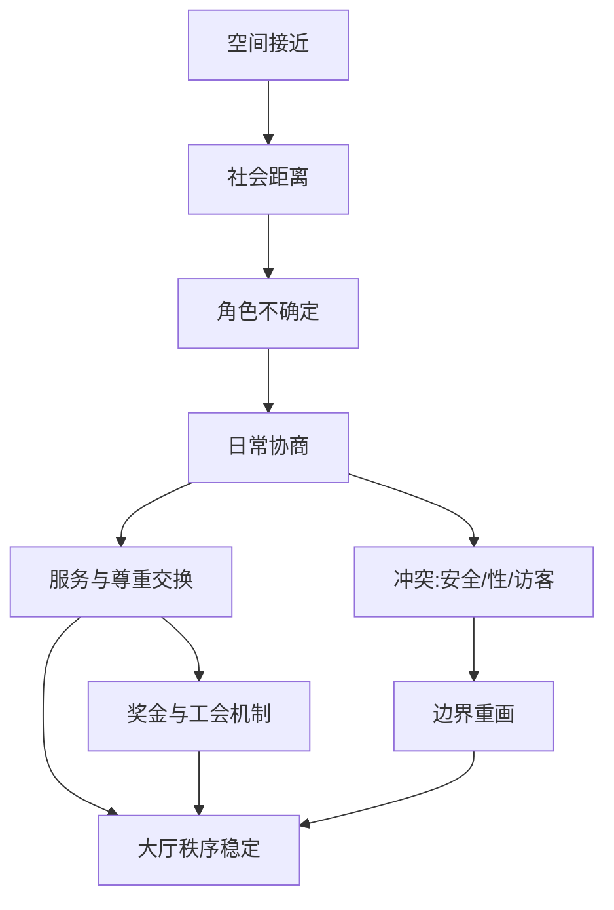

# 《寻找门卫》主要内容拆解（导师笔记版）
- 作者：叫我小杨同学的小码酱
- 标签：社会学民族志、城市研究、阶级互动、组织与劳动、门卫-住户关系

## 模块 0：核心摘要（TL;DR）
一句话：这本书把“门卫”当成一把社会学手术刀，切开了现代城市中“空间很近、社会很远”的关系结构。

认知挂钩：像你每天都用的电梯按钮，人人看得见，却很少有人研究按钮背后的整套楼宇秩序系统。

真理锚点：原书英文版《Doormen》由芝加哥大学出版社在 2005 年出版，章节与中译本目录高度一致（Interpersonal Closeness and Social Distance 到 The Union/Conclusion）。

## 模块 1：概念破冰（Concept Ice-breaking）
记忆口诀（巧记卡片）：

门口三件事：
近而不亲、熟而不私、帮而不越。

故事引入：
你每天进出同一栋楼，门卫认识你的作息、快递和访客偏好，你也依赖他处理“麻烦时刻”。但你几乎不知道他的家庭与人生。这种“高频互动+低度互知”的关系，就是本书的核心张力。

可视化（ASCII）：

```text
[住户私生活] --(依赖服务)--> [门卫判断]
      ^                        |
      |                        v
 [地位焦虑] <---(礼貌/规训)-- [大厅秩序]
```

## 模块 2：深度解析（Deep Analysis）
### 全书总问题
彼得·比尔曼研究的不是“门卫职业介绍”，而是一个更大问题：
当人们在物理上长期接近、在社会上却保持距离时，秩序如何被日常互动制造出来？

### 逐章主线（你要读懂的 8 个台阶）
1. 第一章《人际接近与社会距离》：提出总框架。
门卫与住户的关系不是“熟人关系”，也不是“纯市场交易”，而是处在两者之间的紧张地带。

2. 第二章《迈出第一步》：解释门卫如何入行、为何“好工作却难进入”。
作者强调非正式网络与匹配机制（谁介绍谁、谁信任谁）如何决定岗位分配，并指出这会带来排斥性后果。

3. 第三章《服务时间》：揭示门卫劳动的时间悖论。
门卫常常同时“很忙又很闲”：大量等待、随时响应、不断切换微任务，形成一种难被外行识别的隐形劳动。

4. 第四章《跨越界限》：围绕安全、性、访客管理讨论“边界工作”。
门卫借“安全”话语获得裁量空间，住户借“安全”正当化服务期待；双方在边界协商中共同定义角色。

5. 第五章《展示地位》：大厅是地位表演场。
住户通过服务质量展示自身地位，门卫通过职业判断争取尊重。冲突并非总是零和，很多时候会形成可运转的共谋秩序。

6. 第六章《奖金》：圣诞奖金是关系编码器。
奖金既像礼物、又像工资补丁、也像关系投资，意义多重且含混。正因含混，它反而能维持“亲近但不越界”的稳定。

7. 第七章《工会》：解释“结构性力量不强，却有较高待遇”的悖论。
作者将目光转向工会历史、罢工威胁与住户-门卫的特殊合作关系，说明劳动政治如何嵌入日常生活秩序。

8. 第八章《结语》：检视 9·11 后安全体制变化。
作者观察到：住宅楼中门卫-住户互动逻辑并未被形式规则彻底替代，因为这套系统仍高度依赖情境判断与关系性裁量。

### 研究设计为什么重要（附录精华）
这本书的硬核价值不只在叙事，还在方法：
- 不是随便“逛街访谈”，而是先做抽样框，再分层进入样本街区。
- 样本设计中出现：648 个可行网格、抽取 50 个单元、识别到 287 栋有门卫公寓、约 1200 名门卫总体估算、212 份访谈、63.1% 应答率。
- 作者反复讨论偏差风险（只看得见“显眼门卫”会严重偏样本），这让结论的可信度大幅提高。

### Mermaid 认知地图（核心机制）


## 模块 3：深度裂变（Deep Fission）
<div class="fission-section">

### 颠覆常识的三点
1. 门卫不是“低技能看门人”，而是高强度情境判断者。
2. 高级服务并不自动带来亲密关系，反而经常制造更精细的社会距离。
3. 工会与住户并非天然对立，某些时刻会出现“关系性联盟”（罢工前后尤明显）。

### 核心矛盾
- 住户要“个性化服务”，但不愿承担过高亲密成本。
- 门卫要“职业尊严”，却受制于服务型角色期待。
- 管理制度要“统一规则”，现实运行却离不开例外判断。

### 🔍 搜索内化（校准后结论）
- 书中若干工资与规模数字来自 2000 年前后田野，今天不能直接当作现况。
- 32BJ 官方近年公开口径已远高于书中时代的覆盖规模（官网对外口径为 185,000+ 会员，且覆盖多州）。
- 2022 年 NYC 住宅楼劳资谈判文件明确提到“若罢工将是自 1991 年 12 天罢工后首次”，与书中对 1991 事件的历史叙述方向一致。

</div>

## 模块 4：实战指南（Actionable Guide）
### 如何开始读这本书（高效版）
1. 先读第一章+附录，建立问题意识和方法意识。
2. 再读第三、四、五章，抓住“日常互动机制”。
3. 最后读第六、七、八章，把微观关系连接到制度与历史。

### 避坑指南
- 不要把它当“门卫职业故事集”，这是一本关系结构分析书。
- 不要只盯“有趣轶事”，要追问每个片段在机制链中的位置。
- 不要用今天工资/安保制度直接反推原书结论，先区分“机制”与“参数”。

### ROI 分析
- 对社会学学习者：可同时学到民族志写作与抽样设计。
- 对管理者：能理解一线服务岗位为何必须保留裁量权。
- 对普通读者：会重新理解“礼貌、服务、地位”在日常中的真实运作。

## 模块 5：温故知新（Consolidation）
### FAQ（8个）
<details><summary>1) 这本书是在写纽约上层生活吗？</summary>
不是。它借高层公寓大厅这个小场景，分析社会距离如何被日常互动持续制造与维护。</details>

<details><summary>2) 门卫和保安有什么差别？</summary>
书中的门卫不仅执行安保，还承担关系协调、服务分配、秩序维持与象征展示等复合功能。</details>

<details><summary>3) 为什么作者反复谈“裁量”而不是“规则”？</summary>
因为规则只能给边界，具体执行依赖现场判断；没有裁量，服务系统会僵化，关系也会恶化。</details>

<details><summary>4) 奖金为什么会这么敏感？</summary>
它同时是感谢、义务、比较和权力信号，意义叠加导致高焦虑，但也因此能维持模糊平衡。</details>

<details><summary>5) 工会章节和前面微观互动有什么关系？</summary>
前面解释“日常秩序如何生成”，工会章节解释“这种秩序如何被制度力量支撑或改写”。</details>

<details><summary>6) 书里关于收入的数据还能直接用吗？</summary>
不建议。它们属于特定年代与合同环境，应更新最新数据后再做横向比较。</details>

<details><summary>7) 这本书的方法论贡献是什么？</summary>
把民族志厚描和抽样推断逻辑并置，既讲故事，也防偏差。</details>

<details><summary>8) 最值得带走的一句话是什么？</summary>
社会结构不是高悬在上方的抽象物，它每天在门口、走廊和电梯前被做出来。</details>

### 扪心自问（6道自测题）
1. 为什么“空间接近”不会自动导向“社会亲密”？
2. 门卫的“忙与闲并存”是如何出现的？
3. “安全”在书中是实质功能、修辞资源，还是两者兼有？
4. 奖金为何能同时强化关系与距离？
5. 如果取消门卫裁量权，大厅秩序会发生什么变化？
6. 这本书如何把微观互动连接到宏观制度（工会、罢工、治理）？

### 藏经阁（参考资源）
- 原书出版页（University of Chicago Press）：https://press.uchicago.edu/ucp/books/book/chicago/D/bo3640635.html
- 32BJ 官网（当前组织规模口径）：https://www.seiu32bj.org/
- 32BJ 2022 合同新闻稿（含“1991年后首次罢工”历史锚点）：https://www.seiu32bj.org/press-release/win-historic-first-post-pandemic-contract/
- 哥伦比亚社会学系页面（作者学术背景校验）：https://sociology.columbia.edu/news/peter-bearman-elected-national-academy-medicine
- 中译本书评信息（出版信息交叉核验）：https://epaper.gmw.cn/zhdsb/html/2022-12/14/nw.D110000zhdsb_20221214_3-10.htm
