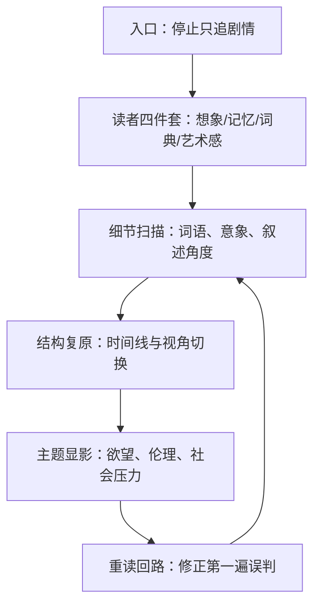

# 《文学讲稿》主要内容拆解（纳博科夫）
作者：叫我小杨同学的小码酱  
标签：文学批评、阅读方法、小说细读、纳博科夫

## 模块 0：核心摘要（TL;DR）
一句话：这本书的核心不是“你懂了情节没有”，而是“你能不能像艺术家那样看见小说的构造”。

认知挂钩：把小说当成一个上锁的行李箱，普通读法只摸到表层，纳博科夫教的是“拆锁、分层、复检”。

真理锚点（校准后）：
- 本书英文本《Lectures on Literature》为 1980 年整理出版，署名涉及 Fredson Bowers 的编辑工作。
- 本地 EPUB 目录显示结构为：导论 + 七讲（奥斯丁、狄更斯、福楼拜、史蒂文森、普鲁斯特、卡夫卡、乔伊斯）。
- 纳博科夫在康奈尔时期（1948 年到 1959 年离开）讲授过“欧洲文学大师”相关课程，这与本书内容来源一致。
- “优秀读者”四要素是：想象力、记忆、词典、艺术感。

## 模块 1：概念破冰（Concept Ice-breaking）
<div class="mnemonic-card">
口诀：读文四件套：想、记、查、赏。

想：进入作者创造的新世界。  
记：抓住细节回环。  
查：不跳过陌生词和典故。  
赏：感受结构与节奏，而非只追剧情。
</div>

故事引入：
你看侦探片时，第一次看通常只想知道“凶手是谁”；第二次看，才会注意镜头放了哪些线索。纳博科夫要你对文学也这么做，而且做得更彻底。

可视化：
```text
第一次读：剧情 -> 人物 -> 结局
第二次读：细节 -> 结构 -> 风格
第三次读：主题 -> 象征 -> 作者手法
```

## 模块 2：深度解析（Deep Analysis）
### 1) 全书总线
《文学讲稿》的总线是：
- 文学是被“制造”出来的艺术对象，不是社会新闻附录。
- 读者需要训练“精密观察力”，从句子、意象、时间处理、叙述视角里读出作者的工程。
- “重读”是必要动作，因为第一次阅读会被情节推进占据注意力。

### 2) 各讲次主内容拆解（基于 EPUB 目录 + 校准资料）
1. **优秀读者与优秀作家**  
   建立阅读方法论：反对把阅读简化为代入、道德评判或社会标签化解读。
2. **简·奥斯丁（《曼斯菲尔德庄园》）**  
   重点看“礼仪秩序下的心理运动”：人物行动的微小偏移，如何体现道德位置变化。
3. **狄更斯（《荒凉山庄》）**  
   双重叙述视角与“雾”意象串联制度腐败与个体命运，结构本身就是批评力量。
4. **福楼拜（《包法利夫人》）**  
   纳博科夫特别强调风格精度：情感并非喊出来，而是通过句法与物象排列显影。
5. **史蒂文森（《化身博士》）**  
   不是简单“善恶二元”，而是现代主体裂变的叙事实验：人格、欲望与社会面具冲突。
6. **普鲁斯特（《追忆似水年华》卷一相关）**  
   时间并非直线流逝，而是由感官触发回忆折返，小说结构模拟意识流动。
7. **卡夫卡（《变形记》）**  
   核心不在“为什么变虫”，而在变形之后家庭、劳动、尊严关系如何重新布线。
8. **乔伊斯（《尤利西斯》）**  
   形式革命与日常经验并置：宏大史诗框架被压进一天的城市生活。

### 3) 认知地图（Mermaid）


## 模块 3：深度裂变（Deep Fission）
<div class="fission-section">
<p><strong>🔍 搜索内化</strong></p>

原子级分歧与校准结论：
1. <strong>“1948-1958”还是“1948-1959”</strong>  
   讲稿形成期常写 1948-1958（对应课程年度），但纳博科夫离开康奈尔是 1959 年。两种说法并不冲突，指向的时间粒度不同。

2. <strong>“优秀读者与优秀作家”与英文本章节名差异</strong>  
   中文题名与英文本目录（如 The art of literature and commonsense）存在译名变体，本质都指向“阅读方法论导论”。

3. <strong>本次输入材料的技术限制</strong>  
   你提供的 EPUB 为“图像页为主”，正文未内嵌可直接抽取文本；本拆解采用“本地目录锚点 + 外部权威校准”的方式完成，属于<strong>结构级高置信总结</strong>，不是逐句校勘版。
</div>

## 模块 4：实战指南（Actionable Guide）
如何开始（7 天可执行版）：
1. 第 1 天：先读“优秀读者与优秀作家”，写下你的四件套短板（想/记/查/赏）。
2. 第 2-6 天：每天选一讲，只做两件事：摘 10 个细节、画 1 张结构图。
3. 第 7 天：回看第一天笔记，重写“我如何判断一本小说写得好”。

避坑指南：
- 只讨论价值观，不分析文本手法。
- 只看故事梗概，不回到句子与意象。
- 只读一遍就下结论。

ROI（投入产出）：
- 投入：每周 4-6 小时。
- 产出：你会从“读完一本书”升级到“拆开一本书”，这会直接提升写作、表达与批判性阅读能力。

## 模块 5：温故知新（Consolidation）
### FAQ（8 问）
1. 为什么纳博科夫反对“过度代入”？  
因为代入会遮蔽文本技术，读者会把作品当情绪镜子。

2. 为什么强调词典？  
词义精度决定理解精度，尤其是风格型作家。

3. 为什么要重读？  
第一次读被“发生了什么”占满，第二次才有余力看“怎么写的”。

4. 这本书是不是只适合文学专业？  
不是。它本质是“注意力训练手册”。

5. 先看哪一讲最容易入门？  
建议从“优秀读者与优秀作家”+“卡夫卡”开始。

6. 书里为什么经常要求记细节？  
细节是结构节点，不是装饰。

7. 如果我时间很少怎么办？  
每讲只做“3 细节 + 1 结构图”，照样有效。

8. 怎么判断自己是否进步？  
看你能否解释“作者为什么要这样写”，而不是“我喜不喜欢这个角色”。

### 扪心自问（自测题，6 题）
1. “想象力”在纳博科夫这里为什么是“非代入式”的？
2. 《荒凉山庄》的双叙述结构为什么重要？
3. 你能举出《包法利夫人》中“风格先于态度”的一个例子吗？
4. 为什么《变形记》的关键不在“变形原因”而在“变形后关系重组”？
5. 你读《尤利西斯》时，如何区分“看不懂”与“尚未建立阅读地图”？
6. 对你自己而言，四件套里最弱的是哪一项，接下来怎么补？

### 藏经阁（参考资源）
- Cornell Library Exhibition: https://exhibits.library.cornell.edu/lolita/feature/nabokov-at-cornell
- Open Library (1980 edition metadata + TOC): https://openlibrary.org/works/OL44521787W/Lectures_on_literature
- Open Yale Courses transcript (Good Readers and Good Writers excerpt): https://openmedia.yale.edu/projects/iphone/departments/engl/engl291/transcript01.html
- 本地 EPUB 目录锚点：`/Users/guanxinyu/Documents/GitHub/reado/.tmp_epub_文学讲稿/OEBPS/toc.ncx`
