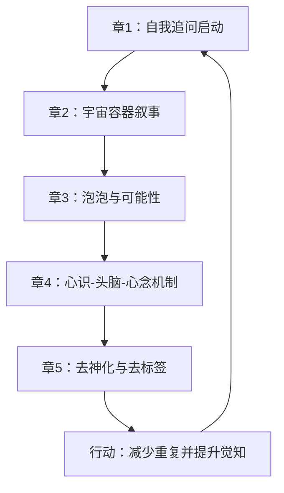

# 《Datre书籍第一册：我们是DATRE-1（部分）》全量拆解笔记

- 撰写：叫我小杨同学的小码酱
- 原著作者：Aona（待校验；封面显示 `by Aona`）
- 中文翻译：QingQing（待校验）
- 文件元数据作者字段：china（来自摄取结果元数据）
- 输入范围：PDF 共 48 页（目录含 5 章；第 5 章为节选前半，后半缺失）
- 标签：Datre、通灵文本、形而上叙事、认知训练、批判性阅读

---

## 模块 0：核心摘要（TL;DR）

一句话版本：
这本书不是在给你“宇宙百科”，而是在逼你从“依赖外部权威”转向“亲自觉知与自我进化”。

认知挂钩（生活类比）：
它像在说“你坐在摩天轮上反复同一圈，还以为每次都是新人生”，真正的任务不是换一辆车，而是学会下摩天轮。

真理锚点（阅读前先定规则）：
- 本书主体是形而上叙事和修行型隐喻，不是现代自然科学教科书。
- 涉及可核验事实（历史数字、天文物理）时，需与 2026 年公开证据交叉校验。
- 最稳妥读法：把它当“认知训练文本”，而非“事实手册”。

---

## 模块 1：概念破冰（Concept Ice-breaking）

<div class="mnemonic-card">
<strong>巧记卡片：</strong><br/>
问自己 → 看惯性 → 识别恐惧 → 放下重复 → 回到当下<br/>
口诀：<strong>问、看、辨、放、行</strong>
</div>

故事引入：
书里反复出现“过河踩石头”的隐喻。人先是因未知而恐惧，然后在“安全石头”上搭建规则与组织，最后把“稳定”误当“真理”。Datre 的主张是：你不是来守石头的，而是来继续走路的。

可视化（ASCII）：

```text
存在焦虑(我是谁?)
   -> 寻找解释
   -> 依赖外部系统(规则/组织/权威)
   -> 形成重复惯例
   -> 失去主动觉知
   -> 通过自我观察与改变微习惯
   -> 回到个体进化
```

---

## 模块 2：深度解析（Deep Analysis）

### 章节/单元地图（按原目录顺序）

### 第 1 章《简介》（目录页码 1；PDF约第 5-10 页）
核心命题：
- 进化的主战场不是物种外形，而是“个体觉知”。

关键证据/情节节点：
- 以“我是谁、我为何在此”为真正起点。
- 以“过河石头”批评灵性路径上的舒适区与教条依附。
- 把社会组织、规则、战争恐惧归结为“害怕改变”。
- 提出“最能帮助世界的是先了解你自己”。

与前后章节逻辑关系：
- 向前：作为全书入口，先把问题从社会叙事拉回个人内核。
- 向后：第 2 章把“个体困境”扩展到“宇宙容器模型”。

### 第 2 章《宇宙》（目录页码 7；PDF约第 11-23 页）
核心命题：
- 宇宙不是单一“神源”创造物，而是多层容器与协作网络。

关键证据/情节节点：
- “宇宙中含多个泡泡；宇宙之外还有宇宙”。
- 反复强调“体验”而非“实验”；“做（Doing）”而非被动等待。
- 把人类循环出生/死亡比作反复坐摩天轮，批评重复惯性。
- 提出“线性时间结束，进入暂时/伪造时间”的转折说法。

与前后章节逻辑关系：
- 承接第 1 章：把“个体困惑”放入更大叙事舞台。
- 引出第 3 章：把“大宇宙”收束到“你们这个泡泡如何运作”。

### 第 3 章《你们的泡泡》（目录页码 20；PDF约第 24-30 页）
核心命题：
- 现实世界是由“几率与可能性（完形概念）+ 能量流”持续实例化出来的。

关键证据/情节节点：
- 泡泡被定义为“能量容器”，服务物质探索。
- 声称新世纪/千禧年伴随能量模式变化，推动觉知扩展。
- 以“管道工忘记回家”比喻“专家”沉迷物质层、忘记来处。
- 讨论火星、人类科技、太阳性质等，呈现与主流科学不同立场。

与前后章节逻辑关系：
- 承接第 2 章：把宇宙结构抽象概念落到“地球泡泡可操作层”。
- 引向第 4 章：从外部容器过渡到内部认知引擎（心识/头脑/心念）。

### 第 4 章《心识》（目录页码 27；PDF约第 31-45 页）
核心命题：
- 区分“头脑处理器”“群体意识想法”和“心念输入”，认为创造力来自后者接入。

关键证据/情节节点：
- 心识泡泡：容纳大量可被使用的“几率与可能性”。
- 头脑：被定位为处理器，负责处理群体意识与心识输入。
- 心念：被比喻为蒲公英种子，可连接个体并触发新信息流。
- 梦境、出体、艺术创作、科学突破被解释为心念接入窗口。
- 反复否定“公式化修行”，强调“允许发生、减少重复”。

与前后章节逻辑关系：
- 承接第 3 章：从“宇宙容器”转入“个体认知机制”。
- 引向第 5 章：从“心智机制”上升到“一切万有/神概念”的去标签化。

### 第 5 章《一切万有》（目录页码 42；PDF约第 46-48 页，部分）
核心命题：
- “一切万有”“神”等词是阶段性扩展工具，不应变成终极执念。

关键证据/情节节点：
- 认为术语本身会形成振动习惯与认知束缚。
- 强调从“词语崇拜”转向“完形概念与直接体验”。
- 提醒重复词汇会强化模式，进而制造自我限制。

与前后章节逻辑关系：
- 承接第 4 章：从“心念机制”延展到“语言与符号如何塑造现实”。
- 后续关系：本章后半缺失，无法完整追踪其终章收束。

### 覆盖度声明（Mandatory）

- 已覆盖章节：目录中第 1 章到第 5 章全部入口与核心链路。
- 高完整度：第 1-4 章（基于连续页文本可做细拆）。
- 降级为结构级总结：第 5 章后半（输入文件本身为“部分”节选，仅到第 48 页）。
- OCR 影响：原文存在少量断词/换行噪声，不影响主干逻辑判断。

### 逻辑循环图（Mermaid）



---

## 模块 3：深度裂变（Deep Fission）

<div class="fission-section">

### 🔍 搜索内化：哪些地方可当“隐喻”，哪些必须“纠错”

1) 历史数字口径差异（可校正）
- 书中表述：`9/11` 涉及 `86` 个国家。
- 交叉结果：公开纪念与官方资料常见口径是“`90+` 国家受害者/遇难者涉及”。
- 内化结论：这里更可能是“早期统计口径或版本差异”，阅读时应把数字当近似，不宜当精确常数。

2) 太阳物理（需明确纠错）
- 书中对话提出：太阳非氢燃料、无磁场、更多是“只能猜测”。
- 2026 可核验证据显示：现代天体物理对太阳结构、核聚变与磁活动已有成熟观测模型；“无磁场”与“非氢核聚变主导”不成立。
- 内化结论：此处应按“形而上象征表达”处理，不可替代基础天文学知识。

3) 地球与人类关系（需明确纠错）
- 书中强调“地球真实进化与人类无关，人类影响不到真实地球”。
- 2026 科学共识：人类活动导致全球增暖并改变气候系统，这是高置信结论。
- 内化结论：若把该段机械套用到现实决策，会产生生态伦理风险。

4) 人文引用（基本可保留）
- 书中转述梭罗“时间是我垂钓的溪流”这类句意，与《瓦尔登湖》经典语句高度接近。
- 内化结论：该引用可作为修辞桥梁，但不必当作严格逐字引文。

</div>

核爆级结论（用于读法升级）：
- 这本书最有价值的部分，不在它“说了多少宇宙事实”，而在它持续攻击“重复性心理程序”。
- 你若把它当科学书，会不断冲突；你若把它当“认知解冻训练手册”，收益会显著上升。

---

## 模块 4：实战指南（Actionable Guide）

如何开始（7 天最小可行实践）：
1. 第 1-2 天：通读第 1 章，只记录“我正在重复什么”。
2. 第 3-4 天：读第 2-3 章，画一张“我的泡泡容器图”（环境、关系、信息输入）。
3. 第 5-6 天：读第 4 章，建立“想法 vs 心念”日志（突然灵感、来源、后续行动）。
4. 第 7 天：读第 5 章（现有部分），删掉一个高频限制性词语（如“我不行”）。

避坑指南：
- 反模式 1：把 metaphysics 断言当自然科学事实。
- 反模式 2：只收藏金句，不做任何微改变。
- 反模式 3：沉迷宏大宇宙叙事，逃避具体生活行动。

ROI 分析（投入产出）：
- 投入：每天 20-30 分钟阅读 + 10 分钟记录。
- 产出：提升自我观察、减少自动化重复、增强行动主动性。
- 风险控制：涉及历史/科学断言时，必须二次核验来源。

---

## 模块 5：温故知新（Consolidation）

### FAQ（8个）

<details>
<summary>1. 这本书到底在讲宇宙，还是讲心理成长？</summary>
本体是“宇宙叙事包装下的心理-认知成长文本”。
</details>

<details>
<summary>2. 我需要相信通灵设定，才能用这本书吗？</summary>
不需要。你可以只使用其中关于“去重复、提觉知、主动改变”的方法层。
</details>

<details>
<summary>3. 为什么它反复批评重复与惯例？</summary>
因为作者把“重复”定义为个体进化停滞的根机制。
</details>

<details>
<summary>4. “心识、头脑、心念”三者怎么记？</summary>
心识像“云端素材库”，头脑像“本地处理器”，心念像“突发高价值输入”。
</details>

<details>
<summary>5. 第 4 章为什么最关键？</summary>
它给出从宇宙叙事落地到认知操作的桥梁，是可实践性最高的一章。
</details>

<details>
<summary>6. 第 5 章为什么看起来像语言哲学？</summary>
因为它把“术语”视为行为引导器，强调词语会塑造习惯与感知框架。
</details>

<details>
<summary>7. 如何避免把这类书读成“逃避现实”？</summary>
每读一节，必须落地一个可执行动作；没有动作，理解就是幻觉。
</details>

<details>
<summary>8. 这份“部分版”最大缺口在哪？</summary>
第 5 章后半缺失，终章论证闭环不完整；建议补齐原文后再做二轮精读。
</details>

### 扪心自问（自测题 8 题）

1. 你目前最明显的“重复性心理程序”是什么？
2. 你把哪种“安全感”误当成了“真理”？
3. 你最近一次真正改变日常微习惯是什么时候？
4. 你能否区分“旧想法复读”与“新心念输入”？
5. 哪一句常用词正在塑造你的自我限制？
6. 若不依赖外部权威，你会先做哪一步小实验？
7. 本书哪一章最能触发你的行动，而非幻想？
8. 你将如何为“可核验事实”建立二次校验机制？

### 藏经阁（参考资源）

- 本次输入文本：`Datre书籍-第1册 我们是DATRE-1（部分）.pdf`
- 9/11 纪念机构资料（遇难者涉及国家口径）：
  - https://www.911memorial.org/learn/resources-and-references/faq-about-911
- 纽约市官方 9/11 死亡人数统计：
  - https://www.nyc.gov/site/911health/about/wtc-exposure-zone.page
- NOAA（太阳黑子与磁活动）：
  - https://www.swpc.noaa.gov/phenomena/sunspot
- NASA（太阳事实与核聚变）：
  - https://science.nasa.gov/sun/facts/
- NASA 气候证据（人类驱动增暖）：
  - https://science.nasa.gov/climate-change/evidence/
- 《瓦尔登湖》原文（梭罗时间比喻）：
  - https://www.gutenberg.org/files/205/205-h/205-h.htm

---

> 结语：
> 若你的目标是“一个完全正确的宇宙模型”，这本书不合适。
> 若你的目标是“拆掉旧思维脚本并重建行动能力”，它很有穿透力。

